<!-- _class: lead -->

# <span style="color:white;"> CPU5006-20: Artificial Intelligence </span>

## Session 1: CPU 5006 Welcome & 
## Overview 25-26


<!-- _footer: "" -->

---

## Course Overview

<!-- _footer: "" -->

Week | Session | |
-----|------|---|
1 | Welcome Session & Intro to Python |
2 | The history of AI & Conducting Liturature Review |
3 | Rule-Based AI Systems |
4 | S1 Assessment Workshop |
5 | Supervised Learning |
RW | Reading Week |
6 | Unsupervised Learning |  S1
7 | Artificial Neural Networks |  
8 | Convolutional NN & Computer Vision |
9 | Recurrent NN & NLP |
10 | S2 Assessment Workshop |
11 | Generative AI | S2
12 | Building AI Agents |

---

## Overview

- Overview of the Module
- Expectations of you
- Introduction to Python

---

## Assignment Deadlines

- S1: Week 6 - $^{th}$ November 2026
- S2: Week 11 - $^{th}$ December 2026

---

## Resources Required

- VS Code
- Python
- GitHub Desktop


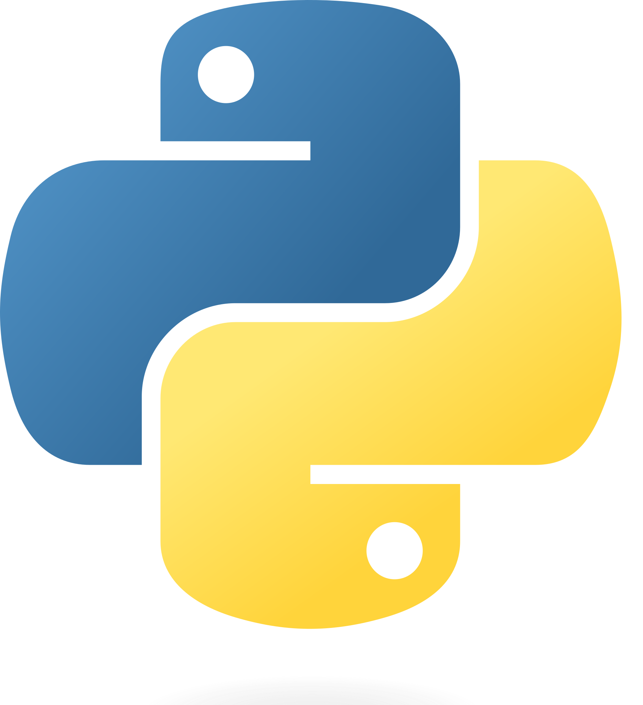


---

## Expectations

- Be professional
- Be respectful
- Be inquisitive

---


## Be Curious

- We’re not going to cover every detail of every area of AI (that would be death by PowerPoint!)
- So, it comes down to you to learn new things! We don’t really mind.
- what, so follow your interest!
- We’ll gloss over some things in class – maybe there’s more to uncover?..

---

## Be Diligant

- We learn by doing – so you’ve got to be self-motivated to do it!
- Use independent study time to learn new things and/or consolidate things covered in class.
- Independent Study ≠ Studying Alone

---

## This module is not a course on how to Code in Python!

- 3 optional Workshops are available:
    1) $X^{nd}$ October 2026
    2) $X^{th}$ October 2026
    3) $X^{th}$ October 2026

Time: 1:30pm - 2:30 pm
Room: TBC

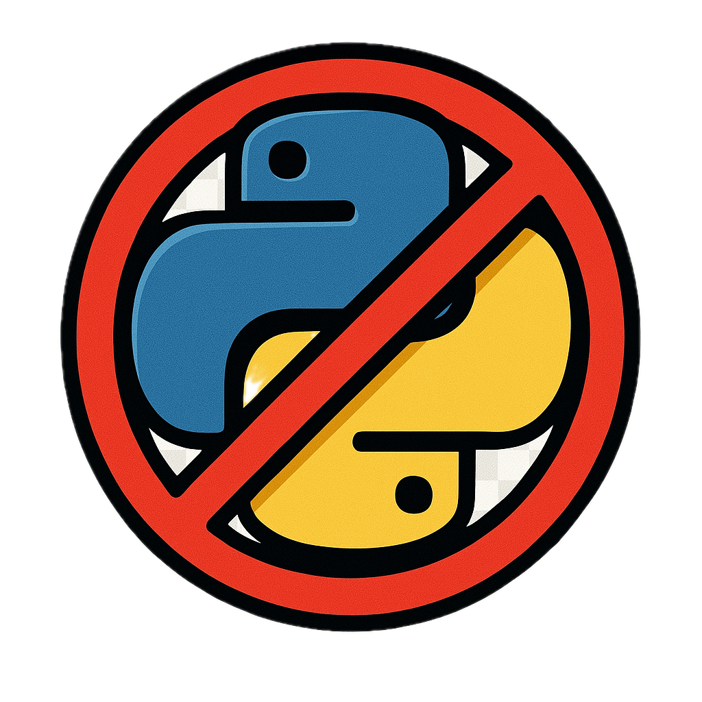

---

#  History of Python

<div style="display: flex; justify-content: space-between;">
<div style="width: 60%;">

<ul style="font-size: 0.6em">
    <li> <b>Origins</b>: Python was conceived in the late 1980s by Guido van Rossum at Centrum Wiskunde & Informatica (CWI) in the Netherlands.</li>
    <li> <b>Early Development</b>: In February 1991, Guido van Rossum published the code (labeled version 0.9.0) to alt.sources.</li>
    <li> <b>Python 2.0 Release</b>: Python 2.0 was released on October 16, 2000, with many major new features.</li>
    <li> <b>Python 3.0 Release</b>: Python 3.0, a major, backwards-incompatible release, was released on December 3, 2008.</li>
    <li> <b>Python’s Philosophy</b>: The philosophy of Python is summarized in “The Zen of Python,” which states the 19 guiding principles for writing computer programs that have influenced the design of the Python language. </li>
<ul>

</div>
<div style="width: 40%;">


</div>
</div>

---

## Why Python?

- Simplicity and Readability
- Extensive Libraries and Frameworks
- Dynamic Nature
- Platform Indipendance
- Community Support
- Readability

---

## 🧪 Using Jupyter in VS Code

- Install the [**Python**](https://marketplace.visualstudio.com/items?itemName=ms-python.vscode-python-envs) and [**Jupyter**](https://marketplace.visualstudio.com/items?itemName=ms-toolsai.jupyter) extensions from the VS Code marketplace.
- Open or create a `<filename>.ipynb` file to start coding interactively.
- Within Jupyter you can use: **Markdown**, **code cells**, and **interactive outputs**.
- Great for **data science**, **machine learning**, and **exploratory analysis**.
- When creating for production, create and use a `<filename>.py` file instead of a`.ipynb`.

---

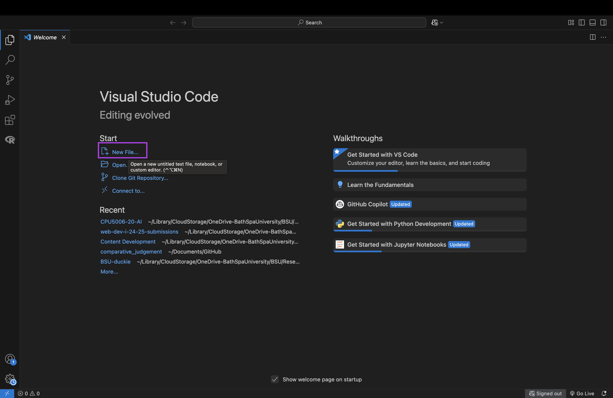

<!-- 
When opening VS Code you should be greeted with this screen. Ensure extensions are installed before continuing at this point.
-->

---

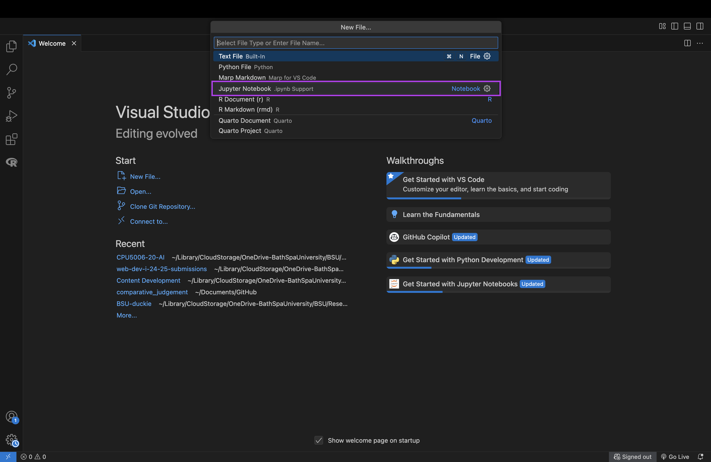

<!-- 
If students do not do this but create a new file another way. Just ensure that they just give it any name and then use the .ipynb extension and it will save the file as a Jupyter Notebook.
 -->

---

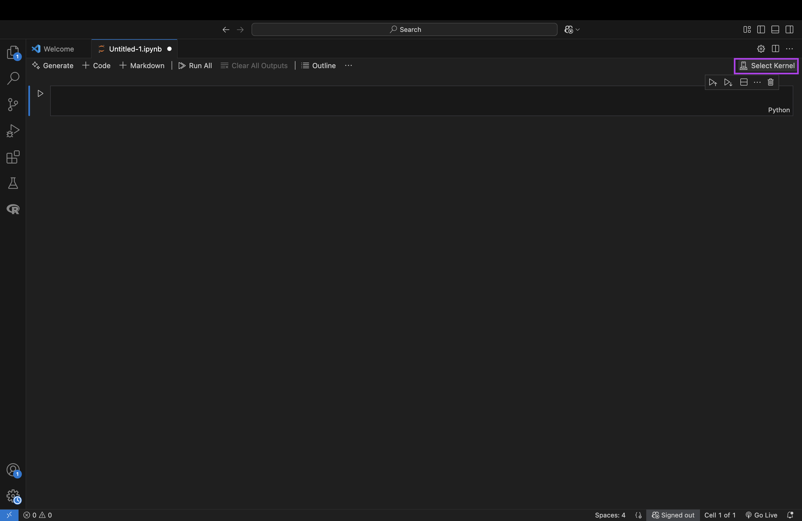

---

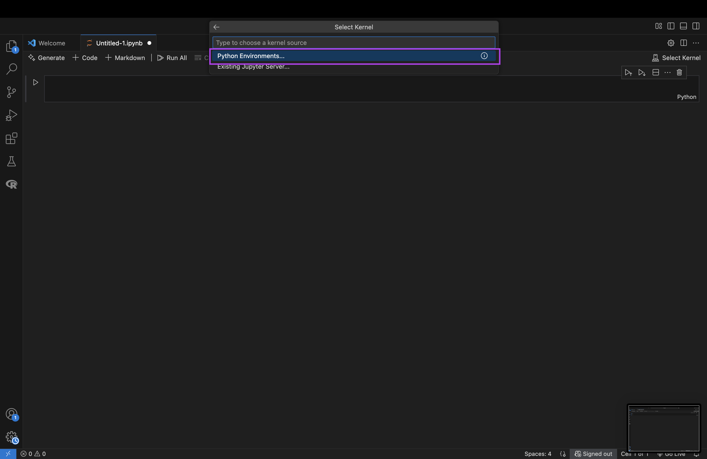

---

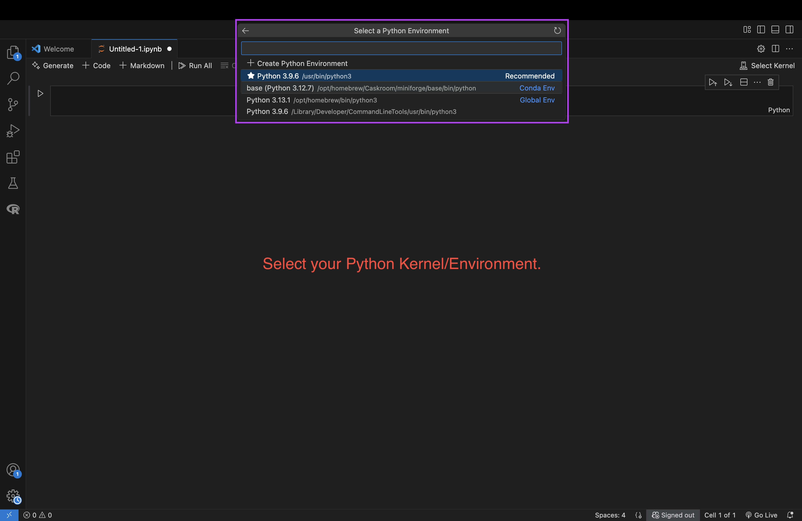

<!-- 
This list will differ based on the listen of Python Eviroments that are listed on the machine. So don't expect to see exactly the same list. 
If a conda virtual enviroment has been installed, then you will see the base.
 -->
---

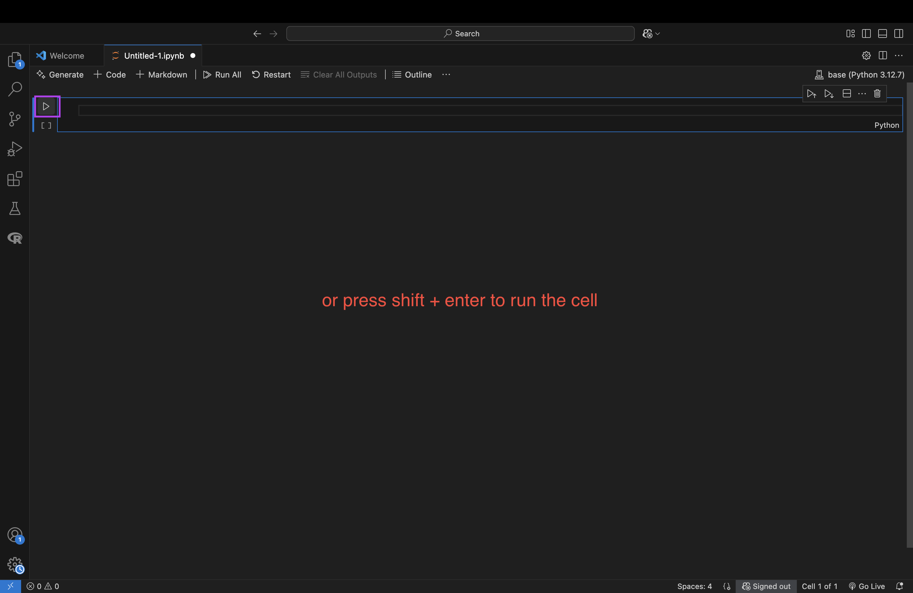

<!-- 
When running for the first time, a pop up box in the bottom left will appear asking to install ipykernel. Accept and install. This is required to run the notebook.
 -->

---

## Python Syntax

<div style="display: flex; justify-content: space-between;">
<div style="width: 60%;">

```python
name = "Andy"

if name == "Andy":
    print("Hello Class!")
else:
    print("Wrong lecturer")

for i in range(10, 0, -1):
    print(i)

print("BLAST OFF!")
```
</div>
<div style="width: 40%;">

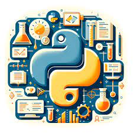
</div>
</div>

<!-- 
Further details will be explained later on, this is a visual representation of example code. 
-->

---

## Important Notes


<span style="font-size: 0.8em">

- Python is case sensitive
    - Code will not work without correct case

- “Text” values need to be in “” double quotations or '' single quotation
    - Numbers do not

- Variables cannot be any Python reserved keywords
    - Print, input, etc

- Files cannot be saved using Python reserved keywords

</span>

<!-- 
While either quotation can be used, the recommeneded way is using a double.
-->

---

## Variables and Data Types

A variable is a value that can change, depending on conditions or on information passed to the program.

<style>

img[alt~="bottom-centre2"] {
  position: absolute;
  bottom: 150px;
  left: 450px;
  width: 450px;
  margin: auto;
}
</style>

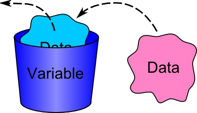

---

## Variables and Data Types

```python 
my_variable = Value
```

How we handle that value depends on the data type that we want to use.

---

## Variables and Data Types

- Strings

```python 
"Hello class"
```

- Integers 

```python
1, 2, 3, ...
```


---

## Variables and Data Types

- Float 

```python
1.0, 1.1, 1.3, ...
```

- Boolean

```python
True or False
```

---

## Basic Operators

```python
+  # Addition: sums two values (e.g. 3 + 2 = 5)

-  # Subtraction: difference between two values (e.g. 5 - 2 = 3)

/  # Division: divides and returns a float (e.g. 5 / 2 = 2.5)

// # Integer Division: divides and truncates to an integer (e.g. 5 // 2 = 2)

%  # Modulus: returns the remainder of a division (e.g. 5 % 2 = 1)

** # Exponentiation: raises a number to a power (e.g. 2 ** 3 = 8)
```

---

<!-- _class: task -->

## Task 
<!-- (15 Mins) -->

- On Ultra there are Variables and Operator tasks to complete.
- answer in the Jupyter Notebook provided.
- complete tasks **0-4** in the worksheet `CPU5006_Session1_Introduction_to_Python_Tasks.ipynb`.

### Stretch:
See worksheet: ``python_datatypes_worksheet.pdf``

---

## Data Structures - Lists

- creating

```python
my_list = [1, 2, 3, 4, 5]
```

```python
my_list = [1, "2", 3, "4", 5]
```

```python
my_2d_list = [
    [1, 2, 3, 4, 5],
    [6, 7, 8, 9, 10],
    [11, 12, 13, 14, 15]
]
```

---

## Data Structures - Lists

Indexing 1D lists:

```python
my_list[0]
```
```python
my_list[3]
```

Indexing 2D lists:
```python
my_list[0][1]
```

---

## Data Structures - Lists
<!-- - methods -->

| Method Name | Description |
| --- | --- |
| append() | Adds an element at the end of the list |
| clear()  | Removes all the elements from the list  |
| copy() | Returns a copy of the list |
| count() | Returns the number of elements with the specified value |
| extend() | Add the elements of a list (or any iterable), to the end of the current list |
| index() | Returns the index of the first element with the specified value |
| insert() | Adds an element at the specified position |
| pop() | Removes the element at the specified position |
| remove() | Removes the first item with the specified value |
| reverse() | Reverses the order of the list |
| sort() | Sorts the list |

---

# Data Structures - Tuples

```python
my_tuple = (1, 2, 3, 4)
```

```python
my_tuple_be_careful = (1, 2, 3, 4, [])
```

---

## Data Structures - Dictionaries

```python
my_dict = {
    "name": "Andy",
    "age": 36,
    "Position": "Lecturer"
    "Subjects": [
        "AI",
        "Innovation Labs",
        "Web Dev I"
    ] 
}
```

---

## Data Structures - Dictionaries

- Key-value pairs

```python
my_dict["name"]

>>> "Andy"
```

```python
my_dict["subjects"][0]

>>> "AI"
```

---

## Data Structures - Dictionaries

| Method Name | Description |
| --- | --- |
| clear()| Removes all the elements from the dictionary |
| copy() | Returns a copy of the dictionary |
| fromkeys() | Returns a dictionary with the specified keys and value|
| get() | Returns the value of the specified key|
| items()| Returns a list containing a tuple for each key value pair|
| keys()| Returns a list containing the dictionary's keys|
| pop() | Removes the element with the specified key|
| popitem() | Removes the last inserted key-value pair|
| setdefault()| Returns the value of the specified key. If the key does not exist: insert the key, with the specified value|
| update()| Updates the dictionary with the specified key-value pairs|
| values()| Returns a list of all the values in the dictionary|

---

<!-- _class: task -->

## Task

- complete tasks **5-7** in the worksheet `CPU5006_Session1_Introduction_to_Python_Tasks.ipynb`.

### Stretch:
worksheet: ``python_data_structures_worksheet.pdf``

---

## Control Flow - If

```python
number_1 = 5
number_2 = 10

if number_1 > number_2:
    print(f"number 1: {number_1} is greater than number 2: {number_2}")
```

---

## Control Flow - Else If

```python
number_1 = 5
number_2 = 10

if number_1 > number_2:
    print(f"number 1: {number_1} is greater than number 2: {number_2}")
elif number_1 < number_2:
    print(f"number 1: {number_1} is less than number 2: {number_2}")
```

---

## Control Flow - Else

```python
number_1 = 5
number_2 = 5

if number_1 > number_2:
    print(f"number 1: {number_1} is greater than number 2: {number_2}")
elif number_1 < number_2:
    print(f"number 1: {number_1} is less than number 2: {number_2}")
else:
    print(f"number 1 and number 2 are both the same")
```

---

## Control Flow - Case

```python
lang = input("What's the programming language you want to learn? ")

match lang:
    case "JavaScript":
        print("You can become a web developer.")
    case "Python":
        print("You can become a Data Scientist")
    case "PHP":
        print("You can become a backend developer")
    case "Java":
        print("You can become a mobile app developer")
    case _:
        print("The language doesn't matter, what matters is solving problems.")
```

---

## Control Flow - For

```python
for i in range(10):
    print(f"i = {i}")
```

---

## Control Flow - While

```python
i = 0

while i < 10:
    print(f"i = {i}")
    i += 1
```

---

## Functions

- Defining and calling them

```python
def function_name():
    ...

function_name()
```

---

## Functions with Parameters

- arguments and return values

```python
def function_name(params1, params2):
    ...
    return output

function_name(1, 2)
```

---

<!-- _class: task -->

## Task

- complete tasks **8-13** in the worksheet `CPU5006_Session1_Introduction_to_Python_Tasks.ipynb`.

### Stretch:
Worksheet ``python_control_flow_worksheet.pdf``

---

## Comprehensions

- list
- dict

---

## Comprehensions - List

```python
my_list = [i for i in range(10)]
```

---

## Comprehensions - Dictionary

```python
details = [
    ["Andy", 36, "Senior Lecturer"],
    ["Ed", 21, "Lecturer"],
    ["Dave", 22, "Senior Lecturer"],
]

my_dict = {id: values for id, values in enumerate(details)}
```

---

## Python Libraries

<span style="font-size: 0.6em;">

Python libraries are collections of modules that offer a wide range of functionalities. They simplify complex tasks by providing a set of pre-written functions that can be used in the development process.


<div style="display: flex; justify-content: space-between;">
<div style="width: 60%;">

- Numpy
- Pandas
- SciPy
- Matplotlin
- Scikit-Learn
- Seaborn
- TensorFlow/PyTorch

</span>

</div>
<div style="width: 40%;">

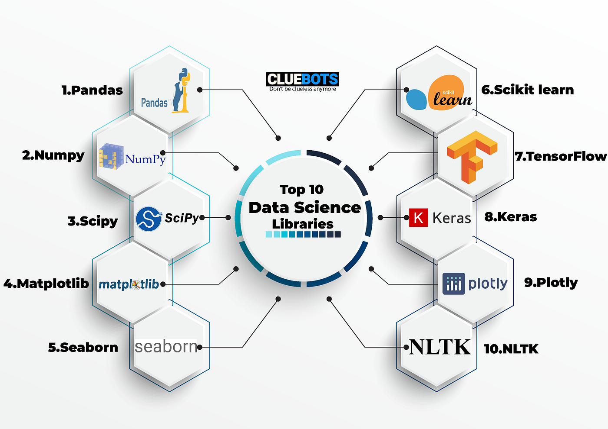

</div>
</div>

<!-- _footer: "Access to the [PyPI](https://pypi.org/)" -->

---

## Importing Libraries

``` python
import pandas as pd
from x import y
```

``` python
df = pd.dataframe()
```

---

## PIP

<style scoped>

</style>

<div style="display: flex; justify-content: space-between;">
<div style="width: 60%;">

<span style="font-size:0.65em">
<ul>
    <li>pip is the standard package manager for Python. </li>
    <li>It allows you to install and manage additional packages that are not part of the Python standard library. </li>
    <li>The name pip is a recursive acronym for 'Pip Installs Packages’.</li>
    <li>pip is a package-management system written in Python and is used to install and manage software packages. </li>
    <li>The Python Software Foundation recommends using pip for installing Python applications and its dependencies during deployment.</li>
<ul>
</span>

</div>
<div style="width: 40%;">

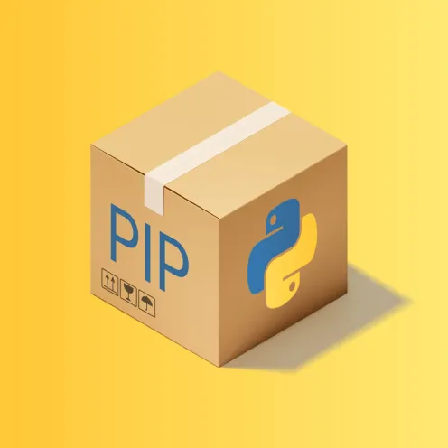

</div>
</div>

---

<!-- _class: task -->

## Task

- complete tasks remaining tasks in the worksheet `CPU5006_Session1_Introduction_to_Python_Tasks.ipynb`.

### Stretch:
worksheet: ``python_datatypes_worksheet.pdf``
worksheet: ``python_control_flow_worksheet.pdf``
worksheet: ``python_data_structures_worksheet.pdf``

---

## Next Session

- History of AI
- S1 Introduction
- Introduction to Overleaf
- How to write a liturature Review
