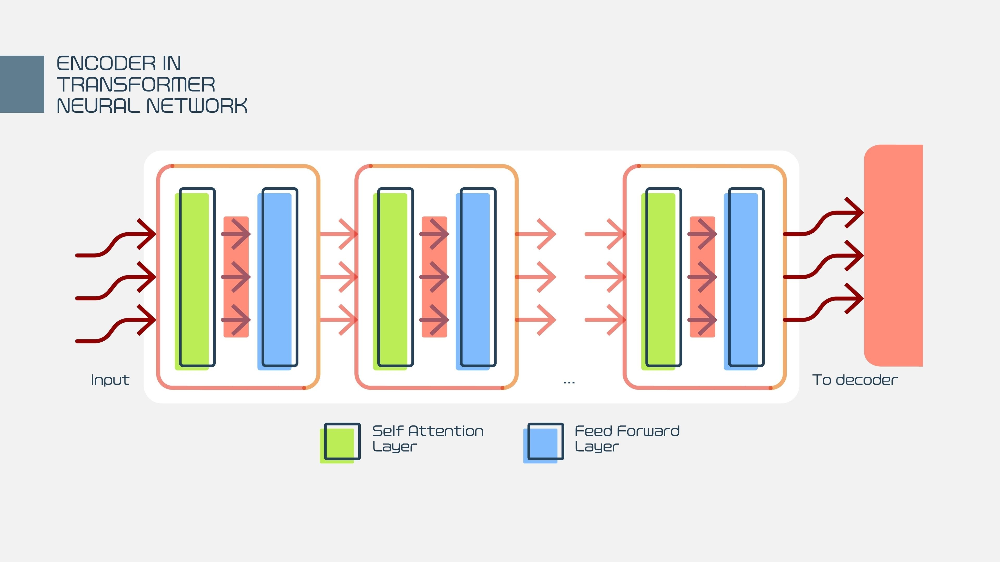

<!-- _class: lead -->

# CPU5006-20: Artificial Intelligence
## Session 10: Generative AI

------------------------------------------------------------------------

## Course Overview

Week | Session | |
-----|------|---|
11 | Generative AI | S2
12 | Building AI Agents |

---

# Overview

-   What is an LLM?
-   How LLMs are trained
-   How they generate text
-   Key components: tokens, embeddings, transformers
-   Strengths and limits
-   Real-world applications
-   Ethical considerations
-   Future directions

------------------------------------------------------------------------

# What Is a Large Language Model?

-   An AI system trained to understand and generate human language
-   Built using deep learning
-   Learns patterns from massive text datasets
-   Predicts the next word (token) in a sequence

------------------------------------------------------------------------

# Why Are They "Large"?

-   Millions to trillions of parameters
-   Large datasets = broad knowledge
-   Greater capacity = better performance$^*$

------------------------------------------------------------------------

# Tokens: The Language of LLMs

-   Text is broken into **tokens** (words, subwords, characters)
-   LLMs process and predict tokens, not full sentences
-   Example:
    -   "Computing is fun" = \["Comput", "ing", " is", " fun"\]

------------------------------------------------------------------------

# Embeddings

-   Tokens are converted into vectors (numbers)
-   Vectors capture meaning
-   Similar meanings → similar vectors
-   Think of it as placing words in a high-dimensional meaning space

------------------------------------------------------------------------

# Transformers (The Core Architecture)

-   Introduced in 2017
-   Enable parallel processing of sequences
-   Use **attention mechanisms** to understand context
-   Replaced older models like RNNs and LSTMs

------------------------------------------------------------------------

# Attention (High-Level)

-   Attention helps the model focus on relevant words
-   Example:
    -   In the sentence "The dog chased the cat because **it** was
        scared," attention helps decide what "it" refers to

---

------------------------------------------------------------------------

# How Training Works (Simplified)

-   Feed in text → mask or hide next token
-   Model predicts the hidden token
-   Compare prediction with the true token
-   Adjust parameters (learning)
-   Repeat billions of times

------------------------------------------------------------------------

# Pre-Training

-   Main learning stage
-   Trained on general text (books, websites, articles)
-   Learns grammar, facts, reasoning patterns
-   Very expensive to run (GPU clusters)

------------------------------------------------------------------------

# Fine-Tuning

-   Adaptation to a specific domain or task
-   Examples:
    -   Medical text
    -   Legal advice
    -   Programming assistance

------------------------------------------------------------------------

# RLHF (Reinforcement Learning from Human Feedback)

-   Humans rate outputs
-   Model learns to improve quality and safety
-   Used in modern LLMs (GPT-4, Claude, etc.)

------------------------------------------------------------------------

# How LLMs Generate Text

1.  User provides a prompt
2.  Model encodes tokens → embeddings
3.  Transformer layers process them
4.  Model predicts the next token
5.  Loop until completion

------------------------------------------------------------------------

# Sampling Methods (High-Level)

-   **Greedy decoding**: pick best token each time
-   **Temperature**: randomness level
-   **Top-k / Top-p**: limit choices to best tokens

------------------------------------------------------------------------

# Strengths of LLMs

-   Great at summarisation
-   Programming assistance
-   Language translation
-   Pattern detection
-   Dialogue and tutoring

------------------------------------------------------------------------

# Limitations

-   Lacks true understanding
-   Can hallucinate incorrect information
-   Sensitive to phrasing
-   Biased by training data
-   Requires large computational resources

------------------------------------------------------------------------

# Hallucinations

-   Confident but wrong answers
-   Caused by pattern prediction, not verification
-   Why verification and citations are important

---

# Task

Use this [link](https://tokenprobe.cs.columbia.edu) to see what is happening under the hood with a LLM.

https://tokenprobe.cs.columbia.edu

------------------------------------------------------------------------

# LLMs in Computing Education

-   Code explanation
-   Debugging support
-   Chat-based tutoring
-   Resource generation

------------------------------------------------------------------------

# LLMs in Industry

-   Customer service bots
-   Developer copilots and automation
-   Data analysis
-   Content generation
-   Search enhancement (RAG systems)

------------------------------------------------------------------------

# Retrieval-Augmented Generation (RAG)

-   LLM + database or documents
-   Retrieves relevant info → feeds model
-   Reduces hallucinations
-   Useful for domain-specific knowledge

------------------------------------------------------------------------

# Example: Chat with RAG

1.  User asks a question
2.  System retrieves documents
3.  LLM summarises and responds using retrieved info

------------------------------------------------------------------------

# Model Sizes (Examples)

-   GPT-2: 1.5B parameters
-   LLaMA 3: 8B--405B
-   GPT-5-class: hundreds of billions (est.)
-   More parameters ≠ always better

------------------------------------------------------------------------

# Safety & Ethics

-   Bias and fairness
-   Data privacy
-   Misuse (deepfakes, misinformation)
-   Responsibility of developers and users

------------------------------------------------------------------------

# Best Practices for Using LLMs

-   Verify outputs
-   Prompt effectively
-   Avoid sensitive data
-   Use citations where possible
-   Understand limitations

------------------------------------------------------------------------

# Careers Related to LLMs

-   ML Engineer
-   Data Scientist
-   AI Ethics Specialist
-   Prompt Engineer
-   Research Scientist
-   Solutions Architect (AI Systems)

------------------------------------------------------------------------

# The Future of LLMs

-   Smaller, efficient models
-   Better reasoning
-   Multimodal (text, images, audio)
-   Personalised AI agents
-   Safer and more transparent systems

------------------------------------------------------------------------

# Summary

-   LLMs learn patterns from huge datasets
-   Use transformers and attention
-   Generate text by predicting tokens
-   Powerful but limited
-   Huge impact across computing

------------------------------------------------------------------------

# Lets Build a LLM Chat bot

- We will Use Ollama
- Flask

---

# Next Session

- Creating AI Agents