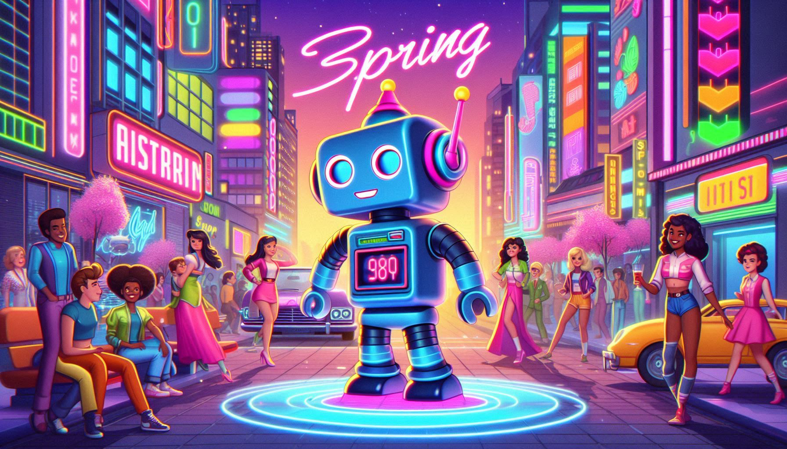
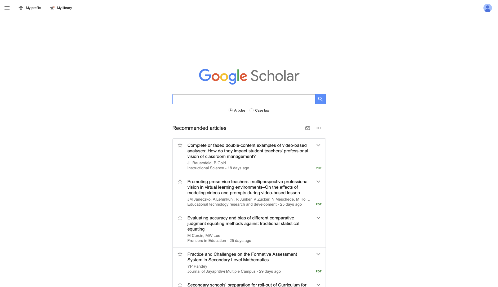
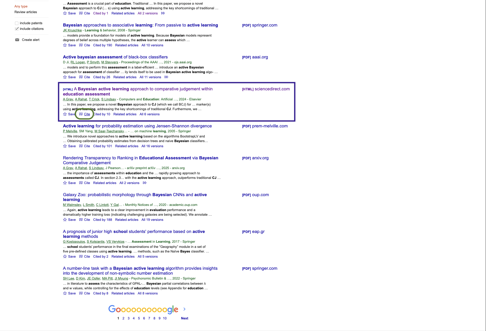
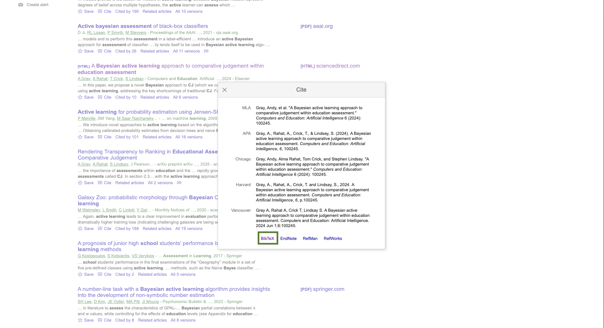
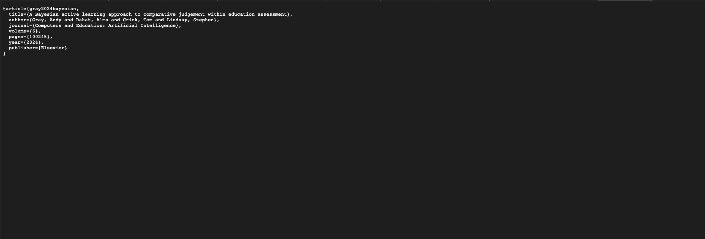

<!-- _class: lead -->

# CPU5006-20: Artificial Intelligence
## Session 2: What is AI?
#### History, paradigms, and literature review

<!-- _footer: "" -->

---

## Learning Outcomes

By the end of this session, you should be able to:

- explain key stages in the history of AI
- distinguish between major AI paradigms
- describe what a literature review does in a scientific report
- begin shaping a research question for S1
- identify relevant sources for rule-based AI research

---

## Course Overview

Week | Session | |
-----|------|----|
2 | History of AI & conducting a literature review |
3 | Rule-Based AI Systems |
4 | S1 Assessment Workshop |
5 | Supervised Learning |
RW | Reading Week |
6 | Unsupervised Learning | S1
7 | Artificial Neural Networks |
8 | Convolutional NN & Computer Vision |
9 | Recurrent NN & NLP |
10 | S2 Assessment Workshop |
11 | Generative AI | S2
12 | Building AI Agents |

---

## Session Overview

### Part 1 — What is AI?
- history of AI
- key paradigms
- why definitions matter

### Part 2 — How do we study AI?
- literature reviews
- critical reading
- finding research gaps

### Part 3 — Your S1 assignment
- topic ideas
- datasets
- getting started in Overleaf

---

## Starter Activity: Is this AI? 
<!-- (5 mins) -->

In pairs, decide whether each example is:

- definitely AI
- maybe AI
- probably not AI

Examples:
- a calculator
- a rule-based chatbot
- a spam filter
- ChatGPT
- Netflix recommendations

Be ready to justify **why**.

<!-- 
1. Calculator
👉 Probably not AI
- Follows fixed rules (arithmetic operations)
- No learning, no adaptation
- Same input → same output every time
💡 Good teaching point:
- Not all “smart” software is AI

2. Rule-based chatbot
👉 Maybe AI (or weak AI)
Uses predefined rules (if user says X → respond Y)
No learning or generalisation
Historically considered AI (symbolic AI)
💡 Link to next session:
This is exactly what you’ll build in Session 3

3. Spam filter
👉 Definitely AI (modern view)
Typically uses machine learning
Learns patterns from data
Improves over time
⚠️ Caveat:
Early spam filters were rule-based → could be “maybe AI”
💡 Good discussion point:
Same task, different approaches → different “AI-ness”

4. ChatGPT
👉 Definitely AI
Uses large language models
Learns from massive datasets
Generates new content (not just rules)
💡 Extension:
This is generative AI — a key modern paradigm

5. Netflix recommendations
👉 Definitely AI
Uses machine learning/recommender systems
Learns user preferences
Predicts behaviour
💡 Link: This connects to supervised/unsupervised learning later
 -->

---

<!-- _class: lead -->

## Part 1: What is AI?

<!-- _footer: "" -->

---

## Why study the history of AI?

- it shows that AI is **not one single thing**
- different approaches have become popular at different times
- ideas from the past still influence systems today
- understanding this helps you evaluate AI critically

---

## Early Beginnings

- the idea of artificial beings is much older than computers
- stories of mechanical or intelligent artefacts appear in ancient cultures
- modern AI emerges when computing, logic, and mathematics come together in the 20th century

---

<!-- _footer: "" -->

---

## Birth of AI (1956)

- the term **Artificial Intelligence** was popularised by John McCarthy in 1956
- the Dartmouth workshop is often seen as the formal starting point of AI as a field
- early optimism led to substantial funding and bold predictions

<!-- 
In 1956, the field of Artificial Intelligence was officially born at a conference at Dartmouth College. Here, John McCarthy coined the term 'Artificial Intelligence,' marking a pivotal moment in the development of the field. This event sparked early optimism, with researchers believing that, within a few decades, we would have machines capable of human-level intelligence. As a result, there was a significant influx of funding and research during this time, as people hoped AI would revolutionise the world in a short span of time.
 -->

---

## Early Optimism

- researchers believed human-like intelligence might be achieved quickly
- early systems showed promise in logic and problem solving
- expectations rose faster than the technology could support

---

<!-- _footer: "" -->

---

## AI Winter (1974–1980)

- progress was slower than expected
- computing power and data were limited
- confidence and funding dropped

### Key lesson:
AI progress is shaped by both ideas **and** practical constraints.

<!-- 
However, AI's early promise didn’t pan out as quickly as expected. Progress was much slower than anticipated, and the limitations of early computers became apparent. By the mid-1970s, disillusionment set in. Funding for AI research dried up, and the field entered what is now known as the 'AI Winter.' During this period, both public and scientific interest in AI waned, as many concluded that true artificial intelligence was far more challenging than they had initially thought.
 -->

---

<!-- _footer: "" -->

---

## AI Spring (1980–1987)

- expert systems revived interest in AI
- commercial applications increased
- organisations saw value in narrow, domain-specific intelligence

<!-- 
But the story of AI didn’t end with the AI Winter. The 1980s brought a new wave of interest in artificial intelligence, often referred to as the 'AI Spring.' This resurgence was driven by the rise of expert systems—software that could emulate the decision-making abilities of a human expert in specific fields. Coupled with advances in computing power, this period saw a renewed optimism, and investments in AI research once again began to flow, reinvigorating the field.
 -->

---

<!-- _footer: "" -->

---

## Modern AI (21st Century)

- machine learning and deep learning transformed the field
- better hardware, larger datasets, and improved algorithms accelerated progress
- AI now appears in search, vision, speech, recommendation, and generative tools

<!-- 
Fast forward to the 21st century, and we are now in the midst of a major AI boom. Advances in machine learning, particularly deep learning, have led to breakthroughs that were previously unimaginable. AI is no longer just a research field; it has become an integral part of our daily lives, from personal assistants like Siri and Alexa to recommendation algorithms on platforms like Netflix and YouTube. The rapid pace of innovation in AI has transformed industries across the board, from healthcare to transportation, and its growth shows no sign of slowing.
 -->

---

<!-- _footer: "" -->

---

## Future of AI

- The future of AI holds much promise and uncertainty.
- Ethical considerations are becoming increasingly important.

<!-- 
Looking ahead, the future of AI holds immense potential but also significant challenges. As AI continues to evolve, it will unlock new possibilities in fields such as autonomous vehicles, personalised medicine, and even creative industries like art and music. However, along with these advancements come critical ethical questions—how do we ensure AI systems are fair, transparent, and accountable? How can we prevent AI from being misused? As we move forward, addressing these ethical considerations will be crucial in shaping the future of AI for the benefit of all.

Also Provide final overview:

- The history of AI is a fascinating journey of ups and downs.
- As we look to the future, it's important to learn from the past.
 -->

---

## Paradigms of AI

| Paradigm | Core idea | Example |
|---|---|---|
| Symbolic AI | rules, logic, knowledge representation | expert systems |
| Statistical / Machine Learning | patterns learned from data | classifiers, regressors |
| Deep / Generative AI | layered representations and generation | image models, LLMs |

---

## Why paradigms matter

Two AI systems can solve the **same problem** in very different ways.

Example:
- a **rule-based** system may use explicit `IF-THEN` rules
- a **machine learning** system may learn patterns from examples

This matters for:
- accuracy
- explainability
- data requirements
- ethics
- implementation choices

---

<!-- _class: task -->

## Task: Sort the examples 
<!-- (8 mins) -->

Classify each example as mainly:

- **symbolic AI**
- **machine learning**
- **deep / generative AI**

Examples:
- medical expert system
- handwritten digit classifier
- ChatGPT
- chess program using fixed rules
- fraud detector trained on historical transactions

### Stretch:
Which of these are easiest to explain to a user?

<!-- 
Symbolic AI = AI that thinks using rules and logic instead of learning from data

Symbolic AI systems use:
Symbols → represent things (e.g. "fever", "high_income")
Rules → define relationships

Key characteristics
✅ Human-readable rules
✅ Transparent decisions (you can explain why)
❌ No learning from data
❌ Hard to scale for complex problems
 -->

---

## Why this matters for your assignment

For S1 you will investigate **rule-based AI**.

That means you are working mainly within the **symbolic AI** tradition.

Your report should show that you understand:

- where rule-based systems fit in the history of AI
- what their strengths are
- what their limitations are
- how they compare with other approaches

---

<!-- _class: summary -->

## Quick Reflection

Complete this sentence:

> Rule-based AI is useful when...

Then complete this one:

> Rule-based AI may struggle when...

Share one idea with the class.

<!--
Rule-based AI is useful when…
If students struggle, give hints:
- when problems are well-defined
- when there are clear rules
- when decisions need to be transparent/explainable
- when the environment is stable (doesn’t change much)

Examples:
- loan approval rules
- basic chatbots
- safety systems

Rule-based AI may struggle when…
Guide them toward:
- complex or messy data
- uncertainty or ambiguity
- problems requiring learning from data
- situations with too many rules to manage

Examples:
- image recognition
- natural language understanding
- unpredictable environments
-->

---

## S1 Assessment Overview

You will:

- design and implement a rule-based AI system
- test it on a chosen dataset
- evaluate how well it works
- write up the work as a scientific paper

### Deliverables
- a scientific paper
- code implementation

---

<!-- _class: summary -->

## Report Structure for S1

- Introduction
- Literature Review
- Methodology
- Results and Discussion
- Conclusion
- References

---

## Marking Criteria

- Introduction and Literature Review (25%)
- Methodology (25%)
- Results and Discussion (25%)
- Conclusion (15%)
- Report Depth and Presentation (10%)*

*This weighting affects the overall score if presentation quality is below the required standard.

---

## Available Datasets

- **Car Evaluation Dataset** — classification using structured attributes
- **Credit Risk Dataset** — decision making / classification
- **Adult Dataset** — income category prediction
- **Food Dataset** — rule-based classification or recommendation style tasks

---

## Example Research Directions

- compare two rule-based approaches on the same dataset
- investigate the interpretability of a rule-based system
- explore the trade-off between simplicity and accuracy
- test how rule design affects classification performance

---

## Task 2: Build a research question (10 mins)

Choose **one dataset** and draft:

1. your dataset
2. the problem you want to solve
3. one possible research question

### Example starter:
> "How accurately can a rule-based system classify ... ?"

### Stretch:
Write a second question that focuses on **interpretability**, not just accuracy.

---

<!-- _class: lead -->

## Part 2: How do we study AI?

---

## What is a literature review?

A literature review is not just a list of papers.

It should:

- explain what is already known
- compare different approaches or findings
- identify strengths, weaknesses, and debates
- show the gap your own work will address

---

## Literature Review in THIS Module

For this assignment, your literature review should help answer:

- What are rule-based AI systems?
- Where are they effective?
- What are their limitations?
- How have researchers evaluated them?
- What gap or angle will my project explore?

---

## Step 1: Define your scope

Be specific.

Instead of:
> "I will review AI in finance."

Try:
> "I will review research on rule-based methods for credit risk classification."

A good scope is:
- focused
- relevant to your dataset
- linked to your research question

---

## Task 3: Narrow the topic (5 mins)

Turn each broad topic into a better literature review scope:

- AI in healthcare
- AI in finance
- AI in education

### Stretch:
Convert one of your improved scopes into a draft research title.

---

## Step 2: Search for relevant sources

Useful databases:
- IEEE Xplore
- ACM Digital Library
- Google Scholar
- your university library databases

Example search strings:
- `"rule-based system" AND "credit risk"`
- `"expert system" AND classification`
- `"decision rules" AND interpretability`

---

## Task 4: Search string builder (8 mins)

Using your chosen dataset, write:

- **two keyword searches**
- **one Boolean search** using AND / OR
- **one alternative search** using a synonym

### Stretch:
Which search is likely to return the most focused results? Why?

---

## Step 3: Summarise and synthesise

### ❌ Do not write:

- Paper 1 says...
- Paper 2 says...
- Paper 3 says...

### ✅ Instead, group sources by:

- theme  
- method  
- dataset  
- findings  
- limitations  

 
 
 
 
 

### Example themes

- accuracy of rule-based systems  
- interpretability and transparency  
- comparison with machine learning models  

---

## Step 4: Critically evaluate

Ask questions like:

- What did the authors do well?
- What evidence supports their claims?
- What are the limitations?
- Is the method suitable for real-world use?
- Can the results be compared fairly with other studies?

---

## Task 5: Quick critical reading (10 mins)

Read the paper called `research_paper.pdf`:

- the research aim
- the method used
- one strength
- one limitation
- one sentence you could use in a literature review

### Stretch:
How does this source help justify your own project?

---

## Step 5: Identify gaps and opportunities

A good literature review leads to a gap.

Examples:
- limited comparison of rule-based methods on this dataset
- strong focus on accuracy, but not explainability
- few studies using simple rules for transparent decision making

Your project should respond to a gap, not repeat old work without purpose.

---

## Mini Writing Frame

A suggested writing structure:

1. introduce the theme  
2. compare what studies found  
3. evaluate strengths / weaknesses  
4. identify a gap  
5. link to your project  

---

## Task 6: Draft a synthesis paragraph (10 mins)

Write 4–6 sentences that:

- introduce a theme linked to your topic
- compare at least two ideas or sources
- identify one limitation or gap

### Stretch:
Add a final sentence that links the gap directly to your S1 study.

---

## Writing a Scientific Paper

- **Introduction** — what problem are you studying and why?
- **Literature Review** — what is already known?
- **Methodology** — what did you do?
- **Results and Discussion** — what happened and what does it mean?
- **Conclusion** — what can be taken from the study?
- **References** — what sources did you use?

---

## Part 3: Getting Started with Tools

- use **Overleaf** to structure and write your report
- use a reference manager or `.bib` file to store citations
- keep notes on papers as you read them
- record full reference details from the start

---

## LaTeX

---

## LaTeX and Overleaf

- LaTeX is widely used for scientific and technical writing
- Overleaf provides an online editor with templates and collaboration features
- it is well suited to reports with references, figures, tables, and equations

---

## Useful Starting Templates

- Harvard style template
- Two-column scientific paper template

### Tip:
Pick **one** template early and keep the structure consistent.

---

## Getting `.bib` References

<!-- _footer: "" -->

---

<!-- _footer: "" -->

---

<!-- _footer: "" -->

---

<!-- _footer: "" -->

---

## Task

Before next week, make a start on all four:

- read the S1 brief carefully
- choose a dataset
- draft a research question
- find at least **3 relevant academic sources**

### Stretch:
Set up your Overleaf document and add your first references.

---

## Key Takeaways

- AI has evolved through multiple waves and paradigms
- rule-based AI sits within the symbolic tradition
- literature reviews compare, evaluate, and identify gaps
- your S1 report should connect theory, implementation, and evaluation

---

## Next Session

- Rule-Based AI Systems
- Introduction to Methodology
- Designing rules from data
