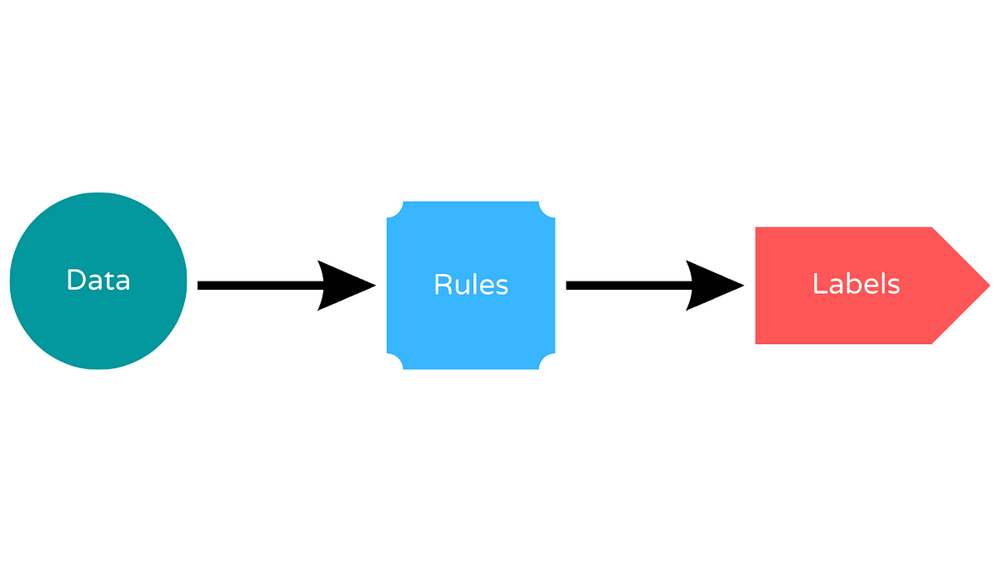

<!-- _class: lead -->


# CPU5006-20: Artificial Intelligence
## Session 3: Rule-based AI Systems

<!-- _footer: "" -->

---

## Course Overview

Week | Session | |
-----|------|---|
3 | Rule-Based AI Systems |
4 | S1 Assessment Workshop |
5 | Supervised Learning |
RW | Reading Week |
6 | Unsupervised Learning |  S1
7 | Artificial Neural Networks |  
8 | Convolutional NN & Computer Vision |
9 | Recurrent NN & NLP |
10 | S2 Assessment Workshop |
11 | Generative AI | S2
12 | Building AI Agents |

---

## Overview


- Rule-based AI Systems
- How to write a Methodology

---

## Introduction to Rule-Based AI Systems

- AI systems that use a set of "if-then" rules to derive conclusions.

---

## Introduction to Rule-Based AI Systems

- Early AI approach, prominent in the 1970s and 1980s.
- Main concept is to "Encode expert knowledge into a system of rules".

---

## Components of Rule-Based Systems

1. **Knowledge Base**
2. **Inference Engine**
3. **User Interface**

<!-- 
More detail to follow in next few slide.
 -->

---

## Components of Rule-Based Systems

1. **Knowledge Base**:
   - Contains rules and facts.
   - Example: IF condition THEN action.

---

## Components of Rule-Based Systems

2. **Inference Engine**:
   - Processes rules and facts to derive conclusions.
   - Methods: Forward chaining and backward chaining.

---

## Components of Rule-Based Systems

3. **User Interface**:
   - Allows interaction with the system.
   - Input facts, view conclusions.

---

## How Rule-Based Systems Work

### Forward Chaining

1. Start with known facts.
2. Apply rules to derive new facts.
3. Continue until goal is reached or no more rules can be applied.

---

```python
# Known facts
facts = {
    "student_is_tired": True,
    "deadline_soon": True
}

# New facts will be added here
inferred = {}

# Forward chaining process
changed = True

while changed:
    changed = False

    # Rule 1
    if facts.get("student_is_tired") and "suggest_break" not in inferred:
        inferred["suggest_break"] = True
        changed = True

    # Rule 2
    if facts.get("deadline_soon") and inferred.get("suggest_break") and "suggest_short_break" not in inferred:
        inferred["suggest_short_break"] = True
        changed = True

    # Rule 3
    if inferred.get("suggest_short_break") and "action" not in inferred:
        inferred["action"] = "Take a 10-minute break, then resume work"
        changed = True

# Final output
print("Inferred facts:", inferred)
print("Final decision:", inferred.get("action"))
```

---

## How Rule-Based Systems Work

### Backward Chaining

1. Start with a goal (desired conclusion).
2. Work backwards to find rules that support the goal.
3. Continue until all facts supporting the goal are found.

---

```python
# Known facts
facts = {
    "student_is_tired": True,
    "deadline_soon": True
}

# Rules represented as functions
def suggest_break(facts):
    return facts.get("student_is_tired", False)

def suggest_short_break(facts):
    return facts.get("deadline_soon", False) and suggest_break(facts)

def action(facts):
    return suggest_short_break(facts)


# Backward chaining: start with the goal
goal = "action"

if action(facts):
    print("Goal achieved: Take a 10-minute break, then resume work.")
else:
    print("Goal not achieved.")
```

<!-- 
We start with the goal:
Do we take a break?

Then work backwards:
1. To take a break → need suggest_short_break
2. To get that → need:
    - deadline_soon = True
    - suggest_break = True
3. To get suggest_break → need:
    - student_is_tired = True

Since all required facts are true → goal is achieved.
-->

---

## Advantages of Rule-Based Systems

- **Transparency**: Easy to understand and explain.
- **Modularity**: Simple to add or modify rules.
- **Speed**: Efficient for well-defined problems.

---

## Disadvantages of Rule-Based Systems

- **Scalability**: Difficult to manage large rule sets.
- **Flexibility**: Struggle with ambiguous or incomplete data.
- **Maintenance**: Updating rules can be cumbersome.

---

## Applications of Rule-Based Systems

- **Expert Systems**: Medical diagnosis, financial advice.
- **Control Systems**: Industrial automation, climate control.
- **Game AI**: NPC behavior, strategy planning.

---

## Examples and Case Studies

### Example: Medical Diagnosis System

- **Knowledge Base**: Symptoms and diagnoses.
- **Inference Engine**: Forward chaining to match symptoms to possible diseases.
- **Outcome**: Suggest potential diagnoses to doctors.

---

## Examples and Case Studies

### Case Study: MYCIN

- **Developed**: 1970s at Stanford.
- **Purpose**: Diagnose bacterial infections and recommend antibiotics.
- **Impact**: Showed effectiveness of rule-based systems in expert domains.

---

## Rule-based AI Summary

- Rule-based AI systems are foundational in AI history.
- Suitable for well-defined problems with clear rules.
- Understanding limitations and applications is crucial.

---

## Rule-Based Systems Examples



---

```python
class RuleBasedAI:
    def __init__(self):
        self.rules = {
            "hello": "Hello! How can I assist you today?",
            "how are you": "I'm an AI, I don't have feelings, but I'm here to help you. What can I do for you?",
            "what is your name": "I'm a Rule Based AI created for 2nd year university computing students.",
            "default": "I'm sorry, I didn't understand that. Could you please rephrase?"
        }

    def respond(self, message):
        for rule in self.rules:
            if rule in message.lower():
                return self.rules[rule]
        return self.rules["default"]

# Create an instance of the AI
ai = RuleBasedAI()

# Test the AI
print(ai.respond("Hello"))
print(ai.respond("How are you"))
print(ai.respond("What is your name"))
print(ai.respond("What is the meaning of life"))
```

---

```python
class RuleBasedAI:
    def respond(self, message):
        message = message.lower()
        if "hello" in message:
            return "Hello! How can I assist you today?"
        elif "how are you" in message:
            return "I'm an AI, I don't have feelings, but I'm here to help you. What can I do for you?"
        elif "what is your name" in message:
            return "I'm a Rule Based AI created for 2nd year university computing students."
        else:
            return "I'm sorry, I didn't understand that. Could you please rephrase?"

# Create an instance of the AI
ai = RuleBasedAI()

# Test the AI
print(ai.respond("Hello"))
print(ai.respond("How are you"))
print(ai.respond("What is your name"))
print(ai.respond("What is the meaning of life"))
```

---

```python
class MedicalRuleBasedAI:
    def __init__(self):
        self.rules = {
            "cough and fever": """You may have a common cold. However, if the fever is high, 
            it could be a sign of the flu or COVID-19.""",
            "headache and blurred vision": """These symptoms could indicate a migraine. 
            However, if they persist, you should see a doctor as they could be signs of a more serious condition, such as a brain tumor.""",
            "chest pain and shortness of breath": """These are serious symptoms that could indicate a heart attack. 
            Seek immediate medical attention."""
        }

    def diagnose(self, symptoms):
        for rule in self.rules:
            if rule in symptoms.lower():
                return self.rules[rule]
        return "Your symptoms don't match any common diseases. If you're feeling unwell, you should see a doctor."

# Create an instance of the AI
ai = MedicalRuleBasedAI()

# Test the AI
print(ai.diagnose("I have a cough and fever"))
print(ai.diagnose("I have a headache and blurred vision"))
print(ai.diagnose("I have chest pain and shortness of breath"))
print(ai.diagnose("I have a runny nose and sore throat"))
```

---

```python
class MedicalRuleBasedAI:
    def __init__(self):
        self.rules = {
            ("cough", "fever"): ("Common Cold", 0.6),
            ("headache", "blurred vision"): ("Migraine", 0.7),
            ("chest pain", "shortness of breath"): ("Heart Attack", 0.9)
        }

    def add_rule(self, symptoms, diagnosis, certainty):
        self.rules[symptoms] = (diagnosis, certainty)

    def diagnose(self, symptoms):
        symptoms = set(symptoms.lower().replace("i have a ", "").replace("i have ", "").split(", "))
        diagnoses = []
        for rule in self.rules:
            if set(rule).issubset(symptoms):
                diagnoses.append(self.rules[rule])
        if diagnoses:
            diagnoses.sort(key=lambda x: x[1], reverse=True)
            return f"The most likely diagnosis is {diagnoses[0][0]} with a certainty of {diagnoses[0][1]*100}%."
        return "Your symptoms don't match any common diseases. If you're feeling unwell, you should see a doctor."

# Create an instance of the AI
ai = MedicalRuleBasedAI()

# Add a new rule
ai.add_rule(("runny nose", "sore throat"), "Common Cold or Flu", 0.5)

# Test the AI
print(ai.diagnose("I have a cough, fever"))
print(ai.diagnose("I have a headache, blurred vision"))
print(ai.diagnose("I have chest pain, shortness of breath"))
print(ai.diagnose("I have a runny nose, sore throat"))
```
---

```python
class SymptomChecker:
    def __init__(self):
        self.symptom_chains = {
            'fever': {
                'next': ['cough', 'sore throat', 'body aches'],
                'diagnosis': 'You may have the flu.'
            },
            'cough': {
                'next': ['shortness of breath'],
                'diagnosis': 'You may have a respiratory infection.'
            },
            'headache': {
                'next': ['nausea', 'blurred vision'],
                'diagnosis': 'You may have a migraine.'
            },
            # Add more symptom chains as needed
        }

    def check_symptoms(self, symptom):
        if symptom in self.symptom_chains:
            next_symptoms = self.symptom_chains[symptom]['next']
            print(f"Do you have any of these symptoms: {', '.join(next_symptoms)}?")
            user_response = input()
            if any(s in user_response for s in next_symptoms):
                print(self.symptom_chains[symptom]['diagnosis'])
            else:
                print("It's unclear what you might have. Please consult with a healthcare professional.")
        else:
            print("Symptom not recognized. Please try again.")

checker = SymptomChecker()
checker.check_symptoms('fever')
```

---

<!-- _class: summary -->

# RB Flask AI App Demo

Notes:
- **Flask** is a web framework
- The **web app** is **not** the **AI system**, the Knowledge engine is
- the web UI is just one possible way to interact with the AI system.

---

<!-- _class: task -->

## Rule-Based AI Task

<!-- - In pairs, create a RB AI system that will solve the following problems:
    - Create one using the Backwards Chaining Method using the iris dataset.
    - Create one using the Forward Chaining method using the California dataset. -->

- Complete the `Jupyter Notebook` called: **CPU5006_Session3_Student_Activities.ipynb**.


### Stretch:

- Attempt to create the flask application in the notebook: **CPU5006_Session3_Student_Activities.ipynb**.

---

<!-- _class: summary -->

# S1 Reflection

- Create a scientific paper on a research problem using a RB solution
- Max 3,000 words
- Include a Introduction, Liturature Review, Methodology, Results & Discuission, Conclusion.


---

## How to Write a Methodology

<span style="font-size: 0.7em">

- **Responds to the question of how the problem was studied**. 
    - If your paper is proposing a new method, you need to include detailed information so a knowledgeable reader can reproduce the experiment.
- Do not repeat the details of established methods; 
    - use References and Supporting Materials to indicate the previously published procedures. 
    - Broad summaries or key references are sufficient.
- Reviewers will criticise incomplete or incorrect methods descriptions and may recommend rejection, because this section is critical in the process of reproducing your investigation.

</span>

---

## Purpose of a Methodology

- Explain how the research problem was studied or the solution was developed.
- Provide enough detail for a knowledgeable reader to replicate your work.
- Demonstrate that your approach is valid, rigorous, and appropriate for the research question.

---

## Methodology Key Principles

1. Describe your approach clearly

Example: “We implemented a convolutional neural network (CNN) using TensorFlow 2.10 to classify handwritten digits from the MNIST dataset.”
Include:

<span style="font-size: 0.8em">

- Algorithms or models used
- Tools, libraries, frameworks (e.g., PyTorch, OpenCV, Scikit-learn)
- Hardware/software environment (e.g., GPU type, OS, compiler version)

</span>

---

## Methodology Key Principles

2. Reference established methods instead of repeating them

Example: “The preprocessing pipeline followed the method described by Krizhevsky et al. (2012), with minor modifications to the data augmentation step.”
- Use citations and link to supplementary materials for full details.

---

## Methodology Key Principles

3. Include enough detail for reproducibility

<span style="font-size: 0.8em">

- Data sources: where and how they were obtained
- Preprocessing steps: filtering, normalisation, feature extraction
- Experimental setup: training/validation/test split, hyperparameters, evaluation metrics
- Example: “Hyperparameters were tuned using grid search over learning rates {0.001, 0.01, 0.1} and batch sizes {32, 64}.”
</span>

---

## Methodology Key Principles

4. Avoid common pitfalls

<span style="font-size: 0.8em">

- Incomplete descriptions (e.g., “We trained the model” without specifying parameters)
- Missing references for standard methods
- Omitting hardware/software details that affect performance
- Clearly distinguish between your contributions and existing methods.
- Keep the tone factual and precise — this is not the place for interpretation or discussion.
</span>

---

## Methodology

Example excerpt:

The dataset comprised 50,000 labelled network traffic records from the UNSW-NB15 dataset (Moustafa & Slay, 2015). Data was normalised to zero mean and unit variance. We implemented a Random Forest classifier using Scikit-learn 1.3.0, with 200 estimators and a maximum depth of 15. Model performance was evaluated using 10-fold cross-validation, reporting mean accuracy, precision, recall, and F1-score.

---

<!-- _class: task -->

## Task
### Dedicated S1 Assessment time

- Start implementing your Rule-based AI system(s) for your chosen topic
- Start writing your methodology

---

<!-- _class: summary -->

## Next Session

- How to write a results and discussion in a research paper
- How to write a conclusion
- Dedicated time for your Assessment S1 and gain verbal feedback