<!-- _class: lead -->


# Supervised Learning

<!-- _footer: "" -->

---

## Course Overview

Week | Session | |
-----|------|---|
5 | Supervised Learning |
RW | Reading Week |
6 | Unsupervised Learning |  S1
7 | Artificial Neural Networks |  
8 | Convolutional NN & Computer Vision |
9 | Recurrent NN & NLP |
10 | S2 Assessment Workshop |
11 | Generative AI | S2
12 | Building AI Agents |

---

## Overview

- What is Supervised Learning
- Regression Techniques
- Classification Techniques

---

<!-- _class: lead -->

## <span style="color:lightgreen; text-shadow: black 3px 6px 10px"> What is Supervised Learning?

</span>


---

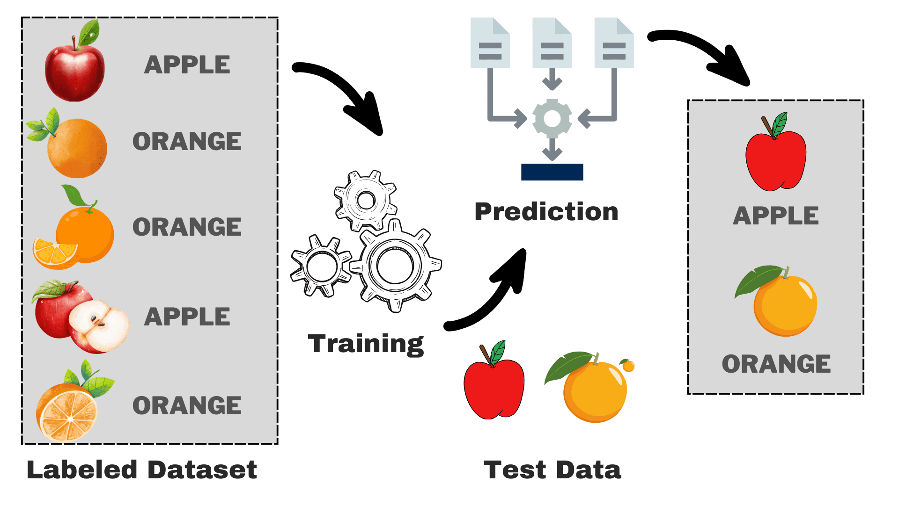

--- 

# Types of Supervised Learning

- Regression
- Classification


---

## Regression 


---

## Regression

- Regression is a statistical method used in ML to model and analyse the relationships between a dependent variable (output) and one or more independent variables (inputs). 
- It aims to predict the dependent variable’s value based on the independent variables’ values.
- In ML, regression is a type of supervised learning in which the model learns from a dataset of input-output pairs. 

---

# Regression

- The model identifies patterns in the input features to predict continuous numerical values of the output variable. 
- Regression algorithms help solve regression problems by finding the relationship between the data points and fitting a regression model.


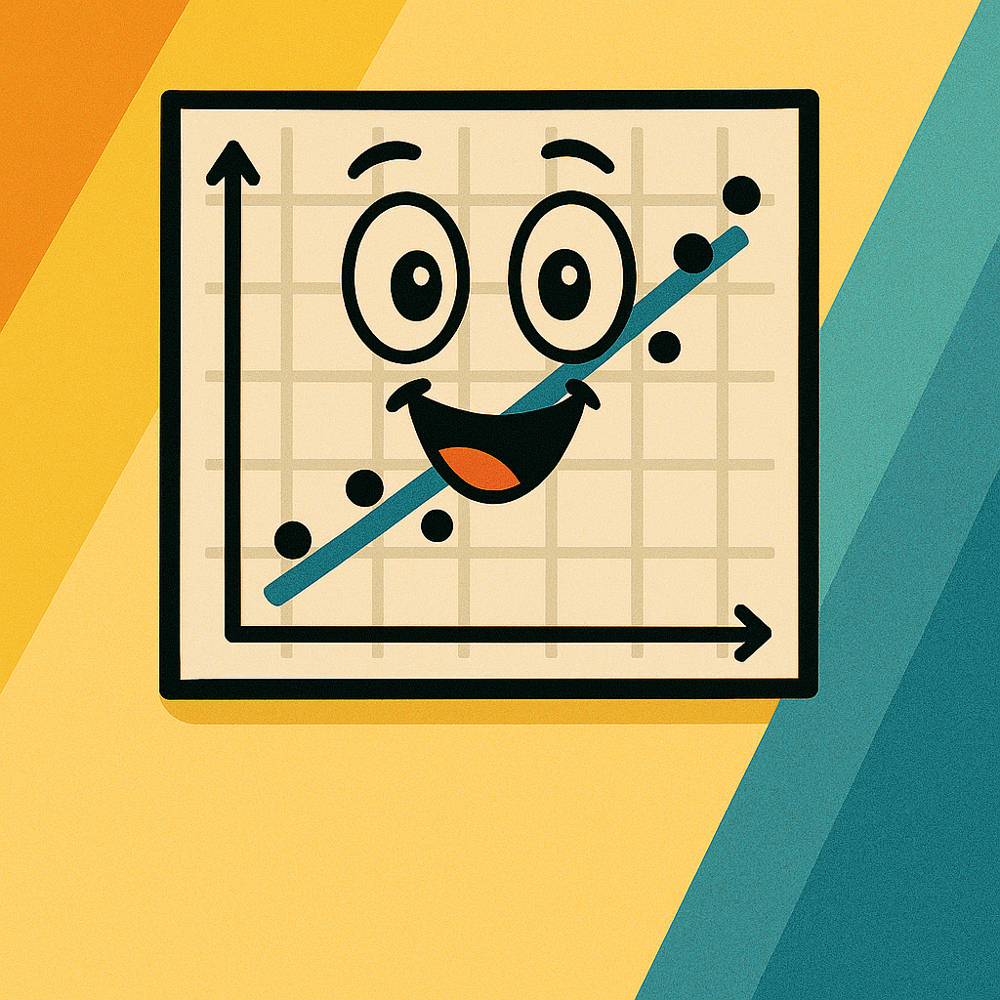

---

## Applicactions of Regression

Finance and Economics:

<span style="font-size: 0.8em">

- Stock Price Prediction: Predicting future stock prices based on historical data, market trends, and economic indicators.
- Risk Management: Estimating the risk of investment portfolios and calculating Value at Risk (VaR).
- Economic Forecasting: Modeling economic indicators like GDP growth, unemployment rates, and inflation trends.
- Credit Scoring: Assessing the creditworthiness of individuals or companies by predicting default probabilities.
</span>

---

## Applicactions of Regression

Healthcare:

<span style="font-size: 0.8em">

- Disease Progression: Predicting the progression of diseases such as diabetes or cancer based on patient history and medical data.
- Patient Outcomes: Estimating patient survival rates, recovery times, and treatment effectiveness.
Healthcare Costs: Forecasting hospital readmission rates and healthcare expenditures.

</span>


---

## Applicactions of Regression

Marketing and Sales:

<span style="font-size: 0.8em">

- Customer Lifetime Value (CLV) Is the total value a customer will bring to a business over the course of their relationship.
- Sales Forecasting: Predicting future sales based on historical sales data, market conditions, and promotional activities.
Market Response Modeling: Understanding and predicting consumer responses to marketing campaigns and changes in pricing.

</span>

<style scoped>


</style>


---

# Applicactions of Regression

Engineering and Manufacturing:
- Predictive Maintenance: Forecasting equipment failures and maintenance needs to reduce downtime and repair costs.


---

## Applicactions of Regression

Environmental Science:

<span style="font-size: 0.8em">

- Weather Forecasting: Predicting weather conditions such as temperature, rainfall, and wind speed.
- Climate Change Modeling: Estimating the impacts of climate change on various environmental factors.
- Pollution Levels: Forecasting air and water pollution levels based on industrial activities, traffic, and meteorological data.

</span>

---

## Applicactions of Regression

Retail and E-commerce:

<span style="font-size: 0.8em">

- Demand Forecasting: 
    - Predicting future product demand to optimize inventory levels and supply chain management.
- Price Optimisation: 
    - Estimating the optimal pricing strategy to maximize revenue and profit.

</span>

---

## Applicactions of Regression

Transportation and Logistics:
- Delivery Time Estimation: 
    - Forecasting delivery times in logistics and supply chain operations based on various factors, such as distance, traffic, and weather conditions.

---

## Linear Regression

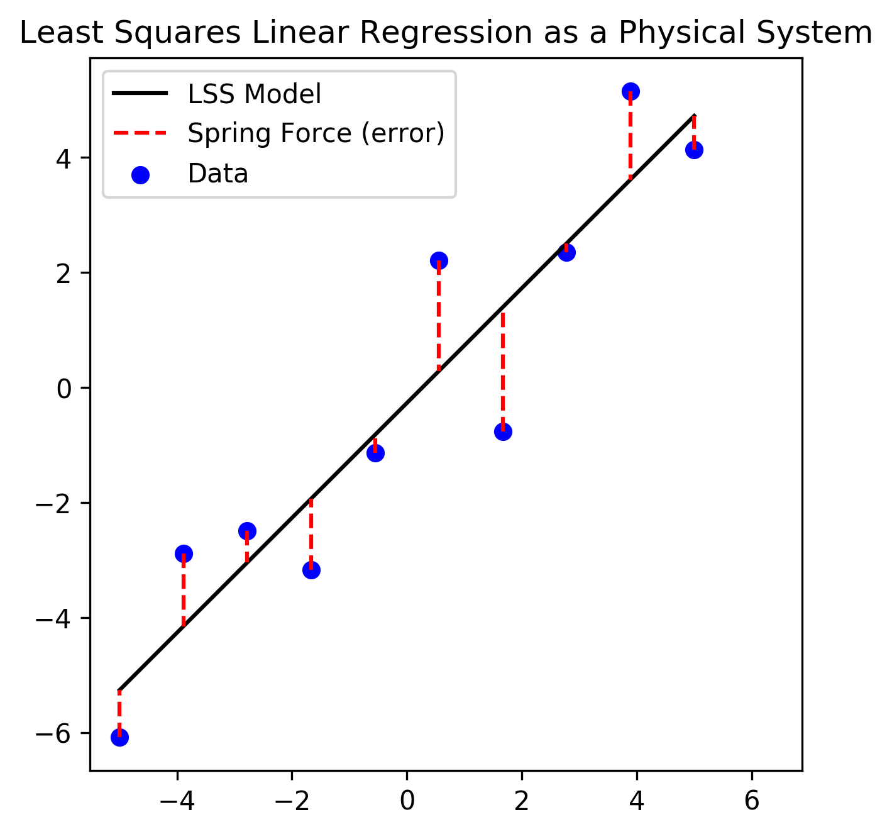

---

## Linear Regression

<span style="font-size: 0.8em">

```python
import numpy as np
from sklearn.linear_model import LinearRegression

X = np.array([[1, 1], [1, 2], [2, 2], [2, 3]])
y = np.dot(X, np.array([1, 2])) + 3
reg = LinearRegression().fit(X, y)
reg.score(X, y)
>>> 1.0
reg.coef_
>>> array([1., 2.])
reg.intercept_
>>> 3.0...
reg.predict(np.array([[3, 5]]))
>>> array([16.])
```

---

## Polynomial Regression

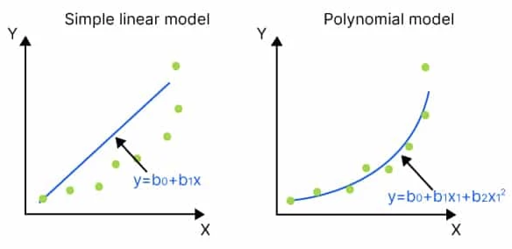

---

## Polynomial Regression

<span style="font-size: 0.8em">

```python
from sklearn.preprocessing import PolynomialFeatures
from sklearn.linear_model import LinearRegression

#specify degree of 3 for polynomial regression model
#include bias=False means don't force y-intercept to equal zero
poly = PolynomialFeatures(degree=3, include_bias=False)

#reshape data to work properly with sklearn
poly_features = poly.fit_transform(x.reshape(-1, 1))

poly_reg_model = LinearRegression()
poly_reg_model.fit(poly_features, y)

#display model coefficients
print(poly_reg_model.intercept_, poly_reg_model.coef_)
>>> 33.62640037532282 [-11.83877127   2.25592957  -0.10889554]
```

---

## Polynomial Regression

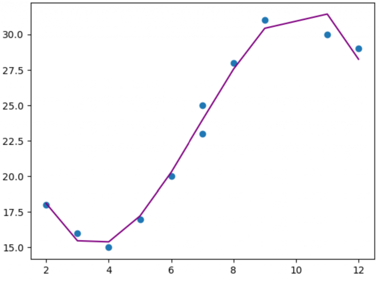

```python
#use model to make predictions on response variable
y_predicted = poly_reg_model.predict(poly_features)

#create scatterplot of x vs. y
plt.scatter(x, y)

#add line to show fitted polynomial regression model
plt.plot(x, y_predicted, color='purple')
```

---

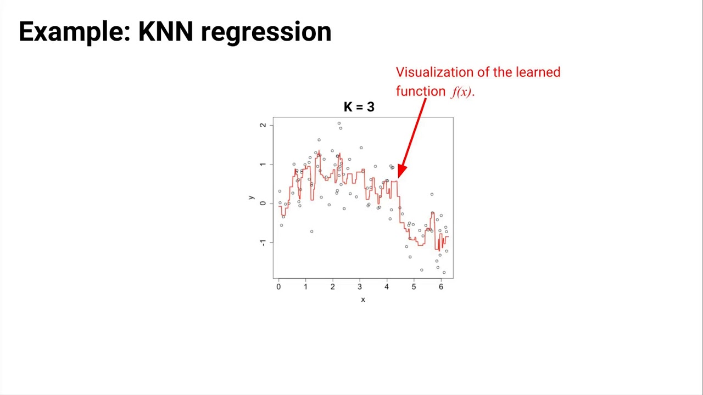

<!-- 
K-Nearest Neighbors (KNN) works for regression in simple terms:

Data Points: Imagine you have data points, each with a value you know (like house prices) and some information about them (like size, location, etc.).

New Point: You get a new data point and want to predict its value (e.g., the price of a new house).

Find Neighbors: KNN looks at the K closest points to the new one, where "closest" means similar based on the information you have (like size and location).

Average the Values: Once it finds those K neighbors, it takes their values (e.g., house prices) and calculates the average.

Prediction: This average becomes the prediction for your new data point.

So, KNN regression is like asking the neighbors of a house what they sold for and using the average to estimate the price of the new house.
 -->

---

# kNN Regression

<div style="display: flex; justify-content: space-between;">

<div style="width: 48%;">

```python
import numpy as np
from sklearn.neighbors import KNeighborsRegressor
from sklearn.model_selection import train_test_split
from sklearn.metrics import mean_squared_error

# Generate synthetic data
np.random.seed(42)
X = np.random.rand(100, 1)  # 100 samples, 1 feature
y = X[:, 0] * 10 + np.random.randn(100) * 0.5  # Linear relationship with some noise

# Split the data into training and testing sets
X_train, X_test, y_train, y_test = train_test_split(X, y, 
                                                    test_size=0.2, 
                                                    random_state=42)
# Create and train the KNN regressor
knn = KNeighborsRegressor(n_neighbors=5)
knn.fit(X_train, y_train)
```

</div>
<div style="width: 48%;">

```python
# Make predictions
y_pred = knn.predict(X_test)

# Evaluate the model
mse = mean_squared_error(y_test, y_pred)
print(f"Mean Squared Error: {mse}")

# Plot the results
import matplotlib.pyplot as plt

plt.scatter(X_test, y_test, color='blue', label='Actual')
plt.scatter(X_test, y_pred, color='red', label='Predicted')
plt.xlabel('Feature')
plt.ylabel('Target')
plt.title('KNN Regression')
plt.legend()
plt.show()
```
</div>
</div>

---

## Task: Regression Analysis

<span style="font-size:0.75em">

- Dataset Selection: Select a regression dataset from the UCI repository - Auto MPG for predicting fuel efficiency.
- Data Exploration: Perform exploratory data analysis (EDA) on the dataset to understand the features and the target variable.
- Model Application: Use Linear Regression and Polynomial Regression to predict the target variable.
- Evaluation: Evaluate the model’s performance using metrics like Mean Absolute Error (MAE) and Mean Squared Error (MSE).
- Reflection: Compare the results of Linear vs. Polynomial Regression and reflect on the differences in performance.

</span>

---

<!-- _class: lead -->


<div style="width: 55%; position: absolute;
    right: 75px; top: 150px">

# Machine Learning

# Classification 

</div>

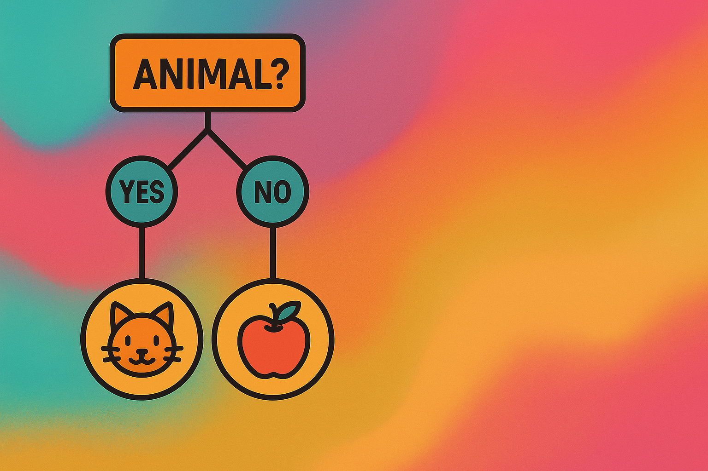

---

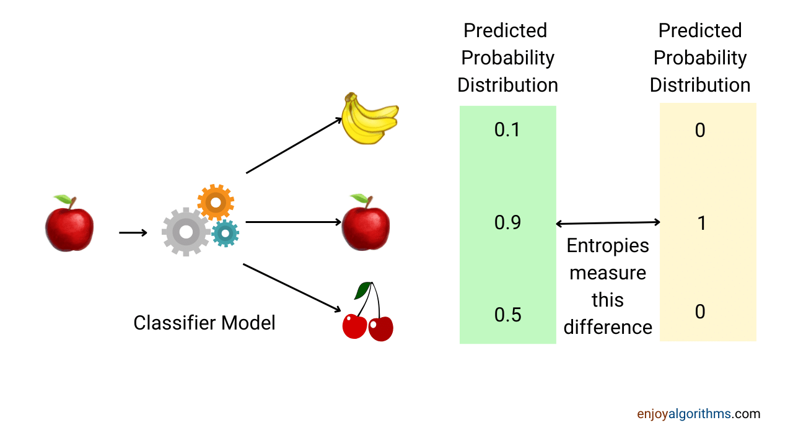

---

## Applications of Classification

Healthcare:

<span style="font-size:0.75em">

Disease Diagnosis:
- Classifying whether a patient has a disease based on symptoms and test results.
- Logistic Regression, Decision Trees, Naive Bayes.

Medical Imaging:
- **Example**: Classifying types of cells in a biopsy or detecting anomalies in X-rays and MRIs.
- **Algorithms**: Convolutional Neural Networks (CNNs).

</span>

---

## Applications of Classification

Finance:

<span style="font-size: 0.75em">

Credit Scoring

- **Example**: Predicting whether a loan applicant will default on their loan.
- **Algorithms**: Logistic Regression, Support Vector Machines (SVMs), Random Forest.

Fraud Detection

- **Example**: Identifying fraudulent transactions based on transaction patterns.
- **Algorithms**: Random Forest, Gradient Boosting, Neural Networks.

</span>

---

## Applications of Classification

Marketing

<span style="font-size: 0.75em">

Customer Segmentation

- **Example**: Classifying customers into different segments for targeted marketing.
- **Algorithms**: K-Means Clustering, Decision Trees.

Churn Prediction

- **Example**: Predicting whether a customer will leave a service.
- **Algorithms**: Logistic Regression, Gradient Boosting.
</span>

---

## Applications of Classification

Text and Natural Language Processing (NLP)

<span style="font-size: 0.7em">

Sentiment Analysis

- **Example**: Classifying the sentiment of a text as positive, negative, or neutral.
- **Algorithms**: Naive Bayes, LSTM (Long Short-Term Memory), BERT.

Spam Detection

- **Example**: Classifying emails as spam or not spam.
- **Algorithms**: Naive Bayes, SVMs.

</span>

---

## Applications of Classification 

Image and Video Analysis

<span style="font-size: 0.8em">

Object Detection

- **Example**: Identifying and classifying objects in images or videos.
- **Algorithms**: YOLO (You Only Look Once), Faster R-CNN.

Facial Recognition

- **Example**: Recognising and classifying individual faces in images.
- **Algorithms**: CNNs, DeepFace.

</span>

---

## Applications of Classification

Autonomous Vehicles

<span style="font-size: 0.8em">

Traffic Sign Recognition

- **Example**: Classifying traffic signs to navigate and make driving decisions.
- **Algorithms**: CNNs, SVMs.

Pedestrian Detection

- **Example**: Identifying and classifying pedestrians in the vehicle’s path.
- **Algorithms**: CNNs, Region-based CNNs (R-CNNs).

</span>

---

## Applications of Classification 

Security

<span style="font-size: 0.8em">

Intrusion Detection

- **Example**: Classifying network activity as normal or suspicious.
- **Algorithms**: Random Forest, SVMs, Neural Networks.

Face Recognition for Security Systems

- **Example**: Identifying individuals for secure access.
- **Algorithms**: CNNs, DeepFace.

</span>

---

## <span style="color:black">Logistic Regression

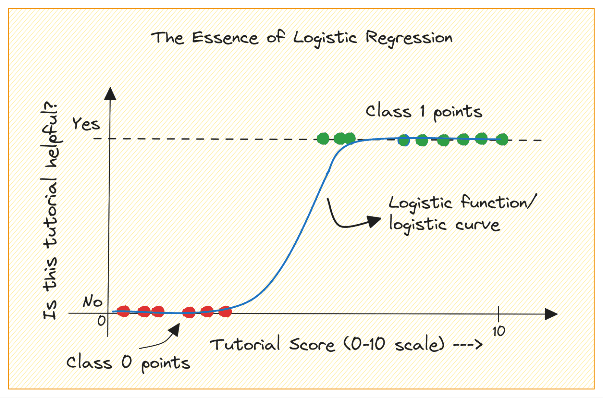

---

## Logistic Regression

<div style="display: flex; justify-content: space-between;">
<div style="width: 48%;">

```python
# Import necessary libraries
import numpy as np
import pandas as pd
from sklearn.linear_model import LogisticRegression
from sklearn.model_selection import train_test_split
from sklearn.metrics import accuracy_score

# Sample data: hours studied, hours slept, and pass/fail outcome
data = {
    'hours_studied': [5, 10, 2, 7, 3, 8, 1, 4, 9, 6],
    'hours_slept': [7, 8, 6, 7, 5, 8, 4, 6, 7, 5],
    'passed': [1, 1, 0, 1, 0, 1, 0, 0, 1, 0]
}

# Create a DataFrame
df = pd.DataFrame(data)

# Features (hours studied and hours slept) and target (pass/fail)
X = df[['hours_studied', 'hours_slept']]
y = df['passed']
```
</div>
<div style="width: 48%;">

```python
# Split the data into training and testing sets
X_train, X_test, y_train, y_test = train_test_split(X, y, test_size=0.2, random_state=42)

# Initialize the logistic regression classifier
log_reg = LogisticRegression()

# Train the classifier
log_reg.fit(X_train, y_train)

# Make predictions on the test set
y_pred = log_reg.predict(X_test)

# Calculate accuracy
accuracy = accuracy_score(y_test, y_pred)
print(f'Accuracy: {accuracy * 100:.2f}%')

# Example prediction
new_data = np.array([[6, 6]])  # 6 hours studied and 6 hours slept
prediction = log_reg.predict(new_data)
print(f'Predicted class for new data {new_data}: {prediction[0]}')
```
</div>
</div>

---

## K-Nearest Neighbours

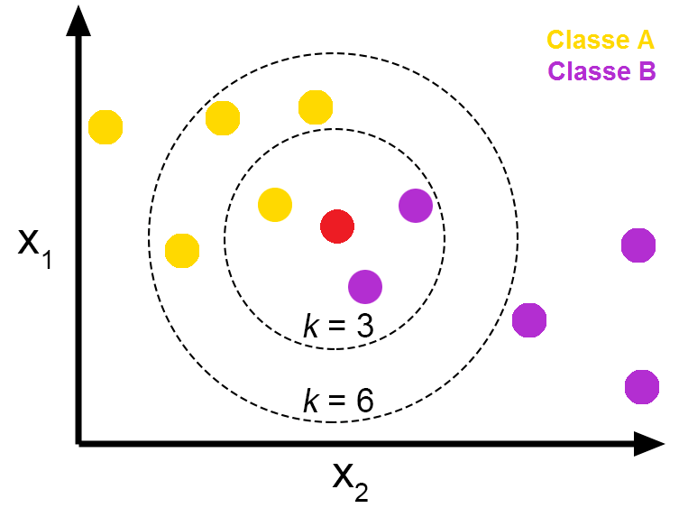

---

## K-Nearest Neighbours

<div style="display: flex; justify-content: space-between;">

<div style="width: 48%;">

```python
# Import necessary libraries
import numpy as np
import pandas as pd
from sklearn.neighbors import KNeighborsClassifier
from sklearn.model_selection import train_test_split
from sklearn.metrics import accuracy_score

# Sample data: hours studied, hours slept, and pass/fail outcome
data = {
    'hours_studied': [5, 10, 2, 7, 3, 8, 1, 4, 9, 6],
    'hours_slept': [7, 8, 6, 7, 5, 8, 4, 6, 7, 5],
    'passed': [1, 1, 0, 1, 0, 1, 0, 0, 1, 0]
}

# Create a DataFrame
df = pd.DataFrame(data)

# Features (hours studied and hours slept) and target (pass/fail)
X = df[['hours_studied', 'hours_slept']]
y = df['passed']
```

</div>
<div style="width: 48%;">

```python
# Split the data into training and testing sets
X_train, X_test, y_train, y_test = train_test_split(X, y, test_size=0.2, random_state=42)

# Initialize the KNN classifier with k=3
knn = KNeighborsClassifier(n_neighbors=3)

# Train the classifier
knn.fit(X_train, y_train)

# Make predictions on the test set
y_pred = knn.predict(X_test)

# Calculate accuracy
accuracy = accuracy_score(y_test, y_pred)
print(f'Accuracy: {accuracy * 100:.2f}%')

# Example prediction
new_data = np.array([[6, 6]])  # 6 hours studied and 6 hours slept
prediction = knn.predict(new_data)
print(f'Predicted class for new data {new_data}: {prediction[0]}')
```

</div>
</div>

---


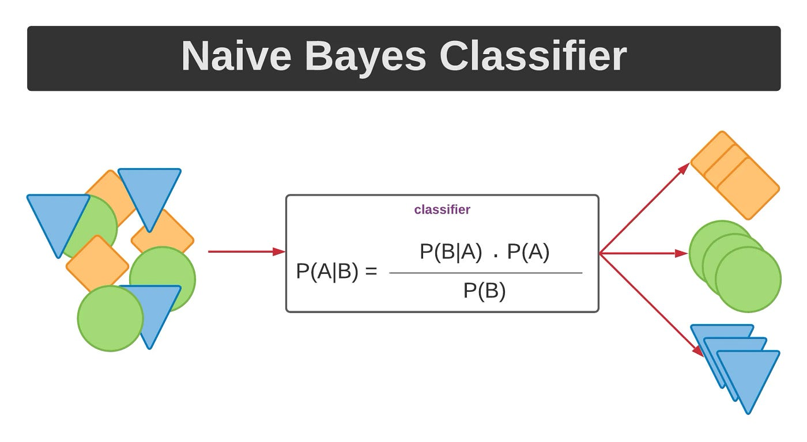


---

## Naive Bayes

<div style="display: flex; justify-content: space-between;">

<div style="width: 48%;">

```python
# Import necessary libraries
import numpy as np
import pandas as pd
from sklearn.naive_bayes import GaussianNB
from sklearn.model_selection import train_test_split
from sklearn.metrics import accuracy_score

# Sample data: hours studied, hours slept, and pass/fail outcome
data = {
    'hours_studied': [5, 10, 2, 7, 3, 8, 1, 4, 9, 6],
    'hours_slept': [7, 8, 6, 7, 5, 8, 4, 6, 7, 5],
    'passed': [1, 1, 0, 1, 0, 1, 0, 0, 1, 0]
}

# Create a DataFrame
df = pd.DataFrame(data)

# Features (hours studied and hours slept) and target (pass/fail)
X = df[['hours_studied', 'hours_slept']]
y = df['passed']
```
</div>
<div style="width: 48%;">

```python
# Split the data into training and testing sets
X_train, X_test, y_train, y_test = train_test_split(X, y, test_size=0.2, random_state=42)

# Initialize the Naive Bayes classifier
nb = GaussianNB()

# Train the classifier
nb.fit(X_train, y_train)

# Make predictions on the test set
y_pred = nb.predict(X_test)

# Calculate accuracy
accuracy = accuracy_score(y_test, y_pred)
print(f'Accuracy: {accuracy * 100:.2f}%')

# Example prediction
new_data = np.array([[6, 6]])  # 6 hours studied and 6 hours slept
prediction = nb.predict(new_data)
print(f'Predicted class for new data {new_data}: {prediction[0]}')
```
</div>
</div>

---

## Decision Tree

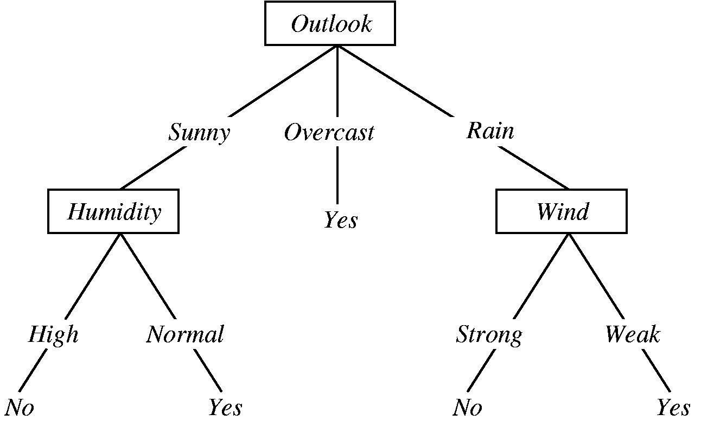

---

## Decision Tree

<div style="display: flex; justify-content: space-between;">

<div style="width: 48%;">

```python
# Import necessary libraries
import numpy as np
import pandas as pd
from sklearn.tree import DecisionTreeClassifier
from sklearn import tree
import graphviz

# Sample data: hours studied, hours slept, and pass/fail outcome
data = {
    'hours_studied': [5, 10, 2, 7, 3, 8, 1, 4, 9, 6],
    'hours_slept': [7, 8, 6, 7, 5, 8, 4, 6, 7, 5],
    'passed': [1, 1, 0, 1, 0, 1, 0, 0, 1, 0]
}

# Create a DataFrame
df = pd.DataFrame(data)
```

</div>
<div style="width: 48%;">

```python
# Features (hours studied and hours slept) and target (pass/fail)
X = df[['hours_studied', 'hours_slept']]
y = df['passed']

# Initialize the decision tree classifier
clf = DecisionTreeClassifier()

# Train the classifier
clf.fit(X, y)

# Visualize the decision tree
dot_data = tree.export_graphviz(clf, out_file=None, 
                                feature_names=['hours_studied', 'hours_slept'],
                                class_names=['fail', 'pass'],
                                filled=True, rounded=True, 
                                special_characters=True)  

graph = graphviz.Source(dot_data)  
graph.render("decision_tree_example")  # Saves the tree as a PDF file
graph.view()  # Opens the PDF file to view the tree
```

</div>
</div>


---

## Task: Classification Challenge

<span style="font-size: 0.8em">

- Dataset Selection: Choose a classification dataset from UCI - Iris for flower species classification.
- Data Exploration: Conduct EDA to analyze class distributions and identify any data imbalance.
- Model Application: Implement Logistic Regression, K-Nearest Neighbors (KNN), and Decision Tree classifiers.
- Model Comparison: Evaluate each model using accuracy, precision, and recall metrics.
</span>

---

## Task: Advanced Classification with Naive Bayes

<span style="font-size: 0.75em">

- Dataset Selection: Choose a suitable text classification dataset, like SMS Spam Collection from UCI.
- Data Preprocessing: Clean and preprocess the text data (e.g., removing stop words, tokenization).
- Model Implementation: Implement Naive Bayes for spam detection and use it to classify messages as spam or not.
- Evaluation: Evaluate the model using accuracy, F1-score, and confusion matrix.
- Analysis: Reflect on Naive Bayes' effectiveness for text-based classifications and discuss potential improvements.

</span>

---

### Starter Code

<div style="display: flex; justify-content: space-between;">

<div style="width: 48%;">

```python
# Import necessary libraries
import pandas as pd
import re
from sklearn.model_selection import train_test_split
from sklearn.feature_extraction.text import CountVectorizer
from nltk.corpus import stopwords
from nltk.tokenize import word_tokenize
import nltk

# Download stopwords for text preprocessing
nltk.download('stopwords')
nltk.download('punkt')

# Load the dataset
# (Assuming the dataset is in CSV format and has 'label' and 'message' columns)
data = pd.read_csv("path_to_your_file/spam.csv", encoding='latin-1')

# Rename columns for convenience if necessary
data = data.rename(columns={'v1': 'label', 'v2': 'message'})

# Basic data cleaning
# Remove unnecessary columns if present
data = data[['label', 'message']]

# Remove any missing values
data.dropna(inplace=True)

# Map labels to binary values (1 for spam, 0 for ham)
data['label'] = data['label'].map({'spam': 1, 'ham': 0})
```

</div>
<div style="width: 48%;">

```python
# Text Preprocessing Function
def preprocess_text(text):
    # Convert to lowercase
    text = text.lower()
    # Remove special characters and numbers
    text = re.sub(r'\W', ' ', text)
    # Tokenize text
    words = word_tokenize(text)
    # Remove stopwords
    words = [word for word in words if word not in stopwords.words('english')]
    # Join words back into a single string
    text = ' '.join(words)
    return text

# Apply preprocessing to messages
data['cleaned_message'] = data['message'].apply(preprocess_text)

# Split data into training and test sets
X_train, X_test, y_train, y_test = train_test_split(data['cleaned_message'], data['label'], test_size=0.2, random_state=42)

# Vectorization (Convert text data into numerical format using Bag of Words)
vectorizer = CountVectorizer()
X_train_vect = vectorizer.fit_transform(X_train)
X_test_vect = vectorizer.transform(X_test)

print("Data preparation complete.")
```
</div>

---

## Evaluation metrics

- Evaluation metrics are crucial in machine learning (ML) for assessing the performance of models. 
- The choice of metric depends on the type of problem (classification, regression, clustering, etc.).

<!-- Confusion Matrix
AUC
Accuracy etc...

Train test splitting datasets etc.... -->

---

## Classification Metrics

<span style="font-size: 0.8em">

- Accarcy
- Precision
- Recall (Sensitivity, True Positive Rate)
- F1 Score
- Confusion Matrix
- ROC - AUC
- Precision-Recall (PR) AUC
- Log Loss

</span>

---

## Accuracy

- The proportion of correctly predicted instances among the total instances.

$$
    Accuracy = \frac{TP + TN}{TP + TN + FP + FN}
$$


---

## Precision

- Used to evaluate the performance of a classification model. 
- It answers the question, "Of all the instances the model predicted as positive, how many were actually positive?"

$$
    Precision = \frac{TP}{TP+FP}
$$

<!-- $$
    Precision = \frac{80}{80+20} = 0.8
$$ -->

---

## Recall

<span style="font-size: 0.8em">

- known as sensitivity or true positive rate, is used to evaluate the performance of a classification model. 
- Recall is the ratio of true positive predictions to the total number of actual positive instances. 
- It answers the question, "Of all the instances that are actually positive, how many did the model correctly identify as positive?"

$$
    Recall = \frac{TP}{TP + FN}
$$

</span>

---

## F1 Score

<span style="font-size: 0.8em">

- Used to evaluate the performance of a classification model by combining precision and recall into a single number. 
- A way to providing a balance between the two metrics. 
- Useful when you need to balance the trade-off between precision and recall, and when the class distribution is imbalanced.

</span>

$$
    F1 Score = 2 \times \frac{Precision \times Recall}{Precision+Recall}
$$

---

## Confusion Matrix


---

## ROC - AUC

<span style="font-size: 0.7em">

- Receiver Operating Characteristic
- Area Under Curve
</span>

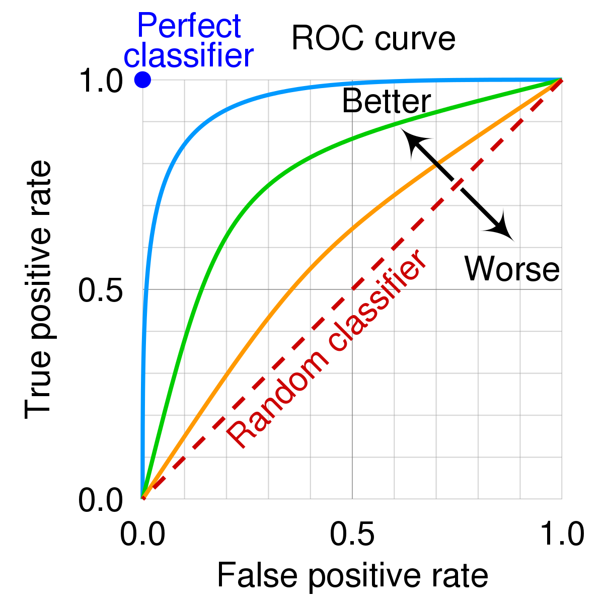

<!-- 

The ROC-AUC (Receiver Operating Characteristic - Area Under Curve) is a performance metric used to evaluate the ability of a classification model to distinguish between classes. It is particularly useful for binary classification problems.

ROC Curve
The ROC curve is a graphical representation of a model's performance. It plots the True Positive Rate (TPR) against the False Positive Rate (FPR) at various threshold settings. The TPR is also known as recall, and the FPR is defined as the proportion of actual negatives that are incorrectly classified as positives.

The AUC measures the entire two-dimensional area underneath the ROC curve from (0,0) to (1,1). The AUC value ranges from 0 to 1, with a higher value indicating better model performance.

AUC = 0.5: The model has no discriminative power (equivalent to random guessing).
AUC > 0.5: The model has some discriminative power.
AUC = 1: The model has perfect discriminative power.

 -->

---

### ROC-AUC Example

<span style="font-size:0.58em">

```python
import numpy as np
from sklearn.metrics import roc_curve, roc_auc_score
import matplotlib.pyplot as plt

# Example true labels and predicted probabilities
y_true = np.array([0, 0, 1, 1])
y_scores = np.array([0.1, 0.4, 0.35, 0.8])

# Calculate the ROC curve
fpr, tpr, thresholds = roc_curve(y_true, y_scores)

# Calculate the AUC
auc = roc_auc_score(y_true, y_scores)

# Plot the ROC curve
plt.figure()
plt.plot(fpr, tpr, color='darkorange', lw=2, label='ROC curve (area = %0.2f)' % auc)
plt.plot([0, 1], [0, 1], color='navy', lw=2, linestyle='--')
plt.xlim([0.0, 1.0])
plt.ylim([0.0, 1.05])
plt.xlabel('False Positive Rate')
plt.ylabel('True Positive Rate')
plt.title('Receiver Operating Characteristic')
plt.legend(loc="lower right")
plt.show()

print(f'AUC: {auc:.2f}')
``` 
</span>

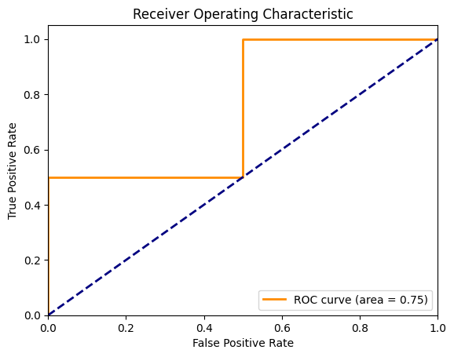

---

## Precision-Recall (PR) AUC

- The PR curve provides a graphical representation of the trade-off between precision and recall for different threshold values.
- The area under the Precision-Recall curve (PR AUC) summarises the performance of the model across all thresholds. 
- A higher PR AUC value indicates better model performance.

---

```python
import numpy as np
from sklearn.metrics import precision_recall_curve, auc
import matplotlib.pyplot as plt

# Example true labels and predicted probabilities
y_true = np.array([0, 0, 1, 1])
y_scores = np.array([0.1, 0.4, 0.35, 0.8])

# Calculate the precision-recall curve
precision, recall, thresholds = precision_recall_curve(y_true, y_scores)

# Calculate the PR AUC
pr_auc = auc(recall, precision)

# Plot the precision-recall curve
plt.figure()
plt.plot(recall, precision, color='b', lw=2, label='PR curve (area = %0.2f)' % pr_auc)
plt.xlabel('Recall')
plt.ylabel('Precision')
plt.title('Precision-Recall Curve')
plt.legend(loc="lower left")
plt.show()

print(f'PR AUC: {pr_auc:.2f}')
```

---

## Log Loss

$$
    \text{Log Loss} = - \frac{1}{N} \sum_{i=1}^{N} \left[ y_i \log(p_i) + (1 - y_i) \log(1 - p_i) \right]
$$

---

$$
\begin{aligned}
\text{Log Loss} &= - \frac{1}{4} \left[ 1 \cdot \log(0.9) + 0 \cdot \log(1 - 0.9) + 0 \cdot \log(0.1) + 1 \cdot \log(1 - 0.1) \right. \\
&\qquad \left. + 1 \cdot \log(0.8) + 0 \cdot \log(1 - 0.8) + 0 \cdot \log(0.4) + 1 \cdot \log(1 - 0.4) \right] \\
&= - \frac{1}{4} \left[ \log(0.9) + \log(1 - 0.1) + \log(0.8) + \log(1 - 0.4) \right] \\
&= - \frac{1}{4} \left[ \log(0.9) + \log(0.9) + \log(0.8) + \log(0.6) \right] \\
&= - \frac{1}{4} \left[ -0.105 + -0.105 + -0.223 + -0.511 \right] \\
&= - \frac{1}{4} \left[ -0.944 \right] \\
&= 0.236
\end{aligned}
$$

<!-- I don't think this is right.... -->

---

```python
from sklearn.metrics import log_loss

# True labels
y_true = [1, 0, 1, 0]

# Predicted probabilities
y_pred = [0.9, 0.1, 0.8, 0.4]

# Calculate log loss
loss = log_loss(y_true, y_pred)

print(f'Log Loss: {loss:.3f}')
```
<!-- Converting the maths formula into code from the previous slide -->

---

# Useful Resources

- Josh Starmer - [Statquest YouTube Channel](https://www.youtube.com/channel/UCtYLUTtgS3k1Fg4y5tAhLbw) 
- Harrison Sentdex - [Sentdex YouTube Channel](https://www.youtube.com/@sentdex)
- Mariya - [Python Simplified YouTube Channel](https://www.youtube.com/@PythonSimplified)
- 3Blue1Brown - [3Blue1Brown YouTube Channel](https://www.youtube.com/@3blue1brown)