<!-- _class: lead -->
<!--  -->


# CPU5006-20: Artificial Intelligence
## Session 6: Unsupervised Learning

<!-- _footer: "" -->

---

## Course Overview

Week | Session | |
-----|------|---|
6 | Unsupervised Learning |  S1
7 | Artificial Neural Networks |  
8 | Convolutional NN & Computer Vision |
9 | Recurrent NN & NLP |
10 | S2 Assessment Workshop |
11 | Generative AI | S2
12 | Building AI Agents |

---

## Overview

- What is Unsupervised learning
- Clustering
- Dimensionality Reduction


---

## Unsupervised learning Techniques

- Clustering 
- Anomoly Detection
- Density Estimation

<!-- 
 - Clustering
The goal is to group similar instances together into clusters. Clustering is a great tool for data analysis, customer segmentation, recommender systems, search engines, image segmentation, semi-supervised learning, dimensionality reduction, and more.

- Anomaly detection
The objective is to learn what “normal” data looks like, and then use that to detect abnormal instances, such as defective items on a production line or a new trend in a time series.

- Density estimation
This is the task of estimating the probability density function (PDF) of the random process that generated the dataset. Density estimation is commonly used for anomaly detection: instances located in very low-density regions are likely to be anomalies. It is also useful for data analysis and visualisation.
 -->

---

## Clustering

Imagine this scene:

<span style="font-size:0.8em">

- Hiking in the mountains
- Stumbling upon a plant you've never seen before
- Noticing a few more similar plants
- These plants are not identical, yet they are similar enough to likely belong to the same species
- This is called **clustering**: identifying similar instances and assigning them to clusters or groups of similar instances.
</span>

<!-- 
As you enjoy a hike in the mountains, you stumble upon a plant you have never seen before. You look around and you notice a few more. They are not identical, yet they are sufficiently similar for you to know that they most likely belong to the same species. You may need a botanist to tell you what species that is, but you certainly don’t need an expert to identify groups of similar-looking objects. This is called clustering: it is the task of identifying similar instances and assigning them to clusters, or groups of similar instances. 
-->

---

## Applications of Clustering

<span style="font-size:0.8em">

- Customer Segmentation
- Data Analysis
- Dimensionality reduction
- Anomaly Detection (outlier detection)
- Semi-supervised learning
- Search Engines
- Image Segmentation

</span>

<!-- 
- For customer segmentation
You can cluster your customers based on their purchases and activity on your website. This is useful for understanding who your customers are and what they need, allowing you to adapt your products and marketing campaigns to each segment. For example, customer segmentation can be useful in recommender systems to suggest content that other users in the same cluster enjoyed.

- For data analysis
When analysing a new dataset, it can be helpful to run a clustering algorithm and then analyse each cluster separately.

- As a dimensionality reduction technique
Once a dataset has been clustered, it is usually possible to measure each instance’s affinity with each cluster (affinity is any measure of how well an instance fits into a cluster). Each instance’s feature vector can then be replaced with the vector of its cluster affinities. If there are k clusters, then this vector is k-dimensional. This vector is typically much lower-dimensional than the original feature vector, but it can preserve enough information for further processing.

- For anomaly detection (also called outlier detection)
Any instance with a low affinity to all the clusters is likely to be an anomaly. For example, if you have clustered the users of your website based on their behaviour, you can detect users with unusual behaviour, such as an unusual number of requests per second. Anomaly detection is particularly useful in detecting defects in manufacturing or for fraud detection.

- For semi-supervised learning
If you only have a few labels, you could perform clustering and propagate the labels to all the instances in the same cluster. This technique can greatly increase the number of labels available for a subsequent supervised learning algorithm, and thus improve its performance.

- For search engines
Some search engines let you search for images similar to a reference image. To build such a system, you would first apply a clustering algorithm to all the images in your database; similar images would end up in the same cluster. Then, when a user provides a reference image, you can use the trained clustering model to find this image’s cluster and return all the images from this cluster.

- To segment an image
By clustering pixels according to their colour, then replacing each pixel’s colour with the mean colour of its cluster, it is possible to considerably reduce the number of different colours in the image. Image segmentation is used in many object detection and tracking systems, as it makes it easier to detect the contour of each object.

There is no universal definition of what a cluster is: it really depends on the context, and different algorithms will capture different kinds of clusters. Some algorithms look for instances centred around a particular point, called a centroid. Others look for continuous regions of densely packed instances: these clusters can take on any shape. Some algorithms are hierarchical, looking for clusters of clusters. And the list goes on.
-->

---

## K-Means

- Simple algorithm
- Proposed by Stuart Lloyd at Bell Labs in 1957
- In 1965, Edward W. Forgy published virtually the same algorithm, so K-Means is sometimes referred to as Lloyd–Forgy.

<!-- 
The K-Means algorithm is a simple algorithm capable of clustering this kind of dataset very quickly and efficiently, often in just a few iterations. It was proposed by Stuart Lloyd at Bell Labs in 1957 as a technique for pulse-code modulation, but it was only published outside of the company in 1982. In 1965, Edward W. Forgy had published virtually the same algorithm, so K-Means is sometimes referred to as Lloyd–Forgy.
 -->

---

## K-Means - How Does It Work?

<div style="display: flex; justify-content: space-between;">
<div style="width: 70%; font-size: 0.7em">

- First, initialise centroids randomly:
    - Distinct instances are chosen randomly from the dataset, and the centroids are placed at their locations.
- Repeat until convergence (i.e., until the centroids stop moving):
    - Assign each instance to the closest centroid.
    - Update the centroids to be the mean of the instances that are assigned to them.

</div>
<div style="width: 30%;">

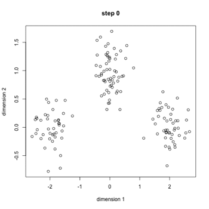

</div>
</div>

<!-- 
The K-Means algorithm is one of the fastest clustering algorithms, and also one of the simplest:

- First initialize 
    - centroids randomly: 
    - distinct instances are chosen randomly from the dataset and the centroids are placed at their locations.
- Repeat until convergence (i.e., until the centroids stop moving):
- Assign each instance to the closest centroid.
- Update the centroids to be the mean of the instances that are assigned to them.
 -->

---

## K-Means - How Does It Work?

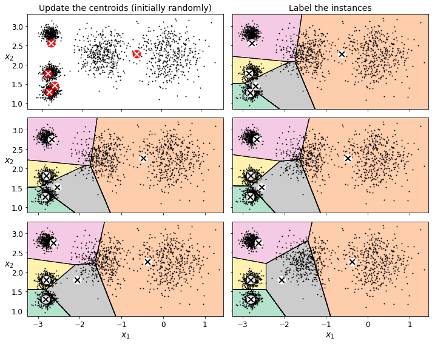

---

<div style="display: flex; justify-content: space-between;">
<div style="width: 48%;">

```python

from sklearn.datasets import make_blobs


blob_centers = np.array(
    [[ 0.2,  2.3],
     [-1.5 ,  2.3],
     [-2.8,  1.8],
     [-2.8,  2.8],
     [-2.8,  1.3]])
blob_std = np.array([0.4, 0.3, 0.1, 0.1, 0.1])


X, y = make_blobs(n_samples=2000, centers=blob_centers,
                  cluster_std=blob_std, random_state=42)


def plot_clusters(X, y=None):
    plt.scatter(X[:, 0], X[:, 1], c=y, s=1)
    plt.xlabel("$x_1$", fontsize=14)
    plt.ylabel("$x_2$", fontsize=14, rotation=0)


plt.figure(figsize=(8, 4))
plot_clusters(X)
save_fig("blobs_plot")
plt.show()
```

</div>
<div style="width: 55%; height: 500px; background-color: lightgray; margin: 30px 30px; padding-top: 75px; border-radius: 25px">

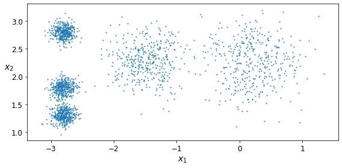

</div>
</div>

---

## K-Means

```python
from sklearn.cluster import KMeans

k = 5
kmeans = KMeans(n_clusters=k)
y_pred = kmeans.fit_predict(X)

y_pred
>>> array([4, 0, 1, ..., 2, 1, 0], dtype=int32)

y_pred is kmeans.labels_
>>> True
```

<!-- 
- Note that you have to specify the number of clusters k that the algorithm must find. 
- In this example, it is obvious from looking at the data that k should be set to 5, but in general it is not that easy.

- Each instance was assigned to one of the five clusters. 
- In the context of clustering, an instance’s label is the index of the cluster that this instance gets assigned to by the algorithm: this is not to be confused with the class labels in classification (remember that clustering is an unsupervised learning task). 
- The KMeans instance preserves a copy of the labels of the instances it was trained on, available via the labels_ instance variable y_pred is kmeans.labels_

- We can also take a look at the five centroids that the algorithm found
 -->

---

## Finding the Centroids

```python
kmeans.cluster_centers_
>>> array([[-2.80389616, 1.80117999], 
           [ 0.20876306, 2.25551336], 
           [-2.79290307, 2.79641063], 
           [-1.46679593, 2.28585348],
           [-2.80037642,  1.30082566]])
```


---

<div style="display: flex; justify-content: space-between;">
<div style="width: 48%;">

```python
def plot_data(X):
    plt.plot(X[:, 0], X[:, 1], 'k.', markersize=2)

def plot_centroids(centroids, weights=None, circle_color='w', cross_color='k'):
    if weights is not None:
        centroids = centroids[weights > weights.max() / 10]
    plt.scatter(centroids[:, 0], centroids[:, 1],
                marker='o', s=35, linewidths=8,
                color=circle_color, zorder=10, alpha=0.9)
    plt.scatter(centroids[:, 0], centroids[:, 1],
                marker='x', s=2, linewidths=12,
                color=cross_color, zorder=11, alpha=1)

def plot_decision_boundaries(clusterer, X, resolution=1000, show_centroids=True,
                             show_xlabels=True, show_ylabels=True):
    mins = X.min(axis=0) - 0.1
    maxs = X.max(axis=0) + 0.1
    xx, yy = np.meshgrid(np.linspace(mins[0], maxs[0], resolution),
                         np.linspace(mins[1], maxs[1], resolution))
    Z = clusterer.predict(np.c_[xx.ravel(), yy.ravel()])
    Z = Z.reshape(xx.shape)

    plt.contourf(Z, extent=(mins[0], maxs[0], mins[1], maxs[1]),
                cmap="Pastel2")
    plt.contour(Z, extent=(mins[0], maxs[0], mins[1], maxs[1]),
                linewidths=1, colors='k')
    plot_data(X)
    if show_centroids:
        plot_centroids(clusterer.cluster_centers_)

    if show_xlabels:
        plt.xlabel("$x_1$", fontsize=14)
    else:
        plt.tick_params(labelbottom=False)
    if show_ylabels:
        plt.ylabel("$x_2$", fontsize=14, rotation=0)
    else:
        plt.tick_params(labelleft=False)
```
</div>
<div style="width: 48%;">

```python
plt.figure(figsize=(8, 4))
plot_decision_boundaries(kmeans, X)
save_fig("voronoi_plot")
plt.show()
```
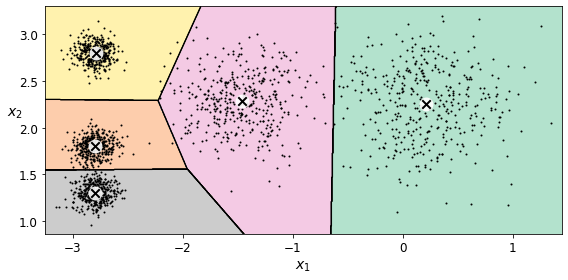

</div>
</div>

---

## Predicting New Labels

```python
X_new = np.array([[0, 2], [3, 2], [-3, 3], [-3, 2.5]])
kmeans.predict(X_new)
>>> array([0, 0, 3, 3], dtype=int32)
```

---

## Finding Optimal Number of Clusters

- It is not easy to know how to set k, and the result might be quite bad if you set it to the wrong value.
- Pick the model with the lowest inertia? - No!


<!-- 
So far, we have set the number of clusters k to 5 because it was obvious by looking at the data that this was the correct number of clusters. But in general, it will not be so easy to know how to set k, and the result might be quite bad if you set it to the wrong value.

You might be thinking that we could just pick the model with the lowest inertia, right? Unfortunately, it is not that simple. The inertia for k=3 is 653.2, which is much higher than for k=5 (which was 211.6). But with k=8, the inertia is just 119.1. The inertia is not a good performance metric when trying to choose k because it keeps getting lower as we increase k. Indeed, the more clusters there are, the closer each instance will be to its closest centroid, and therefore the lower the inertia will be.
 -->
---

## Finding Optimal Number of Clusters

<div style="display: flex; justify-content: space-between;">
<div style="width: 48%;">

```python

kmeans_per_k = [KMeans(n_clusters=k, random_state=42).fit(X)
                for k in range(1, 10)]
inertias = [model.inertia_ for model in kmeans_per_k]

plt.figure(figsize=(8, 3.5))
plt.plot(range(1, 10), inertias, "bo-")
plt.xlabel("$k$", fontsize=14)
plt.ylabel("Inertia", fontsize=14)
plt.annotate('Elbow',
             xy=(4, inertias[3]),
             xytext=(0.55, 0.55),
             textcoords='figure fraction',
             fontsize=16,
             arrowprops=dict(facecolor='black', shrink=0.1)
            )
plt.axis([1, 8.5, 0, 1300])
save_fig("inertia_vs_k_plot")
plt.show()
```

</div>

<div style="width: 50%; padding-top: 60px;">
<div style="margin-right: 0; background-color:white;">

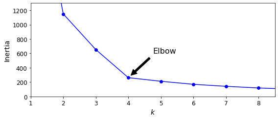

</div>
</div>
</div>

<!-- 
the inertia drops very quickly as we increase k up to 4, but then it decreases much more slowly as we keep increasing k. This curve has roughly the shape of an arm, and there is an “elbow” at k = 4. So, if we did not know better, 4 would be a good choice: any lower value would be dramatic, while any higher value would not help much, and we might just be splitting perfectly good clusters in half for no good reason.
-->

---

## Finding Optimal Number of Clusters

<div style="display: flex; justify-content: space-between;">
<div style="width: 48%;">

```python

from sklearn.metrics import silhouette_score

silhouette_score(X, kmeans.labels_)
>>> 0.655517642572828


silhouette_scores = [silhouette_score(X, model.labels_)
                     for model in kmeans_per_k[1:]]

plt.figure(figsize=(8, 3))
plt.plot(range(2, 10), silhouette_scores, "bo-")
plt.xlabel("$k$", fontsize=14)
plt.ylabel("Silhouette score", fontsize=14)
plt.axis([1.8, 8.5, 0.55, 0.7])
save_fig("silhouette_score_vs_k_plot")
plt.show()
```

</div>

<div style="width: 50%; padding-top: 60px;">
<div style="margin-right: 0; background-color:white;">

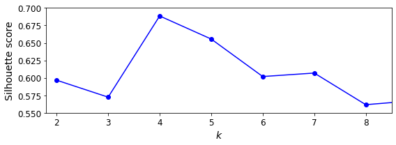

</div>
</div>
</div>

<!-- 
As you can see, this visualization is much richer than the previous one: although it confirms that k = 4 is a very good choice, it also underlines the fact that k = 5 is quite good as well, and much better than k = 6 or 7. This was not visible when comparing inertias.
-->

---

## Clustering for Semi-Supervised Learning

- when we have plenty of unlabeled instances and very few labeled instances. 
- Let’s train a Logistic Regression model on a sample of 50 labeled instances from the digits dataset.

<div style="display: flex; justify-content: space-between;">
<div style="width: 48%;">

```python
from sklearn.linear_model import LogisticRegression
from sklearn.model_selection import train_test_split
from sklearn.datasets import load_digits

X_digits, y_digits = load_digits(return_X_y=True)
X_train, X_test, y_train, y_test = train_test_split(X_digits, y_digits, random_state=42)
```
</div>

<div style="width: 50%;">
<div style="margin-right: 0; background-color:white;">

```python
n_labeled = 50
log_reg = LogisticRegression(multi_class="ovr", solver="lbfgs", random_state=42)
log_reg.fit(X_train[:n_labeled], y_train[:n_labeled])
log_reg.score(X_test, y_test)

>>> 0.8333333333333334
```

</div>
</div>

---

## Clustering for Semi-Supervised Learning

```python
k = 50
kmeans = KMeans(n_clusters=k, random_state=42)
X_digits_dist = kmeans.fit_transform(X_train)
representative_digit_idx = np.argmin(X_digits_dist, axis=0)
X_representative_digits = X_train[representative_digit_idx]

y_train[representative_digit_idx]

>>> array([0, 1, 3, 2, 7, 6, 4, 6, 9, 5, 1, 2, 9, 5, 2, 7, 8, 1, 8, 6, 3, 1,
       5, 4, 5, 4, 0, 3, 2, 6, 1, 7, 7, 9, 1, 8, 6, 5, 4, 8, 5, 3, 3, 6,
       7, 9, 7, 8, 4, 9])
```

---

## Clustering for Semi-Supervised Learning

```python
log_reg = LogisticRegression(multi_class="ovr", solver="lbfgs", max_iter=5000, random_state=42)
log_reg.fit(X_representative_digits, y_representative_digits)
log_reg.score(X_test, y_test)
>>> 0.9133333333333333
```


<!-- 
let’s train the model again on this partially propagated dataset

Wow! We jumped from 83.3% accuracy to 92.2%, although we are still only training the model on 50 instances. Since it is often costly and painful to label instances, especially when 
it has to be done manually by experts, it is a good idea to label representative instances rather than just random instances.

We got a reasonable accuracy boost, but nothing absolutely astounding. The problem is that we propagated each representative instance’s label to all the instances in the same cluster, including the instances located close to the cluster boundaries, which are more likely to be mislabeled. Let’s see what happens if we only propagate the labels to the 20% of the instances that are closest to the centroids.
 -->
---

```python
percentile_closest = 75

X_cluster_dist = X_digits_dist[np.arange(len(X_train)), kmeans.labels_]
for i in range(k):
    in_cluster = (kmeans.labels_ == i)
    cluster_dist = X_cluster_dist[in_cluster]
    cutoff_distance = np.percentile(cluster_dist, percentile_closest)
    above_cutoff = (X_cluster_dist > cutoff_distance)
    X_cluster_dist[in_cluster & above_cutoff] = -1

partially_propagated = (X_cluster_dist != -1)
X_train_partially_propagated = X_train[partially_propagated]
y_train_partially_propagated = y_train_propagated[partially_propagated]

log_reg = LogisticRegression(multi_class="ovr", solver="lbfgs", max_iter=5000, random_state=42)
log_reg.fit(X_train_partially_propagated, y_train_partially_propagated)

log_reg.score(X_test, y_test)
>>> 0.9266666666666666

np.mean(y_train_partially_propagated == y_train[partially_propagated])
>>> 0.9592039800995025
```

<!-- 

A bit better. With just 50 labeled instances (just 5 examples per class on average!), we got 92.7% performance, which is getting closer to the performance of logistic regression on the fully labeled digits dataset (which was 96.9%).

This is because the propagated labels are actually pretty good: their accuracy is close to 96%.

You could now do a few iterations of active learning:

Manually label the instances that the classifier is least sure about, if possible by picking them in distinct clusters.
Train a new model with these additional labels.

-->

---

## DBSCAN

This algorithm defines clusters as continuous regions of high density. Here is how it works:
- The algorithm counts how many instances are located within a small distance ε from it.
- If an instance has at least min_samples instances in its ε-neighborhood, then it is considered a core instance.
- All instances in the neighbourhood of a core instance belong to the same cluster.

<!-- 
This algorithm defines clusters as continuous regions of high density. Here is how it works:
- For each instance, the algorithm counts how many instances are located within a small distance ε (epsilon) from it. This region is called the instance’s ε- neighborhood.
- If an instance has at least min_samples instances in its ε-neighborhood (including itself), then it is considered a core instance. In other words, core instances are those that are located in dense regions.
- All instances in the neighborhood of a core instance belong to the same cluster. This neighborhood may include other core instances; therefore, a long sequence of neighboring core instances forms a single cluster.
- Any instance that is not a core instance and does not have one in its neighborhood is considered an anomaly.

This algorithm works well if all the clusters are dense enough and if they are well sep‐ arated by low-density regions. The DBSCAN class in Scikit-Learn is as simple to use as you might expect.
 -->
---

## DBSCAN

```python
from sklearn.datasets import make_moons
from sklearn.cluster import DBSCAN

X, y = make_moons(n_samples=1000, noise=0.05, random_state=42)
dbscan = DBSCAN(eps=0.05, min_samples=5)
dbscan.fit(X)

dbscan.labels_[:10]
>>> array([ 0,  2, -1, -1,  1,  0,  0,  0,  2,  5])
```
<!-- 
Notice that some instances have a cluster index equal to –1, which means that they are considered as anomalies by the algorithm. The indices of the core instances are available in the core_sample_indices_ instance variable, and the core instances themselves are available in the components_ instance variable

-->

---

<div style="display: flex; justify-content: space-between;">
<div style="width: 50%;">

```python
dbscan2 = DBSCAN(eps=0.2)
dbscan2.fit(X)

def plot_dbscan(dbscan, X, size, show_xlabels=True, show_ylabels=True):
    core_mask = np.zeros_like(dbscan.labels_, dtype=bool)
    core_mask[dbscan.core_sample_indices_] = True
    anomalies_mask = dbscan.labels_ == -1
    non_core_mask = ~(core_mask | anomalies_mask)

    cores = dbscan.components_
    anomalies = X[anomalies_mask]
    non_cores = X[non_core_mask]
    
    plt.scatter(cores[:, 0], cores[:, 1],
                c=dbscan.labels_[core_mask], marker='o', s=size, cmap="Paired")
    plt.scatter(cores[:, 0], cores[:, 1], marker='*', s=20, c=dbscan.labels_[core_mask])
    plt.scatter(anomalies[:, 0], anomalies[:, 1],
                c="r", marker="x", s=100)
    plt.scatter(non_cores[:, 0], non_cores[:, 1], c=dbscan.labels_[non_core_mask], marker=".")
    if show_xlabels:
        plt.xlabel("$x_1$", fontsize=14)
    else:
        plt.tick_params(labelbottom=False)
    if show_ylabels:
        plt.ylabel("$x_2$", fontsize=14, rotation=0)
    else:
        plt.tick_params(labelleft=False)
    plt.title("eps={:.2f}, min_samples={}".format(dbscan.eps, dbscan.min_samples), fontsize=14)

plt.figure(figsize=(9, 3.2))

plt.subplot(121)
plot_dbscan(dbscan, X, size=100)

plt.subplot(122)
plot_dbscan(dbscan2, X, size=600, show_ylabels=False)

plt.show()
```

</div>
<div style="width: 48%; padding-top:55px;">
<!-- <div style="margin-right: 0; background-color:white;"> -->

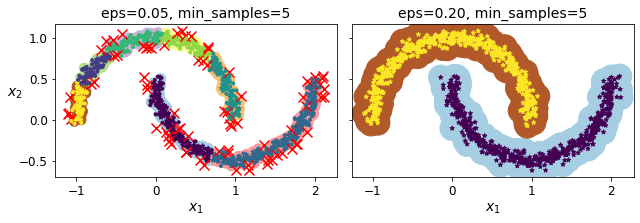

<!-- </div> -->
</div>
</div>

<!-- 
Somewhat surprisingly, the DBSCAN class does not have a predict() method, although it has a fit_predict() method. 
In other words, it cannot predict which cluster a new instance belongs to. 
This implementation decision was made because different classification algorithms can be better for different tasks let the user choose which one to use.
-->

---

## Gaussian Mixture-Models (GMM)

<span style="font-size:0.7em">

- A Gaussian mixture model (GMM) is a probabilistic model 
- assumes that the instances were generated from a mixture of several Gaussian distributions whose parameters are unknown. 
- All the instances generated from a single Gaussian distribution form a cluster that typically looks like an ellipsoid.
- When you observe an instance, you know it was generated from one of the Gaussian distributions.

</span>

<!-- 
A Gaussian mixture model (GMM) is a probabilistic model that assumes that the instances were generated from a mixture of several Gaussian distributions whose parameters are unknown. All the instances generated from a single Gaussian distri‐ bution form a cluster that typically looks like an ellipsoid. Each cluster can have a dif‐ ferent ellipsoidal shape, size, density, and orientation. When you observe an instance, you know it was generated from one of the Gaussian distri‐ butions, but you are not told which one, and you do not know what the parameters of these distributions are.
 -->

---

## Gaussian Mixture-Models (GMM)

<span style="font-size:0.7em">

you must know in advance the number $k$ of Gaussian distributions. The dataset $X$ is assumed to have been generated through the following probabilistic process:
- For each instance, a cluster is picked randomly from among $k$ clusters. 
- The probability of choosing the $j^{th}$ cluster is defined by the cluster’s weight, $\phi^{(j)}$.
- The index of the cluster chosen for the $i^{th}$ instance is noted $z^{(i)}$.
- If $z^{(i)}=j$, meaning the ith instance has been assigned to the jth cluster, the location x(i) of this instance is sampled randomly from the Gaussian distribution with mean μ(j) and covariance matrix $\sum^{(j)}$. This is noted $x^{(i)} \sim \mathcal{N}(\mu^{(j)}, \sum^{(j)})$ 

</span>

<!-- 
you must know in advance the number $k$ of Gaussian distributions. The dataset $X$ is assumed to have been generated through the following probabilistic process:
- For each instance, a cluster is picked randomly from among $k$ clusters. The probability of choosing the $j^{th}$ cluster is defined by the cluster’s weight, $\phi^{(j)}$. The index of the cluster chosen for the ith instance is noted $z^{(i)}$.
- If $z^{(i)}=j$, meaning the ith instance has been assigned to the jth cluster, the location x(i) of this instance is sampled randomly from the Gaussian distribution with mean μ(j) and covariance matrix $\sum^{(j)}$. This is noted $x^{(i) \sim N(\mu^{(j)}, \sum^{(j)})} 
 -->
---

<!-- _footer: "" -->

<style>
img[alt~="full"] {
    position: absolute;
    top: 0px;
    left: 0px;
    width: 100%;
    height: 100%;
    
}
</style>

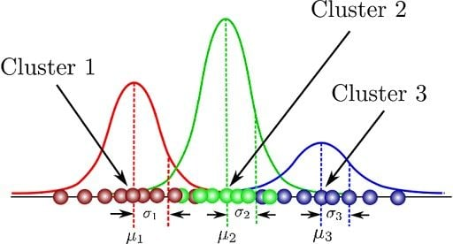

---

## Bayesian GMM

$p(z|X) = posterior = \frac{likelihood \times prior}{evidence} = \frac{p(X|x)p(z)}{p(X)}$

```python
from sklearn.mixture import BayesianGaussianMixture

bgm = BayesianGaussianMixture(n_components=10, n_init=10, random_state=42)
bgm.fit(X)
np.round(bgm.weights_, 2)
>>> array([0.4 , 0.  , 0.  , 0.  , 0.39, 0.2 , 0.  , 0.  , 0.  , 0.  ])
```

<!-- 
Rather than manually searching for the optimal number of clusters, you can use the BayesianGaussianMixture class, which is capable of giving weights equal (or close) to zero to unnecessary clusters. Set the number of clusters n_components to a value that you have good reason to believe is greater than the optimal number of clusters (this assumes some minimal knowledge about the problem at hand), and the algo‐ rithm will eliminate the unnecessary clusters automatically. For example, let’s set the number of clusters to 10 and see what happens:

Perfect: the algorithm automatically detected that only three clusters are needed, and the resulting clusters.
-->

---

### Task: Compare GMM and k-means Clustering for Data Clustering

<span style="font-size:0.6em">

Understand and implement **k-means clustering** and **Gaussian Mixture Models (GMM)** to explore how these algorithms differ in handling overlapping clusters in the Iris dataset.  

```python
from sklearn.datasets import load_iris

# Load the Iris dataset
iris = load_iris()

# Access the features and target
X = iris.data  # Features (sepal length, sepal width, petal length, petal width)
y = iris.target  # Target (species)

# Access feature names and target names
feature_names = iris.feature_names
target_names = iris.target_names

# Example: Print the first 5 rows
print("Feature names:", feature_names)
print("Target names:", target_names)
print("First 5 feature rows:\n", X[:5])
print("First 5 target values:", y[:5])
```

</span>

---

**Stages**

<span style="font-size:0.35em">

1. **Generate a Dataset**  
   Create a synthetic dataset with two features using `sklearn.datasets.make_blobs` or `numpy`. Ensure the dataset has some overlap between clusters.

   Example:
   ```python
   from sklearn.datasets import make_blobs
   X, y = make_blobs(n_samples=300, centers=3, cluster_std=1.5, random_state=42)
   ```

2. **Visualize the Dataset**  
   Plot the dataset using a scatter plot to visualise the true clusters.
3. **Apply k-means Clustering**  
   - Use the `KMeans` implementation from `sklearn` to fit the dataset.  
   - Visualise the predicted clusters.
4. **Apply Gaussian Mixture Model**  
   - Use `GaussianMixture` from `sklearn.mixture` to fit the dataset.  
   - Visualize the predicted clusters.  
   - Extract and plot the cluster probabilities as a heatmap (optional).
5. **Compare Results**  
   <!-- - Compare the results of k-means and GMM using metrics like adjusted Rand index (ARI) or silhouette score.  
   - Highlight differences in how k-means and GMM handle overlapping clusters.   -->

#### **Bonus Challenge**  
Apply the models to a dataset with varying densities or non-spherical clusters (e.g., using `make_moons` or `make_circles`) to further compare their performance and try DBSCAN.

</span>

---

## Dimensionality Reduction

- Many Machine Learning problems involve thousands or even millions of features for each training instance. 
- Not only do all these features make training extremely slow, but they can also make it much harder to find a good solution, as we will see. 
- This problem is often referred to as the curse of dimensionality.


---

## The Curse of Dimensionality

<style scoped>
img[alt~="centre-float"] {
    position: absolute;
    left: 350px;    
}
</style>

We are so used to living in three dimensions1 that our intuition fails us when we try to imagine a high-dimensional space. Even a basic 4D hypercube is incredibly hard to picture in our minds, let alone a 200-dimensional ellipsoid bent in a 1,000-dimensional space.

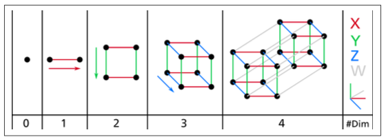


<!-- 
It turns out that many things behave very differently in high-dimensional space. For example, if you pick a random point in a unit square (a 1 × 1 square), it will have only about a 0.4% chance of being located less than 0.001 from a border (in other words, it is very unlikely that a random point will be “extreme” along any dimension). 
But in a 10,000-dimensional unit hypercube, this probability is greater than 99.999999%. Most points in a high-dimensional hypercube are very close to the border.3
 -->

---

## PCA

<style scoped>
    img[alt~="centre"] {
        position: absolute;
        left: 350px;
    }
</style>

<span style="font-size:0.9em">

- Principal Component Analysis (PCA) is by far the most popular dimensionality reduction algorithm. 
- First it identifies the hyperplane that lies closest to the data, and then it projects the data onto it.

</span>

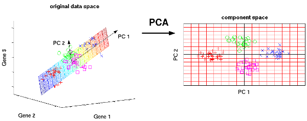

---

## PCA

```python
from sklearn.decomposition import PCA 
pca = PCA(n_components = 2)
X2D = pca.fit_transform(X)
```

<!-- 
Scikit-Learn’s PCA class uses SVD decomposition to implement PCA. 
The following code applies PCA to reduce the dimensionality of the dataset down to two dimensions (note that it automatically takes care of centering the data)
 -->

---

## Choosing the Dimensions

```python
pca = PCA()
pca.fit(X_train)
cumsum = np.cumsum(pca.explained_variance_ratio_)
d = np.argmax(cumsum >= 0.95) + 1
```

```python
pca = PCA(n_components=0.95)
X_reduced = pca.fit_transform(X_train)
```

<!-- 

Instead of arbitrarily choosing the number of dimensions to reduce down to, it is simpler to choose the number of dimensions that add up to a sufficiently large portion of the variance (e.g., 95%). 

Unless, of course, you are reducing dimensionality for data visualization—in that case you will want to reduce the dimensionality down to 2 or 3.

The following code performs PCA without reducing dimensionality, then computes the minimum number of dimensions required to preserve 95% of the training set’s variance


You could then set n_components=d and run PCA again. But there is a much better option: instead of specifying the number of principal components you want to preserve, you can set n_components to be a float between 0.0 and 1.0, indicating the ratio of variance you wish to preserve
 -->

---

<style scoped>

    img[alt~="right-float"] {
         display: block;
         float: right;
         margin-right: 0;
    }
</style>


<div style="display: flex; justify-content: space-between;">
<div style="width: 60%; font-size:0.7em">

- another option is to plot the explained variance as a function of the number of dimensions 
- There will usually be an elbow in the curve, where the explained variance stops growing fast.

```python
plt.figure(figsize=(6,4))
plt.plot(cumsum, linewidth=3)
plt.axis([0, 400, 0, 1])
plt.xlabel("Dimensions")
plt.ylabel("Explained Variance")
plt.plot([d, d], [0, 0.95], "k:")
plt.plot([0, d], [0.95, 0.95], "k:")
plt.plot(d, 0.95, "ko")
plt.annotate("Elbow", xy=(65, 0.85), xytext=(70, 0.7),
             arrowprops=dict(arrowstyle="->"), fontsize=16)
plt.grid(True)
plt.show()
```

</div>
<div style="width: 40%; padding-top: 150px;">

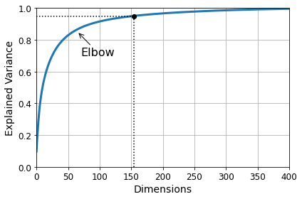

</div>
</div>

<!-- 
Yet another option is to plot the explained variance as a function of the number of dimensions. There will usually be an elbow in the curve, where the explained variance stops growing fast. In this case, you can see that reducing the dimensionality down to about 100 dimensions wouldn’t lose too much explained variance.
 -->

---

<style scoped>

    img[alt~="right-float"] {
         display: block;
         float: right;
         margin-right: 0;
         height: 400px;
    }
</style>


## t-Distributed Stochastic Neighbour Embedding (t-SNE)

<div style="display: flex; justify-content: space-between;">
<div style="width: 48%; font-size: 0.75em">

- Reduces dimensionality while trying to keep similar instances close and dissimilar instances apart. 
- It is mostly used for visualisation, in particular to visualise clusters of instances in high-dimensional space (e.g., to visualise the MNIST images in 2D).  

</div>
<div style="width: 30%;">

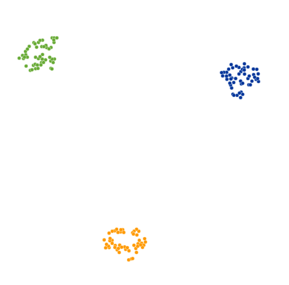

</div>
</div>

<!-- 
t-SNE (t-distributed Stochastic Neighbor Embedding) is an unsupervised non-linear dimensionality reduction technique for data exploration and visualizing high-dimensional data. Non-linear dimensionality reduction means that the algorithm allows us to separate data that cannot be separated by a straight line.

t-SNE gives you a feel and intuition on how data is arranged in higher dimensions. It is often used to visualize complex datasets into two and three dimensions, allowing us to understand more about underlying patterns and relationships in the data.

t-SNE vs PCA
Both t-SNE and PCA are dimensional reduction techniques that have different mechanisms and work best with different types of data.

PCA (Principal Component Analysis) is a linear technique that works best with data that has a linear structure. It seeks to identify the underlying principal components in the data by projecting onto lower dimensions, minimizing variance, and preserving large pairwise distances. Read our Principal Component Analysis (PCA) tutorial to understand the inner working of the algorithms with R examples. 

But, t-SNE is a nonlinear technique that focuses on preserving the pairwise similarities between data points in a lower-dimensional space. t-SNE is concerned with preserving small pairwise distances whereas, PCA focuses on maintaining large pairwise distances to maximize variance.

In summary, PCA preserves the variance in the data, whereas t-SNE preserves the relationships between data points in a lower-dimensional space, making it quite a good algorithm for visualizing complex high-dimensional data. 

 -->

---

<style scoped>
    img[alt~="medium-right"] {
        width: 100%;
    }
</style>

## t-SNE

<div style="display: flex; justify-content: space-between;">
<div style="width: 48%;">

```python
import plotly.express as px
from sklearn.datasets import make_classification

X, y = make_classification(
    n_features=6,
    n_classes=3,
    n_samples=1500,
    n_informative=2,
    random_state=5,
    n_clusters_per_class=1,
)


fig = px.scatter_3d(x=X[:, 0], y=X[:, 1], z=X[:, 2], color=y, opacity=0.8)
fig.show()
```

</div>
<div style="width: 48%;">

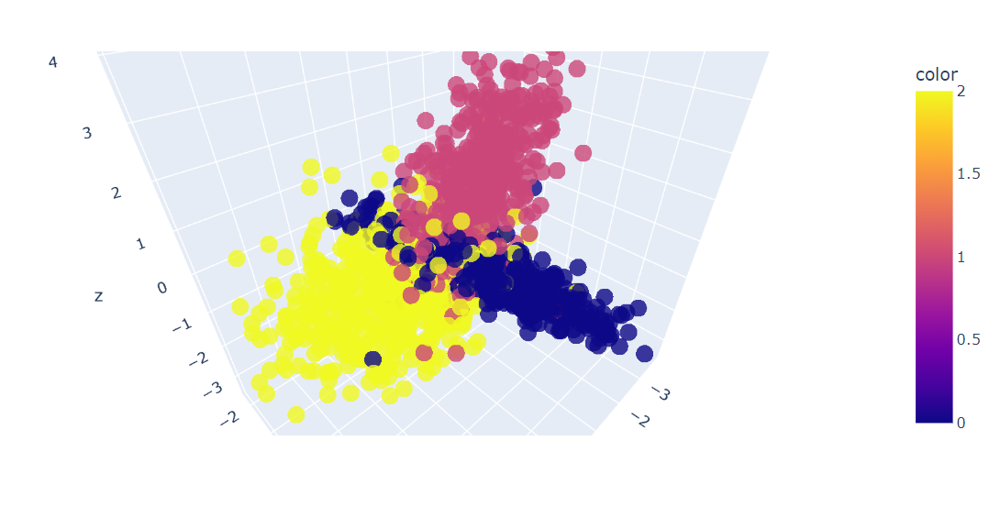

</div>
</div>

---

## t-SNE

<!-- ```python
from sklearn.decomposition import PCA

pca = PCA(n_components=2)
X_pca = pca.fit_transform(X)

fig = px.scatter(x=X_pca[:, 0], y=X_pca[:, 1], color=y)
fig.update_layout(
    title="PCA visualization of Custom Classification dataset",
    xaxis_title="First Principal Component",
    yaxis_title="Second Principal Component",
)
fig.show()
``` -->

<style scoped>
    img[alt~="medium-right"] {
        width: 100%;
    }
</style>

<div style="display: flex; justify-content: space-between;">
<div style="width: 48%;">

```python
from sklearn.manifold import TSNE

tsne = TSNE(n_components=2, random_state=42)
X_tsne = tsne.fit_transform(X)
tsne.kl_divergence_

fig = px.scatter(x=X_tsne[:, 0], y=X_tsne[:, 1], color=y)
fig.update_layout(
    title="t-SNE visualization of Custom Classification dataset",
    xaxis_title="First t-SNE",
    yaxis_title="Second t-SNE",
)
fig.show()
```

</div>
<div style="width: 48%;">

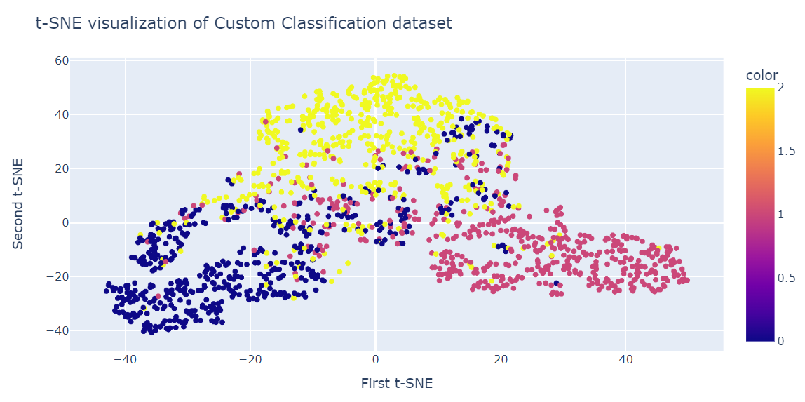

</div>
</div>

---

## Linear Discriminant Analysis (LDA)

<span style="font-size: 0.75em">

- Is a classification algorithm, but during training it learns the most discriminative axes between the classes, and these axes can then be used to define a hyperplane onto which to project the data. 
- The benefit of this approach is that the projection will keep classes as far apart as possible, so LDA is a good technique to reduce dimensionality before running another classification algorithm such as an SVM classifier.
- The primary function of LDA is to project high-dimensional data on to a lower-dimensional space while retaining the data's inherent class separability. 
- LDA can be applied to enhance the operation of classification algorithms such as a decision tree or random forest.

</span>

---

```python
import numpy as np
import pandas as pd
import matplotlib.pyplot as plt
import seaborn as sns
from sklearn.preprocessing import LabelEncoder
from sklearn.model_selection import train_test_split
from sklearn.discriminant_analysis import LinearDiscriminantAnalysis
from sklearn.ensemble import RandomForestClassifier
from sklearn.metrics import accuracy_score, confusion_matrix

url = "https://archive.ics.uci.edu/ml/machine-learning-databases/iris/iris.data"

# Define column names
cls = ['sepal-length', 'sepal-width', 'petal-length', 'petal-width', 'Class']

# Read the data set
dataset = pd.read_csv(url, names=cls)

# Divide the data set into features (X) and target variable (y)
X = dataset.iloc[:, 0:4].values
y = dataset.iloc[:, 4].values

# Encode the target variable
le = LabelEncoder()
y = le.fit_transform(y)

# Split the data set into training and testing sets
X_train, X_test, y_train, y_test = train_test_split(X, y, test_size=0.2)
```

---

## LDA

<style scoped>
    img[alt~="medium-right"] {
        width: 100%;
    }
</style>

<div style="display: flex; justify-content: space-between;">
<div style="width: 48%;">

```python
# Apply Linear Discriminant Analysis
lda = LinearDiscriminantAnalysis(n_components=2)
X_train = lda.fit_transform(X_train, y_train)
X_test = lda.transform(X_test)

tmp_Df = pd.DataFrame(X_train, columns=['LDA Component 1','LDA Component 2'])
tmp_Df['Class']=y_train

sns.FacetGrid(tmp_Df, hue ="Class",
              height = 6).map(plt.scatter,
                              'LDA Component 1',
                              'LDA Component 2')

plt.legend(loc='upper right')
```

</div>
<div style="width: 48%;">

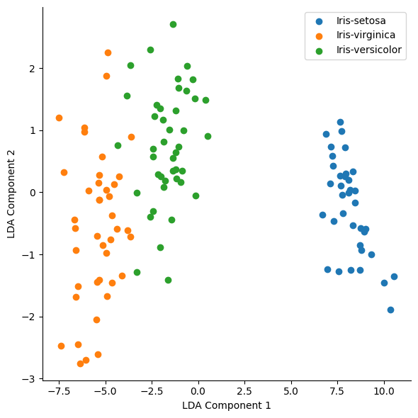

</div>
</div>

---

## Task

Go to one of the two sites below to download a dataset(s), and then start applying dimensionality techniques to the data and then put it into a regression or classification model(s).

What do you find?

- [UCI Datasets](https://archive.ics.uci.edu/datasets)
- [Kaggle](https://www.kaggle.com/datasets)

---

### S2 Walk-Through

Your task is to write a scientific paper on two machine learning AI algorithms you have created.

You are to create a research question that you are trying to solve by using the AI systems, in which you compare the performance of the two machine learning AI algorithms and assess and compare the performance of each. Your scientific paper will need an introduction, literature review, methodology, results, discussion and conclusion sections. The scientific paper should demonstrate your understanding of the material introduced in this module.

---

### Deliverables

The deliverables for this assessment are:

- The Scientific Paper: 3,000 words max, delivered in Word or PDF format. 
- Your ML implementation(s), the source code (Python code), and sample data were used to demonstrate your algorithm(s). 

---

### The Scientific Research Paper

<span style="font-size:0.57em">

The scientific research paper is the primary assessed element. It should describe: 
- Set the scene to your research in the introduction and an overview of what has happened.
- The literature review should explain the problem you are trying to solve and provide a background to the AI systems and domain problem.
- The methodology should identify the metrics, dataset, and how the systems were created. Ensure you are explaining the critical design decisions of the AI systems and the fundamental logic being used in the AI systems.
- The Results and Discussion section should outline the results and then your understanding of what the results mean. Ensure you apply critical analysis to the results and explain/challenge what they show.
- The conclusion is where you summarise your research paper—giving key outsights of the findings to the problem.
- The bibliography section is essential and should be linked to the references used in your paper. Ensure Harvard style or ACM is used.

</span>


---

### The Scientific Research Paper

<span style="font-size:0.6em">

The paper should be the result of a combined effort of your research into possible solutions and the development process and results of implementing one or more machine learning AI algorithms into functional research code, depending on your research question.

While you can adapt the above suggested format if appropriate, it is recommended that the the format is followed. Additionally, it must be well-researched and written using proper academic language.

Your paper is to be based on and facilitated by developing one or more algorithms, depending on your research problem, that attempt to solve a research problem of your choice. You can only use machine learning systems to solve this problem. Ensure that you use appropriate metrics to support your research claims. 

An ideal solution will perform well at whatever your research goal. Ensure to use appropriate metrics to back up your research claims. 

To demonstrate your algorithm(s), you will develop a simple but functional piece of code that utilises an appropriate dataset of your choice. The code is an important artefact to show the effectiveness of your algorithm(s) used to complete your chosen research question to assess and compare their performance, but the software itself is not marked.


</span>

---

### Marking Criteria

Machine Learning scientific paper will be marked against the following criteria:

<span style="font-size:0.8em">

- Introduction and Lit Review (25%)
- Methodology (25%)
- Results and Discussion (25%)
- Conclusion (15%)
- Report Depth and Presentation (10%) *

</span>

<span style="font-size:0.6em">

* This will apply a weighting effect to your overall score if $<70$.

</span>

<!-- 1) Part 1
2) Part 2 -->

<!-- ---

<div style="display: flex; justify-content: space-between;">
<div style="width: 48%;">


</div>
<div style="width: 48%;">


</div>
</div> -->