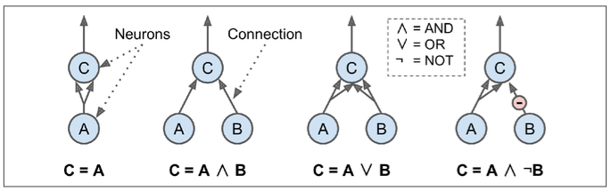
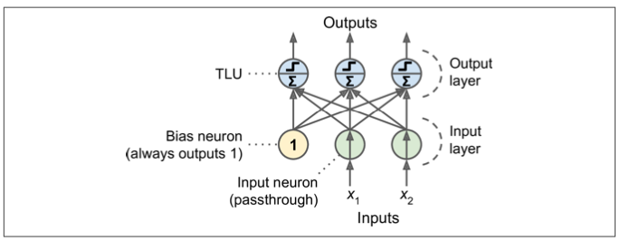
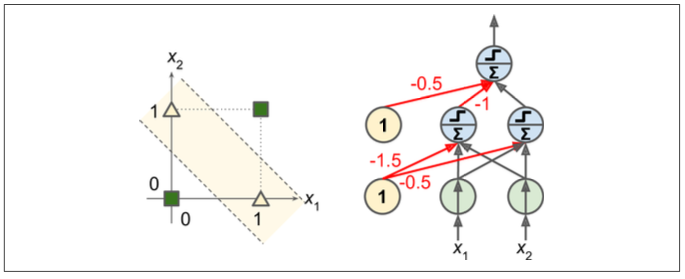
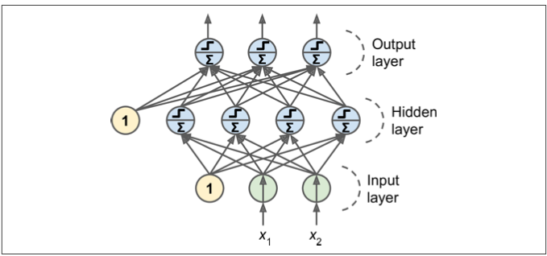
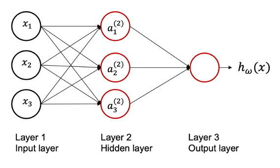
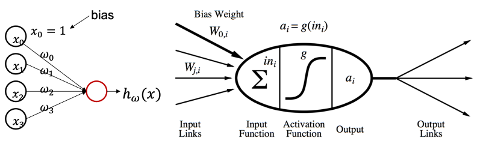
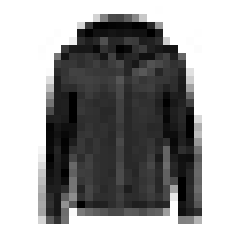
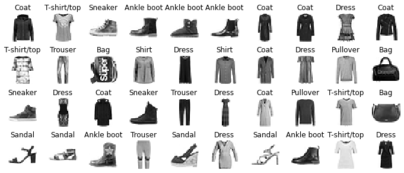
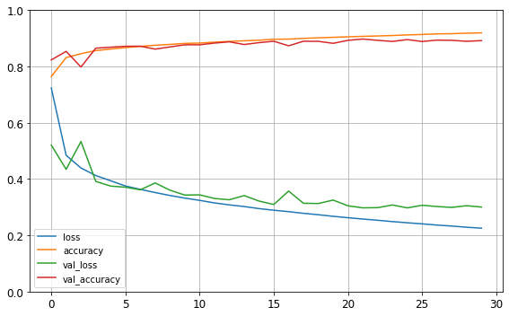
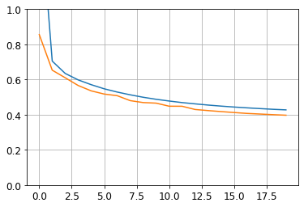

<!-- _class: lead -->


<!-- _footer: "" -->

---

## Course Overview

Week | Session | |
-----|------|---|
7 | Artificial Neural Networks |  
8 | Convolutional NN & Computer Vision |
9 | Recurrent NN & NLP |
10 | S2 Assessment Workshop |
11 | Generative AI | S2
12 | Building AI Agents |

---

# Overview

- Histroy of ANNs
- MLP for Classification 
- MLP for Regression

---

# Artificial Neural Networks (ANN)

- Inspired by the human brain.
- very core of Deep Learning.
- versatile, powerful, and scalable

<!-- 
Birds inspired us to fly, burdock plants inspired Velcro, and nature has inspired countless more inventions. 

It seems only logical, then, to look at the brain’s architec‐ ture for inspiration on how to build an intelligent machine. This is the logic that sparked artificial neural networks (ANNs): an ANN is a Machine Learning model inspired by the networks of biological neurons found in our brains. 

However, although planes were inspired by birds, they don’t have to flap their wings. Similarly, ANNs have gradually become quite different from their biological cousins. Some researchers even argue that we should drop the biological analogy altogether (e.g., by saying “units” rather than “neurons”), lest we restrict our creativity to biologically plausible systems.

ANNs are at the very core of Deep Learning. They are versatile, powerful, and scalable, making them ideal to tackle large and highly complex Machine Learning tasks such as classifying billions of images (e.g., Google Images), powering speech recognition services (e.g., Apple’s Siri), recommending the best videos to watch to hundreds of millions of users every day (e.g., YouTube), or learning to beat the world champion at the game of Go (DeepMind’s AlphaGo).
 -->

---

## Histroy of ANNs

<div style="font-size: 0.65em">

- first introduced back in 1943 by the neurophysiologist Warren McCulloch and the mathematician Walter Pitts.
- “A Logical Calculus of Ideas Immanent in Nervous Activity”
- The early successes of ANNs led to the widespread belief that we would soon be conversing with truly intelligent machines.
- it became clear in the 1960s that this promise would go unfulfilled (at least for quite a while), funding flew elsewhere, and ANNs entered a long winter.
- In the early 1980s, new architectures were invented and better training techniques were developed, sparking a revival of interest in connectionism.
- progress was slow, and by the 1990s other powerful Machine Learning techniques were invented, such as Support Vector Machines.

</div>

<!-- 
Surprisingly, ANNs have been around for quite a while: they were first introduced back in 1943 by the neurophysiologist Warren McCulloch and the mathematician Walter Pitts. 
In their landmark paper “A Logical Calculus of Ideas Immanent in Nervous Activity,” McCulloch and Pitts presented a simplified computational model of how biological neurons might work together in animal brains to perform complex computations using propositional logic. 
This was the first artificial neural network architecture. Since then many other architectures have been invented, as we will see.
The early successes of ANNs led to the widespread belief that we would soon be conversing with truly intelligent machines. When it became clear in the 1960s that this promise would go unfulfilled (at least for quite a while), funding flew elsewhere, and ANNs entered a long winter. In the early 1980s, new architectures were invented and better training techniques were developed, sparking a revival of interest in connectionism (the study of neural networks). But progress was slow, and by the 1990s other powerful Machine Learning techniques were invented, such as Support Vector Machines. 
These techniques seemed to offer better results and stronger theoretical foundations than ANNs, so once again the study of neural networks was put on hold.
 -->

---

## ANNs today

- huge quantity of data available to train neural networks.
- tremendous increase in computing power since the 1990s.
- training algorithms have been improved.
- theoretical limitations of ANNs have turned out to be benign in practice.
- ANNs seem to have entered a virtuous circle of funding and progress.

<!-- 
We are now witnessing yet another wave of interest in ANNs. Will this wave die out like the previous ones did? Well, here are a few good reasons to believe that this time is different and that the renewed interest in ANNs will have a much more profound impact on our lives:
• There is now a huge quantity of data available to train neural networks, and ANNs frequently outperform other ML techniques on very large and complex problems.
• The tremendous increase in computing power since the 1990s now makes it pos‐ sible to train large neural networks in a reasonable amount of time. This is in part due to Moore’s law (the number of components in integrated circuits has doubled about every 2 years over the last 50 years), but also thanks to the gaming industry, which has stimulated the production of powerful GPU cards by the mil‐ lions. Moreover, cloud platforms have made this power accessible to everyone.
• The training algorithms have been improved. To be fair they are only slightly dif‐ ferent from the ones used in the 1990s, but these relatively small tweaks have had a huge positive impact.
• Some theoretical limitations of ANNs have turned out to be benign in practice. For example, many people thought that ANN training algorithms were doomed because they were likely to get stuck in local optima, but it turns out that this is rather rare in practice (and when it is the case, they are usually fairly close to the global optimum).
• ANNs seem to have entered a virtuous circle of funding and progress. Amazing products based on ANNs regularly make the headline news, which pulls more and more attention and funding toward them, resulting in more and more pro‐ gress and even more amazing products.


 -->

---

## Early ANNs - Logical Computations with Neurons

<div style="font-size: 0.8em">

- McCulloch and Pitts proposed a very simple model of the biological neuron
- became known as a artificial neuron: it has one or more binary (on/off) inputs and one binary output

</div>



<!-- 
McCulloch and Pitts proposed a very simple model of the biological neuron, which later became known as an artificial neuron: it has one or more binary (on/off) inputs and one binary output. The artificial neuron activates its output when more than a certain number of its inputs are active. 
In their paper, they showed that even with such a simplified model it is possible to build a network of artificial neurons that computes any logical proposition you want. 
To see how such a network works, let’s build a few ANNs that perform various logical computations (see Figure 10-3), assuming that a neuron is activated when at least two of its inputs are active.

The first network on the left is the identity function: if neuron A is activated, then neuron C gets activated as well (since it receives two input signals from neu‐ ron A); but if neuron A is off, then neuron C is off as well.
• The second network performs a logical AND: neuron C is activated only when both neurons A and B are activated (a single input signal is not enough to acti‐ vate neuron C).
• The third network performs a logical OR: neuron C gets activated if either neu‐ ron A or neuron B is activated (or both).
• Finally, if we suppose that an input connection can inhibit the neuron’s activity (which is the case with biological neurons), then the fourth network computes a slightly more complex logical proposition: neuron C is activated only if neuron A is active and neuron B is off. If neuron A is active all the time, then you get a logical NOT: neuron C is active when neuron B is off, and vice versa.
You can imagine how these networks can be combined to compute complex logical expressions (see the exercises at the end of the chapter for an example).

 -->

---

## The Perceptron

<div style="font-size: 0.8em">

- The Perceptron is one of the simplest ANN architectures, invented in 1957 by Frank Rosenblatt. 
- It is based on a slightly different artificial neuron called a threshold logic unit (TLU), or sometimes a linear threshold unit (LTU). 
- The inputs and output are numbers, and each input connection is associated with a weight. 
- The TLU computes a weighted sum of its inputs $z = w_1 x_1 + w_2 x_2 + \cdots + w_n x_n = x^\intercal w$, then applies a step function to that sum and outputs the result: $hw(x) = step(z)$, where $z = x^\intercal w$.

</div>

<!-- 
The Perceptron is one of the simplest ANN architectures, invented in 1957 by Frank Rosenblatt. It is based on a slightly different artificial neuron (see Figure 10-4) called a threshold logic unit (TLU), or sometimes a linear threshold unit (LTU). The inputs and output are numbers (instead of binary on/off values), and each input connection is associated with a weight. The TLU computes a weighted sum of its inputs (z = w1 x1 + w2 x2 + ⋯ + wn xn = x⊺ w), then applies a step function to that sum and outputs the result: hw(x) = step(z), where z = x⊺ w.
 -->

---



<!-- 
A Perceptron is simply composed of a single layer of TLUs,7 with each TLU connected to all the inputs. When all the neurons in a layer are connected to every neuron in the previous layer (i.e., its input neurons), the layer is called a fully connected layer, or a dense layer. The inputs of the Perceptron are fed to special passthrough neurons called input neurons: they output whatever input they are fed. All the input neurons form the input layer. Moreover, an extra bias feature is generally added (x0 = 1): it is typically represented using a special type of neuron called a bias neuron, which out‐ puts 1 all the time. A Perceptron with two inputs and three outputs. 
This Perceptron can classify instances simultaneously into three different binary classes, which makes it a multioutput classifier.
 -->

---



<!-- 
Note that contrary to Logistic Regression classifiers, Perceptrons do not output a class probability; rather, they make predictions based on a hard threshold. This is one reason to prefer Logistic Regression over Perceptrons.
In their 1969 monograph Perceptrons, Marvin Minsky and Seymour Papert highligh‐ ted a number of serious weaknesses of Perceptrons—in particular, the fact that they are incapable of solving some trivial problems (e.g., the Exclusive OR (XOR) classifi‐ cation problem; see the left side of Figure 10-6). This is true of any other linear classi‐ fication model (such as Logistic Regression classifiers), but researchers had expected much more from Perceptrons, and some were so disappointed that they dropped neural networks altogether in favor of higher-level problems such as logic, problem solving, and search.
It turns out that some of the limitations of Perceptrons can be eliminated by stacking multiple Perceptrons. The resulting ANN is called a Multilayer Perceptron (MLP). An MLP can solve the XOR problem, as you can verify by computing the output of the MLP represented on the right side of Figure 10-6: with inputs (0, 0) or (1, 1), the net‐ work outputs 0, and with inputs (0, 1) or (1, 0) it outputs 1. All connections have a weight equal to 1, except the four connections where the weight is shown. Try verify‐ ing that this network indeed solves the XOR problem!
 -->

---

## The Multilayer Perceptron

<div style="font-size: 0.75em">

- An MLP is composed of one (passthrough) input layer, one or more layers of TLUs, called hidden layers, and one final layer of TLUs called the output layer. 
- The layers close to the input layer are usually called the lower layers, and the ones close to the outputs are usually called the upper layers. 
- Every layer except the output layer includes a bias neuron and is fully connected to the next layer.
- When an ANN contains a deep stack of hidden layers, it is called a deep neural network (DNN). 
- The field of Deep Learning studies DNNs, and more generally models containing deep stacks of computations.

</div>


<!-- 
An MLP is composed of one (passthrough) input layer, one or more layers of TLUs, called hidden layers, and one final layer of TLUs called the output layer. The layers close to the input layer are usually called the lower layers, and the ones close to the outputs are usually called the upper layers. Every layer except the output layer includes a bias neuron and is fully connected to the next layer.

When an ANN contains a deep stack of hidden layers, it is called a deep neural net‐ work (DNN). The field of Deep Learning studies DNNs, and more generally models containing deep stacks of computations. Even so, many people talk about Deep Learning whenever neural networks are involved (even shallow ones).
 -->

---



---

## Back Propagation

<div style="font-size: 0.7em">

- introduced the backpropagation training algorithm, which is still used today. 
- Gradient Descent is used for computing the gradients automatically
    - in just two passes through the network (one forward, one backward), the backpropagation algorithm is able to compute the gradient of the network’s error with regard to every single model parameter. 
- Once it has these gradients, it just performs a regular Gradient Descent step, and the whole process is repeated until the network converges to the solution.
</div>

<!-- 
introduced the backpropagation training algorithm, which is still used today. In short, it is Gradient Descent using an efficient technique for computing the gradients automatically: in just two passes through the network (one forward, one backward), the backpropagation algorithm is able to compute the gradient of the network’s error with regard to every single model parameter. In other words, it can find out how each connection weight and each bias term should be tweaked in order to reduce the error. 
Once it has these gradients, it just performs a regular Gradient Descent step, and the whole process is repeated until the network converges to the solution.
 -->

---

<!-- # How does it all work? -->




<!-- 
Let’s run through this algorithm in a bit more detail:
• It handles one mini-batch at a time (for example, containing 32 instances each), and it goes through the full training set multiple times. Each pass is called an epoch.
• Each mini-batch is passed to the network’s input layer, which sends it to the first hidden layer. The algorithm then computes the output of all the neurons in this layer (for every instance in the mini-batch). The result is passed on to the next layer, its output is computed and passed to the next layer, and so on until we get the output of the last layer, the output layer. This is the forward pass: it is exactly like making predictions, except all intermediate results are preserved since they are needed for the backward pass.
• Next, the algorithm measures the network’s output error (i.e., it uses a loss func‐ tion that compares the desired output and the actual output of the network, and returns some measure of the error).
• Then it computes how much each output connection contributed to the error. This is done analytically by applying the chain rule (perhaps the most fundamen‐ tal rule in calculus), which makes this step fast and precise.
- The algorithm then measures how much of these error contributions came from each connection in the layer below, again using the chain rule, working backward until the algorithm reaches the input layer. As explained earlier, this reverse pass efficiently measures the error gradient across all the connection weights in the network by propagating the error gradient backward through the network (hence the name of the algorithm).
- Finally, the algorithm performs a Gradient Descent step to tweak all the connec‐ tion weights in the network, using the error gradients it just computed.

This algorithm is so important that it’s worth summarizing it again: for each training instance, the backpropagation algorithm first makes a prediction (forward pass) and measures the error, then goes through each layer in reverse to measure the error con‐ tribution from each connection (reverse pass), and finally tweaks the connection weights to reduce the error (Gradient Descent step).
 -->

---

## How does it all work?



---

## Actavation Functions

- sigmoid
- relu
- log_softmax
- and more...

[More details Activation Functions](https://www.tensorflow.org/api_docs/python/tf/keras/activations)

---

## Building a Image Classifier


<div style="display: flex; justify-content: space-between;">
<div style="width: 70%;">

```python
import tensorflow as tf
from tensorflow import keras


fashion_mnist = keras.datasets.fashion_mnist
(X_train_full, y_train_full), (X_test, y_test) = fashion_mnist.load_data()

X_train_full.shape
>>> (60000, 28, 28)


X_valid, X_train = X_train_full[:5000] / 255., X_train_full[5000:] / 255.
y_valid, y_train = y_train_full[:5000], y_train_full[5000:]
X_test = X_test / 255.

plt.imshow(X_train[0], cmap="binary")
plt.axis('off')
plt.show()
```

</div>
<div style="width: 30%;">



</div>
</div>

---

```python
class_names = ["T-shirt/top", "Trouser", "Pullover", "Dress", "Coat",
               "Sandal", "Shirt", "Sneaker", "Bag", "Ankle boot"]

class_names[y_train[0]]
>>> 'Coat'

n_rows = 4
n_cols = 10
plt.figure(figsize=(n_cols * 1.2, n_rows * 1.2))
for row in range(n_rows):
    for col in range(n_cols):
        index = n_cols * row + col
        plt.subplot(n_rows, n_cols, index + 1)
        plt.imshow(X_train[index], cmap="binary", interpolation="nearest")
        plt.axis('off')
        plt.title(class_names[y_train[index]], fontsize=12)
plt.subplots_adjust(wspace=0.2, hspace=0.5)
plt.show()
```

---

<div style="width: 100%; background-color: lightgray; border-radius: 25px;">



</div>

---

## Creating the ANN with TensorFlow

<div style="display: flex; justify-content: space-between;">
<div style="width: 48%;">


```python
# Method 1
model = keras.models.Sequential()
model.add(keras.layers.Flatten(input_shape=[28, 28]))
model.add(keras.layers.Dense(300, activation="relu"))
model.add(keras.layers.Dense(100, activation="relu"))
model.add(keras.layers.Dense(10, activation="softmax"))
```

</div>
<div style="width: 48%; font-size: 0.6em">

```python
# Method 2
model = keras.models.Sequential([
    keras.layers.Flatten(input_shape=[28, 28]),
    keras.layers.Dense(300, activation="relu"),
    keras.layers.Dense(100, activation="relu"),
    keras.layers.Dense(10, activation="softmax")
])
```
</div>
</div>

<div style="font-size: 0.5em; width: 500px;">

```python
model.summary()
>>>
Model: "sequential"
_________________________________________________________________
Layer (type)                 Output Shape              Param #   
=================================================================
flatten (Flatten)            (None, 784)               0         
_________________________________________________________________
dense (Dense)                (None, 300)               235500    
_________________________________________________________________
dense_1 (Dense)              (None, 100)               30100     
_________________________________________________________________
dense_2 (Dense)              (None, 10)                1010      
=================================================================
Total params: 266,610
Trainable params: 266,610
Non-trainable params: 0
_________________________________________________________________
```
</div>

<!-- _footer: "" -->

---

## Train the Model

```python
history = model.fit(X_train, y_train, epochs=30,
                    validation_data=(X_valid, y_valid))
```

---

## Visualise Results

<div style="display: flex; justify-content: space-between;">
<div style="width: 45%;">

```python
import pandas as pd

pd.DataFrame(history.history).plot(figsize=(8, 5))
plt.grid(True)
plt.gca().set_ylim(0, 1)
plt.show()
```

</div>
<div style="width: 48%; background-color: lightgray; border-radius: 25px; width:575px;">



</div>
</div>

---

## Making Predictions

<div style="font-size: 0.8em">

```python
X_new = X_test[:3]
y_proba = model.predict(X_new)
y_proba.round(2)
>>> 
array([[0.  , 0.  , 0.  , 0.  , 0.  , 0.01, 0.  , 0.03, 0.  , 0.96],
       [0.  , 0.  , 0.99, 0.  , 0.01, 0.  , 0.  , 0.  , 0.  , 0.  ],
       [0.  , 1.  , 0.  , 0.  , 0.  , 0.  , 0.  , 0.  , 0.  , 0.  ]],
      dtype=float32)

y_pred = np.argmax(model.predict(X_new), axis=-1)
y_pred
>>> array([9, 2, 1])

np.array(class_names)[y_pred]
>>> array(['Ankle boot', 'Pullover', 'Trouser'])
```

</div>

---

### Task: Binary Classification with the Breast Cancer Dataset

<span style="font-size: 0.6em">

Build a binary classification model to predict cancer malignancy.

Steps:
</span>

<span style="font-size: 0.6em">

- Load the Breast Cancer dataset using sklearn.datasets.load_breast_cancer.
- Preprocess the data:
    - Normalize the features using StandardScaler.
    - Split the data into training and testing sets.
- Build a neural network using TensorFlow/Keras with:
    - Input layer matching the number of features.
    - At least two hidden layers (e.g., with 128 and 64 units, ReLU activation).
    - Output layer with 1 neuron and sigmoid activation.
- Compile the model with Binary Cross-Entropy loss and Adam optimizer.
- Train the model for 20 epochs with a batch size of 16, and visualize the accuracy over epochs.
- Evaluate the model on the test set using accuracy and a confusion matrix.
- Expected Outcome:
    - Visualization of training and validation accuracy over epochs.
    - Confusion matrix and model accuracy on the test set.
</span>

---

### Task: Multi-Class Classification with the Fashion MNIST Dataset

<span style="font-size: 0.6em">

Build a neural network to classify images of clothing into categories.

Steps:
</span>

<span style="font-size: 0.6em">

- Load the Fashion MNIST dataset using tensorflow.keras.datasets.fashion_mnist.
- Preprocess the data:
    - Normalize the pixel values to the range [0, 1].
    - Split the data into training and testing sets.
- Build a neural network using TensorFlow/Keras with:
    - Input layer for the flattened 28x28 images (784 features).
    - At least two hidden layers (e.g., with 256 and 128 units, ReLU activation).
    - Output layer with 10 neurons (one for each class) and softmax activation.
- Compile the model with Sparse Categorical Cross-Entropy loss and Adam optimizer.
- Train the model for 10 epochs with a batch size of 64, and plot the training accuracy.
- Evaluate the model on the test set using accuracy and visualize some predictions with their true labels.
- Expected Outcome:
    - Plot of training and validation accuracy.
    - Visualization of sample predictions (e.g., a 3x3 grid with images, predicted labels, and true labels).

</span>

---

## Regression MLP

```python 
from sklearn.datasets import fetch_california_housing
from sklearn.model_selection import train_test_split
from sklearn.preprocessing import StandardScaler

housing = fetch_california_housing()

X_train_full, X_test, y_train_full, y_test = train_test_split(housing.data, housing.target, random_state=42)
X_train, X_valid, y_train, y_valid = train_test_split(X_train_full, y_train_full, random_state=42)

scaler = StandardScaler()
X_train = scaler.fit_transform(X_train)
X_valid = scaler.transform(X_valid)
X_test = scaler.transform(X_test)
```

---

## Creating Regression MLP & Prediction

```python
model = keras.models.Sequential([
    keras.layers.Dense(30, activation="relu", input_shape=X_train.shape[1:]),
    keras.layers.Dense(1)
])
model.compile(
    loss="mean_squared_error", 
    optimizer=keras.optimizers.SGD(learning_rate=1e-3)
)
history = model.fit(X_train, y_train, 
                    epochs=20, validation_data=(X_valid, y_valid))
mse_test = model.evaluate(X_test, y_test)

X_new = X_test[:3]
y_pred = model.predict(X_new)
```

---

## Checking Training Loss

<div style="display: flex; justify-content: space-between;">
<div style="width: 48%;">

```python
plt.plot(pd.DataFrame(history.history))
plt.grid(True)
plt.gca().set_ylim(0, 1)
plt.show()

y_pred
>>> array([[0.3885664],
           [1.6792021],
           [3.1022797]], dtype=float32)
```

</div>
<div style="width: 48%; background-color: white;">



</div>
</div>

---

### Task: Regression with the California Housing Dataset

<span style="font-size: 0.6em">

Build a neural network to predict house prices using the California Housing dataset.

Steps:
</span>

<span style="font-size: 0.6em">

- Load the California Housing dataset using sklearn.datasets.fetch_california_housing.
- Preprocess the data:
    - Normalize the features using StandardScaler from sklearn.preprocessing.
    - Split the data into training and testing sets (e.g., 80/20 split).
- Build a neural network using TensorFlow/Keras with:
    - Input layer matching the number of features.
    - At least two hidden layers (e.g., with 64 and 32 units, ReLU activation).
    - Output layer with a single neuron (no activation for regression).
- Compile the model with Mean Squared Error (MSE) loss and Adam optimizer.
- Train the model for 50 epochs with a batch size of 32, and visualize the training loss.
- Evaluate the model on the test set using MSE and plot predicted vs. actual prices.
- Expected Outcome:
    - Visualization of training loss over epochs.
    - Scatter plot comparing predicted and actual house prices on the test set.

</span>

---

## Next Session

- Convolutional Neural Networks
- Computer Vision

<!-- # Task

Go to one of the two sites below to download a dataset(s), and then start applying regression and/or classification techniques to the data.

- [UCI Datasets](https://archive.ics.uci.edu/datasets)
- [Kaggle](https://www.kaggle.com/datasets) -->

<!-- ---

<div style="display: flex; justify-content: space-between;">
<div style="width: 48%;">


</div>
<div style="width: 48%;">


</div>
</div> -->