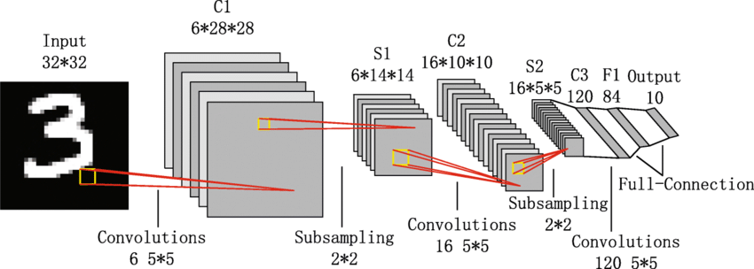
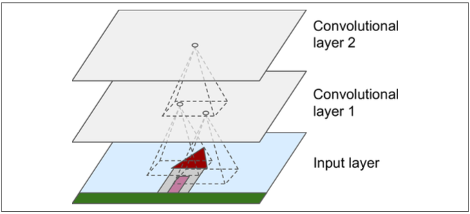
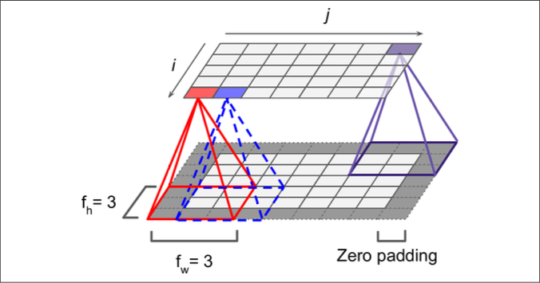
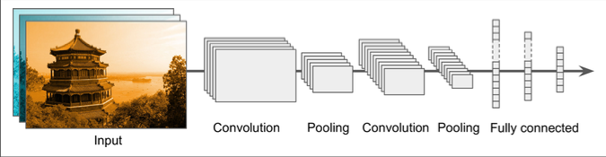

<!-- _class: lead -->


# CPU5006-20: Artificial Intelligence
## Session 8: Convolutional Neural Networks

<!-- _footer: "" -->

---

## Course Overview

Week | Session | |
-----|------|---|
8 | Convolutional NN & Computer Vision |
9 | Recurrent NN & NLP |
10 | S2 Assessment Workshop |
11 | Generative AI | S2
12 | Building AI Agents |

---

## Overview

- Convolutional Neural Networks
- CNN Architetures
- Computer Vision

---

## Convolutional NN

<span style="font-size:0.8em">

- Convolutional neural networks (CNNs) emerged from the study of the brain’s visual cortex, and they have been used in image recognition since the 1980s. 
- In the last few years, thanks to the increase in computational power, the amount of available training data, for training deep nets, CNNs have managed to achieve superhuman performance on some complex visual tasks. 
- They power image search services, self-driving cars, automatic video classification systems, and more. 

</span>

<!-- 
Convolutional neural networks (CNNs) emerged from the study of the brain’s visual cortex, and they have been used in image recognition since the 1980s. In the last few years, thanks to the increase in computational power, the amount of available training data, and the tricks presented in Chapter 11 for training deep nets, CNNs have managed to achieve superhuman performance on some complex visual tasks. They power image search services, self-driving cars, automatic video classification systems, and more. Moreover, CNNs are not restricted to visual perception: they are also successful at many other tasks, such as voice recognition and natural language processing.
 -->

---

## LeNet-5 Architecture




---

## Convolutional Layers



<!-- 
The most important building block of a CNN is the convolutional layer:6 neurons in the first convolutional layer are not connected to every single pixel in the input image, but only to pixels in their receptive fields. 
In turn, each neuron in the second convolutional layer is connected only to neurons located within a small rectangle in the first layer. 
This architecture allows the network to concentrate on small low-level features in the first hidden layer, then assemble them into larger higher-level features in the next hidden layer, and so on. 
This hierarchical structure is common in real-world images, which is one of the reasons why CNNs work so well for image recognition.

NOTE: All the multilayer neural networks we’ve looked at so far had layers composed of a long line of neurons, and we had to flatten input images to 1D before feeding them to the neural network. In a CNN each layer is represented in 2D, which makes it easier to match neurons with their corresponding inputs.
 -->

---



<!-- 
A neuron located in row i, column j of a given layer is connected to the outputs of the neurons in the previous layer located in rows $i$ to $i + f_h – 1$, columns $j$ to $j + f_w – 1$, where $f_h$ and $f_w$ are the height and width of the receptive field. 
In order for a layer to have the same height and width as the previous layer, it is common to add zeros around the inputs, as shown in the diagram. 
This is called zero padding.
-->

---

## Pooling

- Max
- Min
- Average
- Global Pooling

---

## CNN Architectures




<!-- 
Typical CNN architectures stack a few convolutional layers (each one generally followed by a ReLU layer), then a pooling layer, then another few convolutional layers (+ReLU), then another pooling layer, and so on. The image gets smaller and smaller as it progresses through the network, but it also typically gets deeper and deeper (i.e., with more feature maps), thanks to the convolutional layers. At the top of the stack, a regular feedforward neural network is added, composed of a few fully connected layers (+ReLUs), and the final layer outputs the prediction (e.g., a softmax layer that outputs estimated class probabilities).

A common mistake is to use convolution kernels that are too large. For example, instead of using a convolutional layer with a 5 × 5 kernel, stack two layers with 3 × 3 kernels: it will use fewer parameters and require fewer computations, and it will usually perform better. One exception is for the first convolutional layer: it can typically have a large kernel (e.g., 5 × 5), usually with a stride of 2 or more: this will reduce the spatial dimension of the image without losing too much information, and since the input image only has three channels in general, it will not be too costly.
 -->

---

## CNN in TensorFlow

<div style="display: flex; justify-content: space-between;">
<div style="width: 48%;">

```python
import tensorflow as tf
from tensorflow import keras
from functools import partial

(X_train_full, y_train_full), (X_test, y_test) = keras.datasets.fashion_mnist.load_data()
X_train, X_valid = X_train_full[:-5000], X_train_full[-5000:]
y_train, y_valid = y_train_full[:-5000], y_train_full[-5000:]

X_mean = X_train.mean(axis=0, keepdims=True)
X_std = X_train.std(axis=0, keepdims=True) + 1e-7
X_train = (X_train - X_mean) / X_std
X_valid = (X_valid - X_mean) / X_std
X_test = (X_test - X_mean) / X_std

X_train = X_train[..., np.newaxis]
X_valid = X_valid[..., np.newaxis]
X_test = X_test[..., np.newaxis]
```
</div>
<div style="width: 48%;">

```python
DefaultConv2D = partial(keras.layers.Conv2D,
                        kernel_size=3, activation='relu', padding="SAME")

model = keras.models.Sequential([
    DefaultConv2D(filters=64, kernel_size=7, input_shape=[28, 28, 1]),
    keras.layers.MaxPooling2D(pool_size=2),
    DefaultConv2D(filters=128),
    DefaultConv2D(filters=128),
    keras.layers.MaxPooling2D(pool_size=2),
    DefaultConv2D(filters=256),
    DefaultConv2D(filters=256),
    keras.layers.MaxPooling2D(pool_size=2),
    keras.layers.Flatten(),
    keras.layers.Dense(units=128, activation='relu'),
    keras.layers.Dropout(0.5),
    keras.layers.Dense(units=64, activation='relu'),
    keras.layers.Dropout(0.5),
    keras.layers.Dense(units=10, activation='softmax'),
])


model.compile(loss="sparse_categorical_crossentropy", optimizer="nadam", metrics=["accuracy"])
history = model.fit(X_train, y_train, epochs=10, validation_data=(X_valid, y_valid))
score = model.evaluate(X_test, y_test)
X_new = X_test[:10] # pretend we have new images
y_pred = model.predict(X_new)
```
</div>
</div>

---

## Task:  CNN for CIFAR Dataset

Create a CNN that classifies the CIFAR dataset.

- [CIFAR dataset](https://www.cs.toronto.edu/~kriz/cifar.html)

<span style="font-size:0.45em">

```python
import tensorflow as tf
from tensorflow.keras.datasets import cifar10
from sklearn.model_selection import train_test_split

# Load CIFAR-10 dataset
(x_train_full, y_train_full), (x_test, y_test) = cifar10.load_data()

# Normalize the pixel values to the range [0, 1]
x_train_full = x_train_full.astype('float32') / 255.0
x_test = x_test.astype('float32') / 255.0

# Optionally split the training set into a smaller training set and validation set
x_train, x_val, y_train, y_val = train_test_split(
    x_train_full, y_train_full, test_size=0.2, random_state=42
)

# Print dataset shapes
print(f"x_train shape: {x_train.shape}, y_train shape: {y_train.shape}")
print(f"x_val shape: {x_val.shape}, y_val shape: {y_val.shape}")
print(f"x_test shape: {x_test.shape}, y_test shape: {y_test.shape}")
```

</span>

---

## Task

Dedicated time S2

Go to one of the two sites below to download a dataset(s), and then start applying CNN and RNN techniques to the data.

- [NLP Datasets](https://github.com/niderhoff/nlp-datasets)
- [Kaggle](https://www.kaggle.com/datasets)

or continue to work on your S2 assessment.

---

## Next Session

- Recurrent Neural Networks
- Natural Language Processing

<!-- ---

<div style="display: flex; justify-content: space-between;">
<div style="width: 48%;">


</div>
<div style="width: 48%;">


</div>
</div> -->