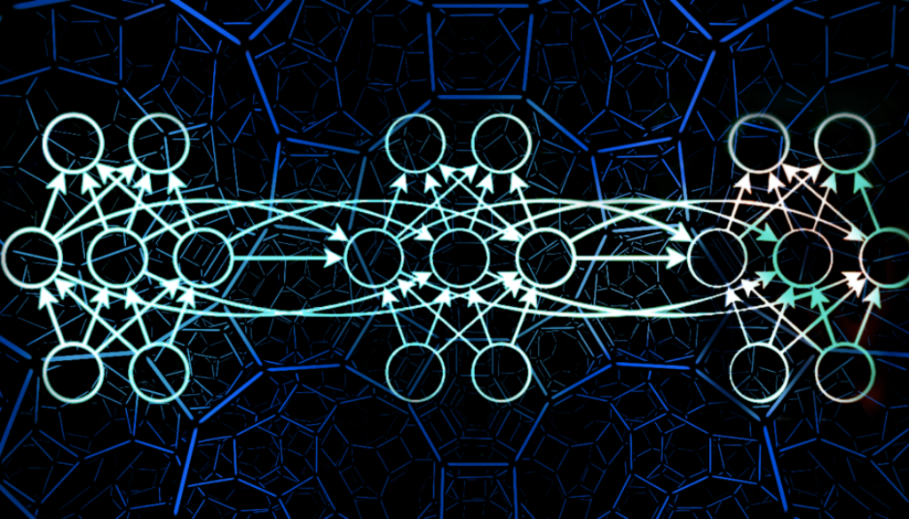
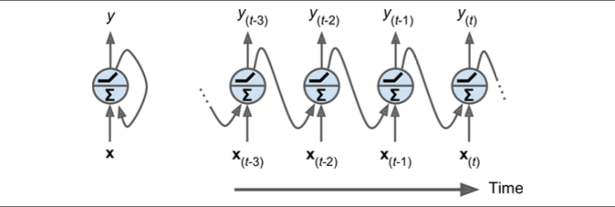
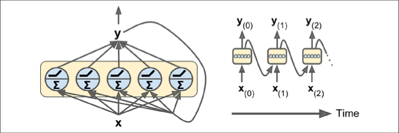
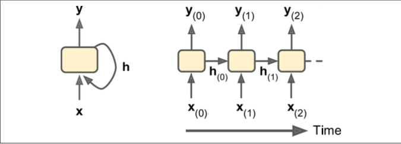
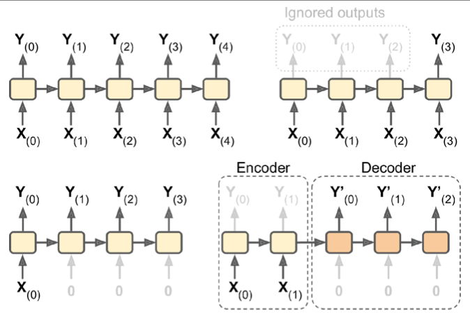
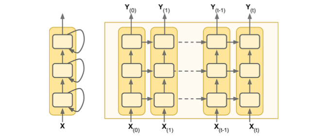
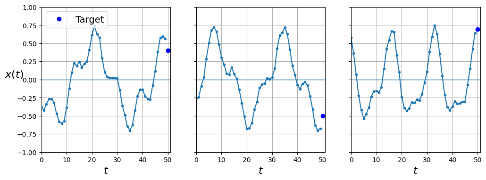
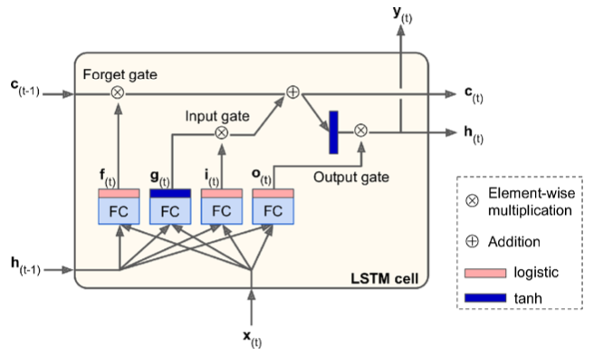
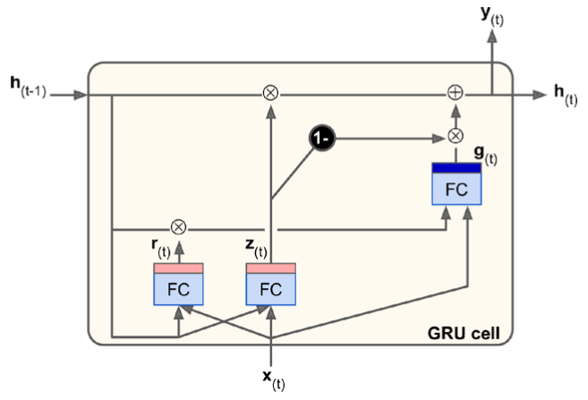
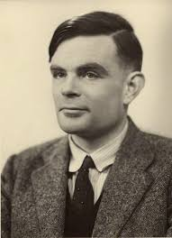

<!-- _class: lead -->



# <span style="color:red"> Recurrant Neural Networks

</span>

<!-- _footer: "" -->

---

## Course Overview

Week | Session | |
-----|------|---|
9 | Recurrent NN & NLP |
10 | S2 Assessment Workshop |
11 | Generative AI | S2
12 | Building AI Agents |

---

## Overview

- Recurrent Neural Networks
- Natural Language Processing

---

## RNN 

<!-- (Chapter 15) -->

- The batter hits the ball. The outfielder immediately starts running, anticipating the ball’s trajectory. 
- They tracks it, adapts their movements, and finally catches it (under a thunder of applause). 
- Predicting the future is something you do all the time, whether you are finishing a friend’s sentence or anticipating the smell of coffee at breakfast. 

<!-- 
The batter hits the ball. The outfielder immediately starts running, anticipating the ball’s trajectory. 
He tracks it, adapts his movements, and finally catches it (under a thunder of applause). 
Predicting the future is something you do all the time, whether you are finishing a friend’s sentence or anticipating the smell of coffee at breakfast. 

we will discuss recurrent neural networks (RNNs), a class of nets that can predict the future (well, up to a point, of course). They can analyze time series data such as stock prices, and tell you when to buy or sell. 
In autonomous driving systems, they can anticipate car trajectories and help avoid accidents. 
More generally, they can work on sequences of arbitrary lengths, rather than on fixed-sized inputs like all the nets we have considered so far. 
For example, they can take sentences, documents, or audio samples as input, making them extremely useful for natural language processing applications such as automatic translation or speech-to-text. 
-->

---

<!-- _class: lead -->

##  Recurrent Neurons and Layers


---

##  Recurrent Neurons and Layers



<!-- 
Up to now we have focused on feedforward neural networks, where the activations flow only in one direction, from the input layer to the output layer (a few exceptions are discussed in Appendix E). A recurrent neural network looks very much like a feedforward neural network, except it also has connections pointing backward. Let’s look at the simplest possible RNN, composed of one neuron receiving inputs, producing an output, and sending that output back to itself, as shown in Figure 15-1 (left). At each time step t (also called a frame), this recurrent neuron receives the inputs x(t) as well as its own output from the previous time step, y(t–1). Since there is no previ‐ ous output at the first time step, it is generally set to 0. We can represent this tiny net‐ work against the time axis, as shown in Figure 15-1 (right). This is called unrolling the network through time (it’s the same recurrent neuron represented once per time step). -->

---

## Recurrent Neurons and Layers



<!-- 
You can easily create a layer of recurrent neurons. At each time step t, every neuron receives both the input vector x(t) and the output vector from the previous time step y(t–1), as shown in Figure 15-2. Note that both the inputs and outputs are vectors now (when there was just a single neuron, the output was a scalar).

Each recurrent neuron has two sets of weights: one for the inputs x(t) and the other for the outputs of the previous time step, y(t–1). Let’s call these weight vectors wx and wy. If we consider the whole recurrent layer instead of just one recurrent neuron, we can place all the weight vectors in two weight matrices, Wx and Wy. The output vector of the whole recurrent layer can then be computed pretty much as you might expect, as shown in Equation 15-1 (b is the bias vector and φ(·) is the activation function (e.g., ReLU1).
 -->

---

## Memory Cells



<!-- 
Since the output of a recurrent neuron at time step t is a function of all the inputs from previous time steps, you could say it has a form of memory. A part of a neural network that preserves some state across time steps is called a memory cell (or simply a cell). A single recurrent neuron, or a layer of recurrent neurons, is a very basic cell, capable of learning only short patterns (typically about 10 steps long, but this varies depending on the task). Later in this chapter, we will look at some more complex and powerful types of cells capable of learning longer patterns (roughly 10 times longer, but again, this depends on the task).
In general a cell’s state at time step t, denoted h(t) (the “h” stands for “hidden”), is a function of some inputs at that time step and its state at the previous time step: h(t) = f(h(t–1), x(t)). Its output at time step t, denoted y(t), is also a function of the previous state and the current inputs. In the case of the basic cells we have discussed so far, the output is simply equal to the state, but in more complex cells this is not always the case,
 -->
---

## Input and Output Sequences




<!-- 
An RNN can simultaneously take a sequence of inputs and produce a sequence of outputs (see the top-left network in Figure 15-4). This type of sequence-to-sequence network is useful for predicting time series such as stock prices: you feed it the prices over the last N days, and it must output the prices shifted by one day into the future (i.e., from N – 1 days ago to tomorrow).
Alternatively, you could feed the network a sequence of inputs and ignore all outputs except for the last one (see the top-right network in Figure 15-4). In other words, this is a sequence-to-vector network. For example, you could feed the network a sequence of words corresponding to a movie review, and the network would output a senti‐ ment score (e.g., from –1 [hate] to +1 [love]).
Conversely, you could feed the network the same input vector over and over again at each time step and let it output a sequence (see the bottom-left network of Figure 15-4). This is a vector-to-sequence network. For example, the input could be an image (or the output of a CNN), and the output could be a caption for that image.
Lastly, you could have a sequence-to-vector network, called an encoder, followed by a vector-to-sequence network, called a decoder (see the bottom-right network of Figure 15-4). For example, this could be used for translating a sentence from one lan‐ guage to another. You would feed the network a sentence in one language, the encoder would convert this sentence into a single vector representation, and then the decoder would decode this vector into a sentence in another language. This two-step model, called an Encoder–Decoder, works much better than trying to translate on the fly with a single sequence-to-sequence RNN (like the one represented at the top left): the last words of a sentence can affect the first words of the translation, so you need to wait until you have seen the whole sentence before translating it. We will see how to implement an Encoder–Decoder in Chapter 16 (as we will see, it is a bit more com‐ plex than in Figure 15-4 suggests).
 -->

---

## Deep RNNs



<!-- 
It is quite common to stack multiple layers of cells, as shown in Figure 15-7. This gives you a deep RNN.
 -->

---

<div style="display: flex; justify-content: space-between;">
<div style="width: 48%;">

```python
def generate_time_series(batch_size, n_steps):
    freq1, freq2, offsets1, offsets2 = np.random.rand(4, batch_size, 1)
    time = np.linspace(0, 1, n_steps)
    series = 0.5 * np.sin((time - offsets1) * (freq1 * 10 + 10))  #   wave 1
    series += 0.2 * np.sin((time - offsets2) * (freq2 * 20 + 20)) # + wave 2
    series += 0.1 * (np.random.rand(batch_size, n_steps) - 0.5)   # + noise
    return series[..., np.newaxis].astype(np.float32)

    def plot_series(series, y=None, y_pred=None, x_label="$t$", y_label="$x(t)$", legend=True):
    plt.plot(series, ".-")
    if y is not None:
        plt.plot(n_steps, y, "bo", label="Target")
    if y_pred is not None:
        plt.plot(n_steps, y_pred, "rx", markersize=10, label="Prediction")
    plt.grid(True)
    if x_label:
        plt.xlabel(x_label, fontsize=16)
    if y_label:
        plt.ylabel(y_label, fontsize=16, rotation=0)
    plt.hlines(0, 0, 100, linewidth=1)
    plt.axis([0, n_steps + 1, -1, 1])
    if legend and (y or y_pred):
        plt.legend(fontsize=14, loc="upper left")
```

</div>
<div style="width: 48%;">

```python
np.random.seed(42)
n_steps = 50
series = generate_time_series(10000, n_steps + 1)
X_train, y_train = series[:7000, :n_steps], series[:7000, -1]
X_valid, y_valid = series[7000:9000, :n_steps], series[7000:9000, -1]
X_test, y_test = series[9000:, :n_steps], series[9000:, -1]

fig, axes = plt.subplots(nrows=1, ncols=3, sharey=True, figsize=(12, 4))
for col in range(3):
    plt.sca(axes[col])
    plot_series(X_valid[col, :, 0], y_valid[col, 0],
                y_label=("$x(t)$" if col==0 else None),
                legend=(col == 0))
plt.show()
```

</div>
</div> 



---

<div style="display: flex; justify-content: space-between;">
<div style="width: 48%;">


```python
np.random.seed(42)
tf.random.set_seed(42)

model = keras.models.Sequential([
    keras.layers.SimpleRNN(20, return_sequences=True, input_shape=[None, 1]),
    keras.layers.SimpleRNN(20, return_sequences=True),
    keras.layers.SimpleRNN(1)
])

model.compile(loss="mse", optimizer="adam")
history = model.fit(X_train, y_train, epochs=20,
                    validation_data=(X_valid, y_valid))
```

</div>
<div style="width: 48%;">


</div>
</div> 

<!-- 
Implementing a deep RNN with tf.keras is quite simple: just stack recurrent layers. In this example, we use three SimpleRNN layers (but we could add any other type of recurrent layer, such as an LSTM layer or a GRU layer, which we will discuss shortly)

Make sure to set return_sequences=True for all recurrent layers (except the last one, if you only care about the last output). If you don’t, they will output a 2D array (containing only the output of the last time step) instead of a 3D array (containing outputs for all time steps), and the next recurrent layer will complain that you are not feeding it sequences in the expected 3D format.

If you compile, fit, and evaluate this model, you will find that it reaches an MSE of 0.003. We finally managed to beat the linear model!
Note that the last layer is not ideal: it must have a single unit because we want to fore‐ cast a univariate time series, and this means we must have a single output value per time step. However, having a single unit means that the hidden state is just a single number. That’s really not much, and it’s probably not that useful; presumably, the RNN will mostly use the hidden states of the other recurrent layers to carry over all the information it needs from time step to time step, and it will not use the final lay‐ er’s hidden state very much. Moreover, since a SimpleRNN layer uses the tanh activa‐ tion function by default, the predicted values must lie within the range –1 to 1. But what if you want to use another activation function? For both these reasons, it might be preferable to replace the output layer with a Dense layer: it would run slightly faster, the accuracy would be roughly the same, and it would allow us to choose any output activation function we want. If you make this change, also make sure to remove return_sequences=True from the second (now last) recurrent layer:

If you train this model, you will see that it converges faster and performs just as well. Plus, you could change the output activation function if you wanted.
 -->

---

## LSTM Cell

- Long Short-Term Memory (LSTM) cell was proposed in 1977 by Sepp Hochreiter and Jürgen Schmidhuber.
- consider the LSTM cell as a black box, it can be used very much like a basic cell, except it will perform much better

```python
model = keras.models.Sequential([
        keras.layers.LSTM(20, return_sequences=True, input_shape=[None, 1]),
        keras.layers.LSTM(20, return_sequences=True),
        keras.layers.TimeDistributed(keras.layers.Dense(10))
])
```

<!-- 
The Long Short-Term Memory (LSTM) cell was proposed in 19977 by Sepp Hochreiter and Jürgen Schmidhuber and gradually improved over the years by several researchers, such as Alex Graves, Haşim Sak, and Wojciech Zaremba. 
If you consider the LSTM cell as a black box, it can be used very much like a basic cell, except it will perform much better; training will converge faster, and it will detect long-term dependencies in the data. 
In Keras, you can simply use the LSTM layer instead of the SimpleRNN layer.
 -->

---



<!-- 
If you don’t look at what’s inside the box, the LSTM cell looks exactly like a regular cell, except that its state is split into two vectors: h_(t) and c_(t) (“c” stands for “cell”). You can think of h_(t) as the short-term state and c_(t) as the long-term state.

let’s open the box! The key idea is that the network can learn what to store in the long-term state, what to throw away, and what to read from it. As the long-term state c(t–1) traverses the network from left to right, you can see that it first goes through a forget gate, dropping some memories, and then it adds some new memories via the addition operation (which adds the memories that were selected by an input gate). The result c(t) is sent straight out, without any further transformation. So, at each time step, some memories are dropped and some memories are added. Moreover, after the addition operation, the long-term state is copied and passed through the tanh function, and then the result is filtered by the output gate. This produces the short-term state h(t) (which is equal to the cell’s output for this time step, y(t)). Now let’s look at where new memories come from and how the gates work.

First, the current input vector x(t) and the previous short-term state h(t–1) are fed to four different fully connected layers. They all serve a different purpose:
• The main layer is the one that outputs g(t). It has the usual role of analyzing the current inputs x(t) and the previous (short-term) state h(t–1). In a basic cell, there is nothing other than this layer, and its output goes straight out to y(t) and h(t). In contrast, in an LSTM cell this layer’s output does not go straight out, but instead its most important parts are stored in the long-term state (and the rest is dropped).
• The three other layers are gate controllers. Since they use the logistic activation function, their outputs range from 0 to 1. As you can see, their outputs are fed to element-wise multiplication operations, so if they output 0s they close the gate, and if they output 1s they open it. Specifically:
    — The forget gate (controlled by f(t)) controls which parts of the long-term state should be erased.
    — The input gate (controlled by i(t)) controls which parts of g(t) should be added to the long-term state.
    — Finally, the output gate (controlled by o(t)) controls which parts of the long- term state should be read and output at this time step, both to h(t) and to y_(t).

In short, an LSTM cell can learn to recognize an important input (that’s the role of the input gate), store it in the long-term state, preserve it for as long as it is needed (that’s the role of the forget gate), and extract it whenever it is needed. This explains why these cells have been amazingly successful at capturing long-term patterns in time series, long texts, audio recordings, and more.

 -->

---

## GRU Cell

- The Gated Recurrent Unit (GRU) cell was proposed by Kyunghyun Cho et al. in a 2014 paper that also introduced the Encoder–Decoder network.
- The GRU cell is a simplified version of the LSTM cell, and it seems to perform just as well (which explains its growing popularity). 

---

<style>
    
</style>



<!-- 
• Both state vectors are merged into a single vector h(t).
• A single gate controller z(t) controls both the forget gate and the input gate. If the gate controller outputs a 1, the forget gate is open (= 1) and the input gate is closed (1 – 1 = 0). If it outputs a 0, the opposite happens. In other words, when‐ ever a memory must be stored, the location where it will be stored is erased first. This is actually a frequent variant to the LSTM cell in and of itself.
• There is no output gate; the full state vector is output at every time step. How‐ ever, there is a new gate controller r(t) that controls which part of the previous state will be shown to the main layer (g(t)).

LSTM and GRU cells are one of the main reasons behind the success of RNNs. Yet while they can tackle much longer sequences than simple RNNs, they still have a fairly limited short-term memory, and they have a hard time learning long-term pat‐ terns in sequences of 100 time steps or more, such as audio samples, long time series, or long sentences. One way to solve this is to shorten the input sequences, for exam‐ ple using 1D convolutional layers.
 -->

---

## NLP with RNNs and Attention

<div style="display: flex; justify-content: space-between;">
<div style="width: 70%; font-size: 0.75em">

- Alan Turing imagined his famous Turing test in 1950
- his objective was to evaluate a machine’s ability to match human intelligence.
- He could have tested for many things, such as the ability to recognise cats in pictures, play chess, compose music, or escape a maze, but, interestingly, he chose a linguistic task. More specifically, he devised a chatbot capable of fooling its interlocutor into thinking it was human.

</div>
<div >



</div>
</div>

<!-- 
When Alan Turing imagined his famous Turing test in 1950, his objective was to evaluate a machine’s ability to match human intelligence. He could have tested for many things, such as the ability to recognize cats in pictures, play chess, compose music, or escape a maze, but, interestingly, he chose a linguistic task. More specifi‐ cally, he devised a chatbot capable of fooling its interlocutor into thinking it was human.

This test does have its weaknesses: a set of hardcoded rules can fool unsuspecting or naive humans (e.g., the machine could give vague predefined answers in response to some keywords; it could pretend that it is joking or drunk, to get a pass on its weirdest answers; or it could escape difficult questions by answering them with its own questions), and many aspects of human intelligence are utterly ignored (e.g., the ability to interpret nonverbal communication such as facial expressions, or to learn a manual task). 

But the test does highlight the fact that mastering language is arguably Homo sapiens’s greatest cognitive ability. Can we build a machine that can read and write natural language?

A common approach for natural language tasks is to use recurrent neural networks.

We will therefore continue to explore RNNs, starting with a character RNN, trained to predict the next character in a sentence. 
This will allow us to generate some original text, and in the process we will see how to build a Tensor‐Flow Dataset on a very long sequence. 
We will first use a stateless RNN (which learns on random portions of text at each iteration, without any information on the rest of the text), then we will build a stateful RNN (which preserves the hidden state between training iterations and continues reading where it left off, allowing it to learn longer patterns). 
 -->

---

## Genereating Shakesperean Text Using a Character RNN

<div style="display: flex; justify-content: space-between;">
<div style="width: 48%;">

```python
import numpy as np
import tensorflow as tf
from tensorflow import keras

shakespeare_url = "https://raw.githubusercontent.com/karpathy/char-rnn/master/data/tinyshakespeare/input.txt"
filepath = keras.utils.get_file("shakespeare.txt", shakespeare_url)
with open(filepath) as f:
    shakespeare_text = f.read()


tokenizer = keras.preprocessing.text.Tokenizer(char_level=True)
tokenizer.fit_on_texts(shakespeare_text)
tokenizer.texts_to_sequences(["First"])
tokenizer.sequences_to_texts([[20, 6, 9, 8, 3]])

max_id = len(tokenizer.word_index) # number of distinct characters
dataset_size = tokenizer.document_count # total number of characters
[encoded] = np.array(tokenizer.texts_to_sequences([shakespeare_text])) - 1
train_size = dataset_size * 90 // 100
dataset = tf.data.Dataset.from_tensor_slices(encoded[:train_size])
```

</div>
<div style="width: 48%;">

```python
n_steps = 100
window_length = n_steps + 1 # target = input shifted 1 character ahead
dataset = dataset.window(window_length, shift=1, drop_remainder=True)

dataset = dataset.flat_map(lambda window: window.batch(window_length))

np.random.seed(42)
tf.random.set_seed(42)

batch_size = 32
dataset = dataset.shuffle(10000).batch(batch_size)
dataset = dataset.map(lambda windows: (windows[:, :-1], windows[:, 1:]))

dataset = dataset.map(
    lambda X_batch, Y_batch: (tf.one_hot(X_batch, depth=max_id), Y_batch))

dataset = dataset.prefetch(1)

for X_batch, Y_batch in dataset.take(1):
    print(X_batch.shape, Y_batch.shape)
```

</div>
</div> 

---

## Creating and Training the Model

```python
model = keras.models.Sequential([
    keras.layers.GRU(128, return_sequences=True, input_shape=[None, max_id],
                     dropout=0.2),
    keras.layers.GRU(128, return_sequences=True,
                     dropout=0.2),
    keras.layers.TimeDistributed(keras.layers.Dense(max_id,
                                                    activation="softmax"))
])
model.compile(loss="sparse_categorical_crossentropy", optimizer="adam")
history = model.fit(dataset, epochs=10)
```

---

```python
def preprocess(texts):
    X = np.array(tokenizer.texts_to_sequences(texts)) - 1
    return tf.one_hot(X, max_id)

X_new = preprocess(["How are yo"])
Y_pred = np.argmax(model(X_new), axis=-1)
tokenizer.sequences_to_texts(Y_pred + 1)[0][-1] # 1st sentence, last char

tf.random.set_seed(42)
tf.random.categorical([[np.log(0.5), np.log(0.4), np.log(0.1)]], num_samples=40).numpy()

def next_char(text, temperature=1):
    X_new = preprocess([text])
    y_proba = model(X_new)[0, -1:, :]
    rescaled_logits = tf.math.log(y_proba) / temperature
    char_id = tf.random.categorical(rescaled_logits, num_samples=1) + 1
    return tokenizer.sequences_to_texts(char_id.numpy())[0]

tf.random.set_seed(42)

next_char("How are yo", temperature=1)
```

---

```python
def complete_text(text, n_chars=50, temperature=1):
    for _ in range(n_chars):
        text += next_char(text, temperature)
    return text

tf.random.set_seed(42)

print(complete_text("t", temperature=0.2))
print(complete_text("t", temperature=1))
print(complete_text("t", temperature=2))
```

---

<!-- # Attention

--- -->

## Task

Dedicated time S2

Go to one of the two sites below to download a dataset(s), and then start applying CNN and RNN techniques to the data.

- [NLP Datasets](https://github.com/niderhoff/nlp-datasets)
- [Kaggle](https://www.kaggle.com/datasets)

or continue to work on your S2 assessment.

<!-- ---

<div style="display: flex; justify-content: space-between;">
<div style="width: 48%;">


</div>
<div style="width: 48%;">


</div>
</div> -->